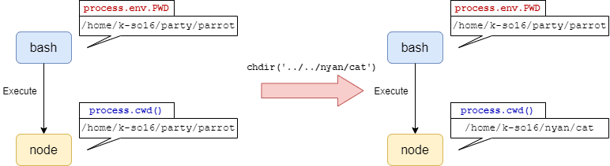

こんにちは。最近、高校生時代に読んでいた小説をもう一度読み直している k-so16 です。意外と内容を忘れているので、かなり新鮮な気持ちで読んでいます（笑）

ファイルを扱うようなプログラムでは、 **プロセスが実行された際のワーキングディレクトリ** を取得したいことがあります。特に CLI のプログラムにおいては、 **ディレクトリエントリを走査** したり、 **ファイルを自動生成** するような場合、プロセスが実行された際のワーキングディレクトリを基準とすることが多いのではないかと思います。

筆者の場合、 Node.js でプロセスが実行された際のワーキングディレクトリを基準に、ディレクトリやファイルをプログラムから生成したいと思うことがありました。

本記事では、 **Node.js でプロセス実行時のワーキングディレクトリを取得** する方法を紹介します。

本記事で想定する読者層は以下の通りです。

- Node.js について基本的な知識を有している
- プロセスについての基礎的な知識を有している

## ワーキングディレクトリの取得方法

Node.js において、ワーキングディレクトリを取得する方法は以下の 2 つが挙げられます。

- **環境変数から** 取得
- **実行中のプロセスから** 取得

### 環境変数から取得する方法

**環境変数** からワーキングディレクトリを取得するには、 `process.env.PWD` を実行します。 `process.env.PWD` は **シェルの環境変数 `PWD` に格納されている文字列** を返します。

Node.js では、 `process.env` のメンバーにシェルの環境変数を指定することで、シェルの環境変数にアクセスすることができます。例えば、環境変数 `PATH` を取得したい場合、 `process.env.PATH` で取得できます。

### 実行中のプロセスから取得する方法

**実行中のプロセス** からワーキングディレクトリを取得するには、 `process.cwd()` を実行します。 `process.cwd()` は現在のワーキングディレクトリの **絶対パス** を返します。

### 取得方法の違い

`process.env.PWD` と `process.cwd()` の違いは、ワーキングディレクトリを取得する際に参照する先が **実行元のプロセス** か **現在実行中のプロセス** かという点です。

`process.env.PWD` は、シェルなどのプロセスの実行元のワーキングディレクトリを取得します。基本的に、シェルからプログラムを実行する場合、 **サブプロセスを生成** して実行されるので、プログラム内で `process.chdir()` などのメソッドを用いてディレクトリを移動しても、 **実行元のシェルのカレントディレクトリは変わりません。** サブプロセスがどのディレクトリにいても、 `process.env.PWD` は **実行元のワーキングディレクトリのパス** を返します。

一方、 `process.cwd()` は実行中のプロセスのワーキングディレクトリを取得します。 `process.env.PWD` とは異なり、ディレクトリを移動した後に `process.cwd()` を実行すると、 **移動先のディレクトリのパス** が返されます。

実行元のワーキングディレクトリを取得したい場合、 `process.env.PWD` を利用するのがシンプルですが、後述のケースを想定する場合、プロセス内でディレクトリを移動する前に、 `process.cwd()` の返す文字列を別の変数に格納し、それを使い回すことも可能です。

本記事を作成する上で、以下のページを参考にしました。

> [javascript - process.env.PWD vs process.cwd() - Stack Overflow](https://stackoverflow.com/questions/31414852/process-env-pwd-vs-process-cwd)

## Windows での注意点

`process.env.PWD` は環境変数 `PWD` に格納されている文字列をそのまま出力するので、 Windows で Git Bash 経由で実行した場合、 **UNIX のパス形式** でカレントディレクトリの文字列が返されます。 Git Bash で得られた絶対パスを `process.resolve()` などで Windows のパス形式の文字列に変換しても、 **実際の Windows のファイルシステムと対応しない** 可能性があります。

また、 PowerShell から実行するように、 **環境変数 `PWD` が設定されていない** 環境で実行すると、 `process.env.PWD` は `undefined`  となります。

Windows も対象とするプログラムを書く場合、特別な事情がない限りは `process.env.PWD` でカレントディレクトリを取得するのは避けたほうが良いでしょう。

## まとめ

本記事のまとめは以下の通りです。

- `process.env.PWD` はプロセスの実行元のワーキングディレクトリを取得
- `process.cwd()` はプロセス内のワーキングディレクトリを取得

以上、 k-so16 でした。プログラムを書く上でも、 OS まわりの基礎知識を疎かにはできませんね（笑）