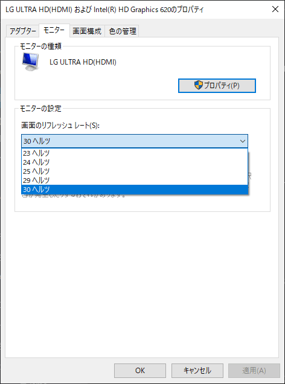
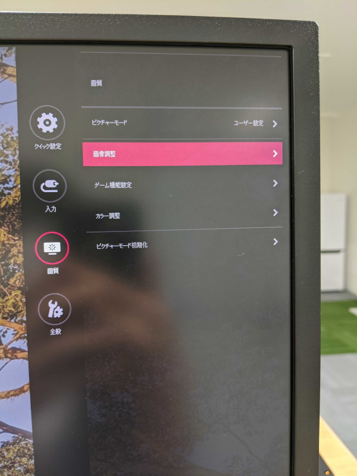
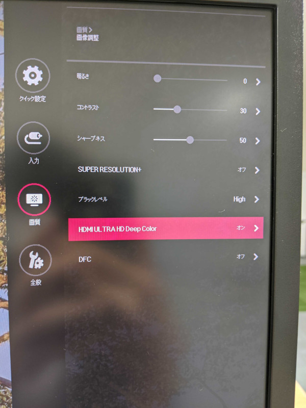
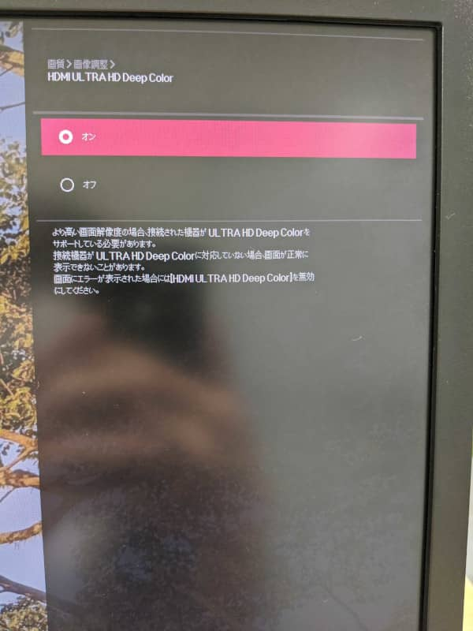
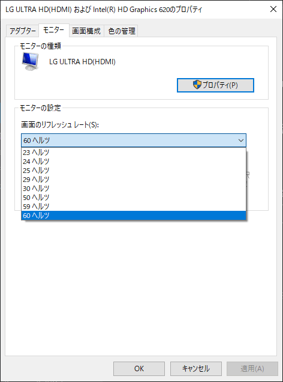

こんにちは。最近、 高校の科目の復習を始めた k-so16 です。現在、苦手科目の 1 つである数学を復習していますが、受験関係なく興味本位で勉強する分には面白いですね（笑）

普段、業務で LG の 32UD59-B のモニターを利用しているのですが、解像度を 4K に設定すると、フレームレートを 60Hz に設定できず、どうしたら解決するか悩んでいました。過去に [じんない](/category/articles-jinnai-wrote/) さんが執筆した 「 **[ThinkPad X1 Carbon (2017) から LG モニター 32UD59-B に 4K 60Hz で出力できない](/can-not-output-4k-60hz-with-32ud59/)** 」 という記事を参考に設定を行ったのですが、同じモニターを利用しているにも関わらず、なぜか解決しませんでした。

色々と検索した結果、ファームウェアやモニターのドライバーの問題ではなく、 **モニター自体の設定の問題** だということが明らかになりました。

本記事では、ファームウェアやドライバーを更新しても 4K で 60Hz 出ない際の対処法を紹介します。

## 環境

筆者の PC 及びモニターの環境は以下の通りです。

- PC: Lenovo Thinkpad X1 Carbon 5th Gen
- グラフィックス: Intel(R) HD Graphics 620
- モニター: 32UD59-B
    - ドライバー: [32UD59 Win10 R3 driver](https://www.lg.com/jp/support/support-product/lg-32UD59-B#softwareUpdate)
- ケーブル: USB-C to HDMI (4K 対応)

## モニターの設定手順

モニターの設定で、 **HDMI Depp Color** を有効化することで、 4K60Hz に対応するデバイスであれば、解像度を 4K にした際に フレームレートを 60Hz に設定できるようになります。

設定手順は以下の通りです。

1. モニターの設定を開き、 **画質** &gt; **画像調整** を選択する
    
1. **HDMI ULTRA HD Deep Color** を選択する
    
1. HDMI ULTRA HD Deep Color を **オン** に設定する
    

一度画面が暗転した後、再度画面が表示されたら、 Windows 側で画面のリフレッシュレートの設定から 60 Hz が選択できるようになります。

モニターのフレームレートの設定をする上で、以下の Reddit のスレッドを参考にしました。

> [LG 27UD68-W - Stuck at 30hz!](https://www.reddit.com/r/Monitors/comments/6lzdx7/lg_27ud68w_stuck_at_30hz/)

## まとめ
本記事のまとめは以下の通りです。

- ドライバーを更新しても 60Hz に変更できなければモニターの設定を確認する
    - **HDMI Deep Color** が有効化されていることを確認する

以上、 k-so16 でした。周辺機器のトラブルの解決方法を見つけると達成感が得られますね（笑）
