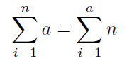
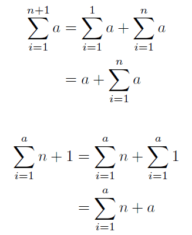

こんにちは。最近、 料理の幅を増やしてみたいと思っている k-so16 です。調理器具や調味料も買い足す必要があるかもしれないので、なかなか進んでいないのが現状です（笑）

2020 年から小学校でプログラミング教育の必修化や新型コロナウイルスによる休校によって、教育に対して社会の関心が高まっているように感じます。

小学校で掛け算を習う際に、文章題で式を書かせる問題があります。 **掛け算の項の順序が逆で間違い** とされ、納得できないと思った経験はないでしょうか。 **掛け算は交換法則が成立する** ので、項が入れ替わっても答えが同じになるから、問題ないのではないかという意見をインターネットで見かけたことがあります。

掛け算の交換法則が成立することは、私達にとって **常識的な知識** です。しかし、 **成立することを証明せよ** 、と言われたらどうでしょうか。

本記事では、 **掛け算の交換法則の証明** に挑戦してみます。

本記事の想定読者層は以下の通りです。

- 高校数学の数学 B の知識を有している [^1]

## 前提条件

証明にあたって、以下を前提知識として利用できることとします。

- 足し算の交換法則
- 数学的帰納法

今回は **数学的帰納法** を用いて証明を行うので、 2 つの任意の **自然数** について掛け算の交換法則が成り立つことを証明します。

## 証明

任意の自然数 a, b について、 ab = ba の証明を考えます。

ab は a を b 回加算したもの、 ba は b を a 回加算したものなので、それぞれ (1), (2) のように表されます。

(1) と (2) が等価であることを示せれば、 ab = ba が示されます。

Ⅰ) b = 1 の時、 それぞれ (1), (2) に代入すると以下のようになります。

a を 1 回足したものは a, 1 を a 回足したものは a になるので、 b = 1 の時、 (1) と (2) は等価であることが示されました。

Ⅱ) b = n の時、 それぞれ (1), (2) に代入すると以下のようになります。

上記の 2 式が等価と仮定します。

Ⅲ) b = n + 1 の時、それぞれ (1), (2) に代入すると以下のようになります。

Ⅱ) の結果から、 b = n + 1 の時、 (1) と (2) が等価であることが示されました。

Ⅰ), Ⅱ), Ⅲ) より、任意の自然数に対して、 (1) と (2) が等価であることが示されたので、 ab = ba が示されました。 (証明終了)

## 所感

掛け算の交換法則は当たり前の知識として覚えていたので、成立することの証明ができるのか疑問でしたが、 **高校数学の知識があれば証明ができる** ことが分かり感動しました。教養って大事ですね（笑）

小学校の文章題で掛け算の式を書く時、なぜ項が逆では間違いなのかをきっかけに、 **式の意味** として違うことをどう教えられたら分かりやすいのか、そもそも交換法則が成り立つことを厳格に示せるのかと疑問が移っていきました。今回証明した感覚では、さすがに **小学生に交換法則が成り立つ理由を説明するのは難しそう** だなと感じました。 **小学生にわかりやすく教えられる先生は偉大** ですね。

以前は、掛け算の式の項を逆に書いたら間違いとする理由が分かりませんでした。しかし、項の順序を逆にすると **式の意味** が変わるのではないかと思い、少し考えが変わりました。

機械的に計算するのであれば、掛け算の項の順序が逆でもさほど問題ないとは思います。しかし、計算が目的ではなく、考え方を問う場合、 **式の意味** を考えることが重要なので、項の順序を意識する意味はあると考えます。

例えば、「りんごが 3 個乗った皿が 5 枚あります。りんごは合計で何個でしょうか。」という文章題があったとします。この場合、 3 個のりんごが乗った皿の 5 枚分足し合わせるので、足し算では 3 + 3 + 3 + 3 + 3 と表せます。これは 3 を 5 回足しているので、 3 × 5 と書くことができます。これを 5 × 3 と書いてしまうと、 5 + 5 + 5 となり、 3 個のりんごという情報が表せなくなるので不適切といえます。

**掛け算の交換法則を縛っておいて、足し算の交換法則を認めているのは少しズルい** ようにも感じますし、 **足し算の交換法則の証明** もいずれ証明してみたいと思います。 **数学的帰納法が証明として成立する理由** も述べてないので、そこも突き詰めたいところです。

何気なく、当たり前の常識として知っている法則を証明してみるのも面白いので、読者のみなさんも何か身近な法則で証明を試みてはいかがでしょうか。

[^1]: 学習指導要領は平成 21 年の [高等学校学習指導要領解説 数学編](https://www.mext.go.jp/component/a_menu/education/micro_detail/__icsFiles/afieldfile/2012/06/06/1282000_5.pdf) に準ずる