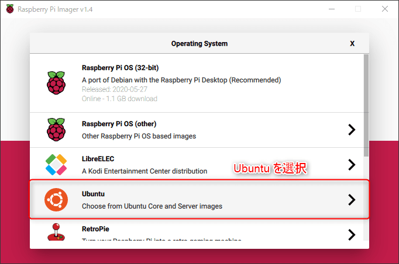
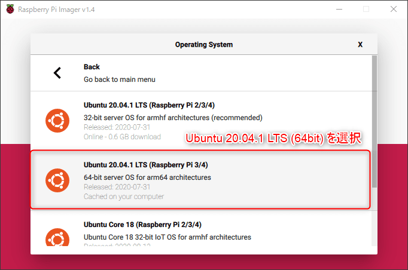
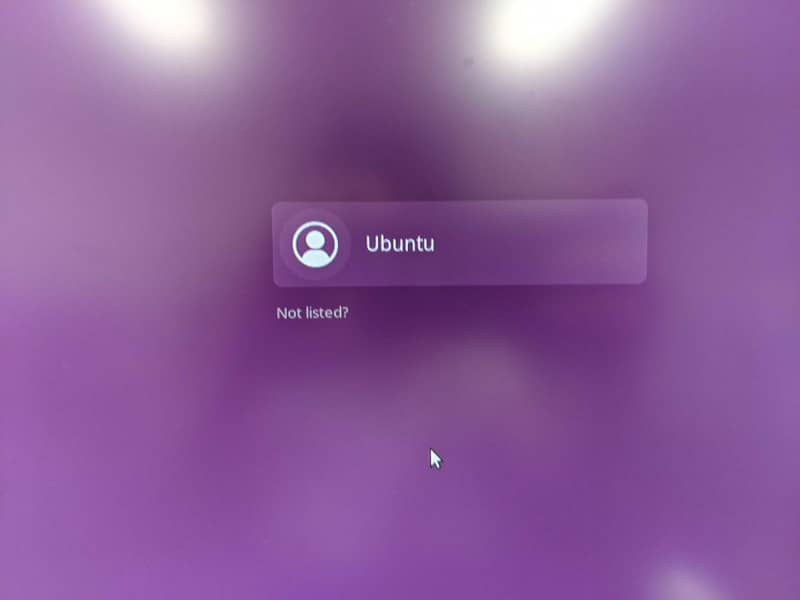
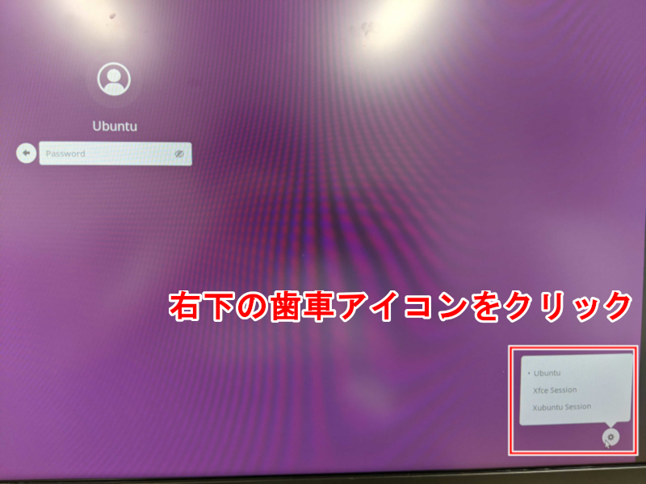
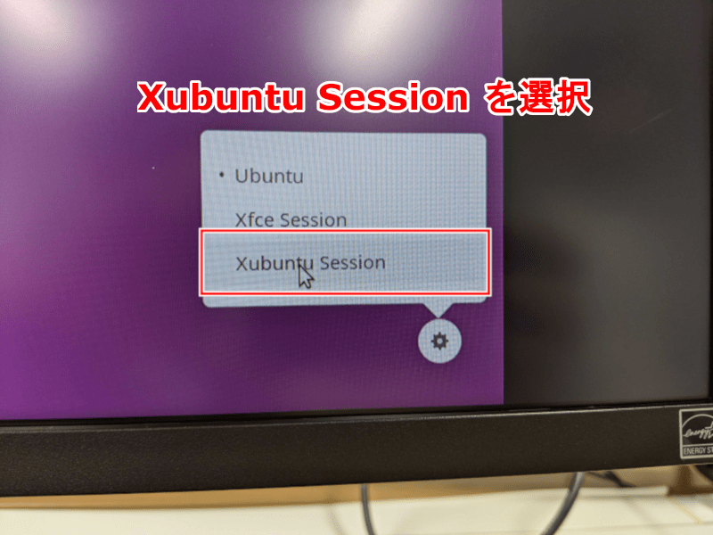
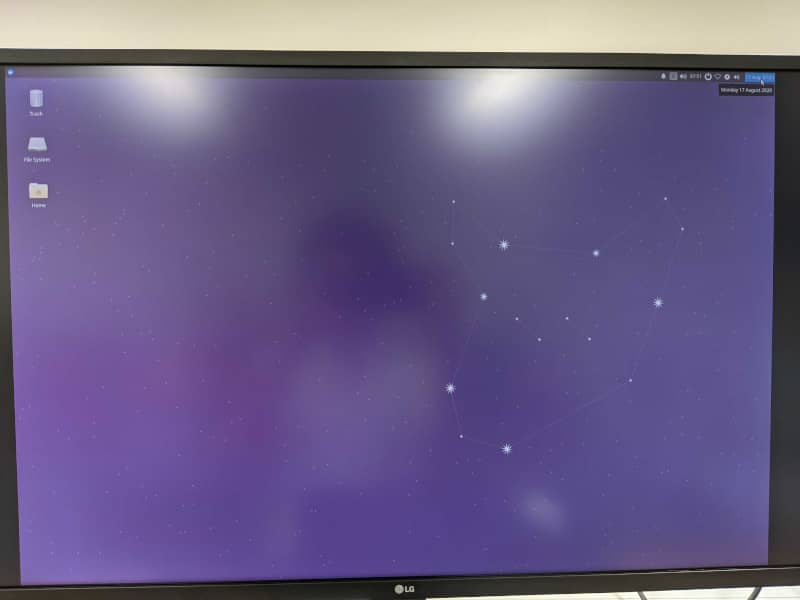

こんにちは。最近、オフィスに導入されたフィットネスバイクを利用し始めた k-so16 です。日頃の運動不足解消に積極的に活用したいと思います(笑)

弊社では、プロジェクトの進捗状況を GitHub の Project 機能を利用して半自動化されたカンバン方式での管理を試みています。カンバンをモニターに常時表示させるために、置き場所をあまり必要としない Raspberry Pi 4 をモニターに繋いで表示させてみることにしました。そのために、 Raspberry Pi 4 に Ubuntu を入れてデスクトップ環境を構築してみました。

本記事では、 Raspberry Pi に **[Ubuntu 20.04](https://ubuntu.com/)** と **[Xfce](https://www.xfce.org/)** によるデスクトップ環境の構築方法を紹介します。

本記事で想定する読者層は以下の通りです。

- Ubuntu と Raspberry Pi に触れたことがある
- Linux の基本的なコマンドを知っている

## Ubuntu のインストール

**Raspberry Pi Imager** を利用すると、簡単に Ubuntu を micro SD カードに書き込むことができます。 OS のインストール作業の詳細は [kenzauros](https://github.com/kenzauros) さんの記事 「[Raspberry Pi Imager を使って Raspberry Pi OS をインストールする (ヘッドレスインストール対応 2020年6月版)](/install-raspberry-pi-os-with-raspberry-pi-imager/)」をご参照ください。

まず、 OS 設定画面で以下の画像のように **Ubuntu** を選択します。



次に、 OS のバージョンを選択します。特にこだわりがなければ、最新のバージョンをインストールします。本記事執筆時点 (2020 年 8 月現在) では、 Ubuntu 20.04.1 が最新なので、こちらを選択します。 Raspberry Pi 3 以降では 64bit 版が利用できるので、 64bit 版を選択しました。



## Ubuntu の初期設定
### ログイン

インストールされた Ubuntu は **デスクトップ環境ではない** ので、最初は CLI で操作する必要があります。起動が完了すると、ログインのプロンプトが表示されるので、画面に従ってユーザー名とパスワードを入力します。なお、初期ユーザー名とパスワードはそれぞれ以下の通りになります。

- ユーザー名: `ubuntu`
- パスワード: `ubuntu`

最初にログインするとパスワードの変更が求められるので、画面に従って新しいパスワードを入力してください。

### キーボードの設定

デフォルトではキーボードの設定が **US 配列** に設定されているようなので、 **JIS 配列のキーボードを Raspberry Pi に接続して利用している場合** はキーボードの設定を **日本語キーボード** に変更します。以下のコマンドを実行すると、キーボードの設定画面が表示されます。

```bash
sudo dpkg-reconfigure keyboard-configuration
```

キーボードの設定画面の設定項目は以下の通りです。

- キーボードモデルの選択
    - `Generic 105-key PC (intl.)` を選択
- キーボードレイアウトの国を選択
    - `Japan` を選択
- キーボードのモデルを選択
    - `Japanese` を選択
- 修飾キーの設定 (AltGr)
    - `The default for the keybard layout` を選択
- Compose キーの設定
    - `No compose key`

修飾キーと Compose キーはアクセント付きのアルファベットなどのような特殊文字を入力するためのキー設定なので、特に必要がなければ上記の選択で良いでしょう。

### ソフトウェアのアップデート

以下のコマンドを実行してソフトウェアをアップデートします。その他インストールしたいソフトウェアがあれば、アップデートの後にインストールすると良いでしょう。

```bash
sudo apt update
sudo apt upgrade
```

## デスクトップ環境の構築

Raspberry Pi 上でデスクトップを動かすことを考慮して、 **軽量なデスクトップ** として有名な **Xfce** を採用することにしました。 Raspberry Pi 4 ではハードウェアがかなり進化してきているので、 **GNOME** や **MATE**, **KDE** などさまざまなデスクトップ環境での動作感を比較してみるのも面白いかもしれませんね。

### Xfce のインストール

以下のコマンドを実行して Xfce のデスクトップ環境一式をインストールします。ちなみに、 **[Xubuntu](https://xubuntu.org/)** は Ubuntu から派生した、デスクトップ環境に Xfce を採用している Linux のディストリビューションです。

```bash
sudo apt install xubuntu-desktop
```

インストールの途中でデフォルトのログインマネージャを **gdm** か **lightdm** のどちらに設定するか問われますが、これはお好きな方を選択してください。なお、デフォルトのログインマネージャは **`dpkg-reconfigure`** で変更ができます。

インストールが完了したら Raspberry Pi を再起動します。インストールに成功していれば、ログイン画面が表示されるはずです。



### デスクトップ環境の起動確認

デフォルトでは、デスクトップ環境として **GNOME** が動くようなので、起動するデスクトップ環境を変更します。ログインユーザーを選択した後、画面右下に歯車マークが表示されるので、それをクリックすると以下の画面のような選択肢が表示されます。



選択肢が表示されたら **Xubuntu Session** を選択します。



デスクトップ環境を選択してログインすると、以下の画面のような Xfce のデスクトップ環境の GUI が立ち上がってきます。これで無事にデスクトップ環境が構築できたことが確認できました。軽量なデスクトップ環境として有名なだけあって、割とサクサク動きました。



本記事を執筆する上で以下の記事を参考にしました。

> - [Ubuntu で日本語キーボードレイアウト - Qiita](https://qiita.com/vochicong/items/6452ac54bde56b0e0bb3)
> - [Raspberry Pi 4とUbuntu Server+デスクトップのインストール](https://raspida.com/rpi4b-ubuntuserver)
> - [第6回　デスクトップのカスタマイズ（1）：Ubuntu/Kubuntu/Xubuntuの切り替え/Ubuntu Tweak ：Ubuntu Weekly Recipe｜gihyo.jp … 技術評論社](https://gihyo.jp/admin/serial/01/ubuntu-recipe/0006)

## まとめ

本記事のまとめは以下の通りです。

- Raspberry Pi でデスクトップ環境を構築
    - Raspberry Pi Imager で Ubuntu をインストール
    - `xubuntu-desktop` をインストールして軽量なデスクトップ環境を構築

以上、 k-so16 でした。 CLI 環境にデスクトップ環境を構築するのはワクワクしますね(笑)