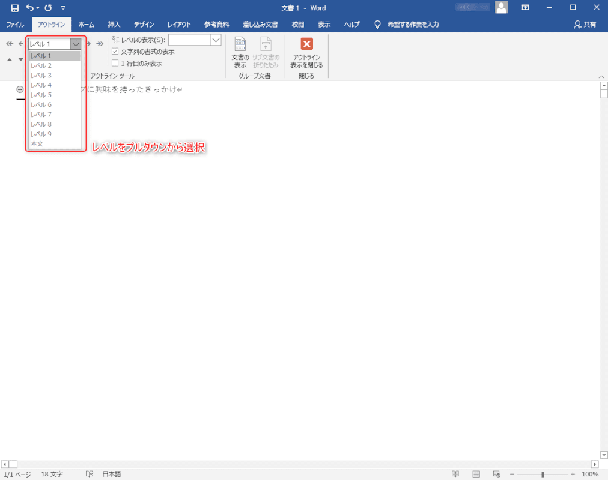
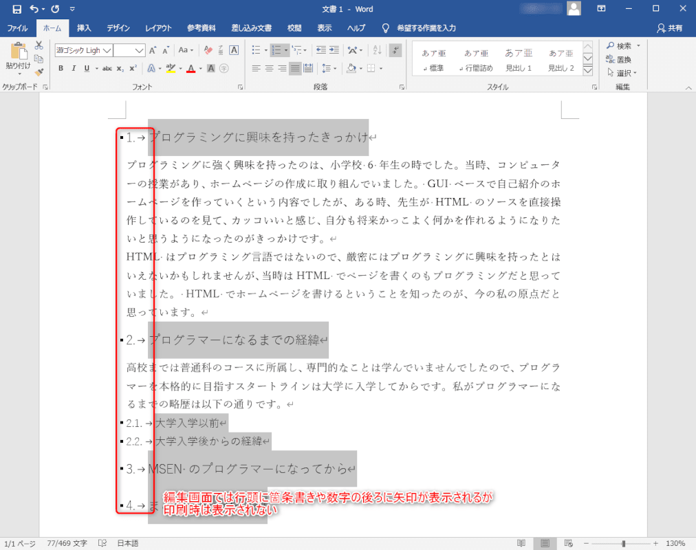

こんにちは。最近、白玉団子を作ってみた k-so16 です。白玉粉をこねる時の水の分量の調整が意外と難しいと感じました (笑)

明確な文書を書くためには、文書が章や節、段落などに **適切に構造化** されている必要があります。特にレポートや論文などを書く場合、明確な論理を展開させるために文書構造は重要な役割を持ちます。

文書を作成する際には、 Word が広く利用されていますが、筆者は大学では主にレポートや論文の執筆には LaTeX を利用してきたので、実はあまり Word で文書を書く機会がほとんどありませんでした。 Word で文書を書く機会があり、見出しなどの文書の構成要素をフォントの設定だけで区別するのではなく、 LaTeX のように文書構造を持たせたいと思い、 Word で文書を構造化する方法について調べてみました。

本記事では、 Word の **アウトライン機能** を使って文書を構造化する方法を紹介します。

本記事で想定する読者層は以下の通りです。

- Word を軽く触ったことがある
- 文書構造を意識した文書を Word で書く必要がある

## 動作環境

筆者の動作環境は以下の通りです。 Word のバージョンによってメニューの場所や表示が異なる可能性があります。

- Windows 10 version 19.09
- Microsoft Office Professional Plus 2016
    - Word バージョン 2006

## アウトラインによる文書の構造化

Word の **アウトライン機能** を利用することで、章や節、段落などの階層構造をもたせることができます。アウトラインでは **レベル** によって階層構造を表現できます。レベル 1 は最上位のレベルで、本文が最下位のレベルです。例えば、章や節にはそれぞれレベル 1, レベル 2 を割り当て、各段落は本文のレベルを割り当てるといったことが考えられます。

アウトライン機能を起動するためには、 **表示** メニューを選択し、 **アウトライン** を選択します。操作手順とアウトライン機能を起動した際の画面はそれぞれ以下のスクリーンショットのようになります。

章や節、段落にそれぞれ分けるためには、アウトラインのレベルを設定します。それぞれの要素の行頭で Tab キーを押下すると 1 つ下のレベルに移行し、 Shift + Tab で 1 つ上のレベルに移行します。または、以下の画像のように、プルダウンメニューからレベルを選択することも可能です。

アウトライン機能の画面では、レベルに沿って自動的にインデントされるので、階層構造が見やすくなります。

## レベルごとのレイアウトの調整

アウトラインでリストの設定の書式を設定したり、レベルごとに書式設定をすることで、章や節の見出しや段落の見た目を統一できます。

### アウトラインのリストの書式設定

アウトラインでレベルを設定した場合、デフォルトでは章番号や箇条書きなどは表示されません。しかし、場合によっては **章や節に番号を振るように数字を自動的に割り当てたり、箇条書きを表示したい** こともあります。そのような場合、 **アウトラインのリストの書式を変更** します。

リストの書式を変更するには、まず書式の変更対象とする箇所を選択します。選択したら、 **ホーム** を選択し、箇条書きのような見た目のアイコンに並ぶ **アウトライン** を選択します。アウトラインを選択するとリストの書式が表示されるので、利用したいものを選択します。

メニューのいくつかはアイコンのみ表示されているので、何のメニューか少々分かりづらい場合があります。そのような場合、 **カーソルをアイコンの上に置いたままにすると、そのアイコンのメニュー名と説明が表示される** ので、何のメニューかが確認できます。

リストの書式を選択すると、設定内容が表示に反映されます。以下の画像はインデントなしの、ドットつなぎの数字リストを選択した例です。

アウトラインを閉じると、行頭に箇条書きの点がついていたり、数字の後ろに矢印が表示されることがありますが、実際に印刷する際にはこれらは印字されません。実際に印字されるものを確認するためには、印刷プレビューを確認すると良いでしょう。

### レベルごとの書式設定

章や節の見出しの書式を変更するには、レベルごとの書式設定を変更します。基本的にはレベル 1 は見出し 1, レベル 2 は見出し 2 のようにスタイルがデフォルトで割り当てられているので、このスタイルをそれぞれ変更して見た目を調整します。 

書式を設定するためには、 **アウトラインの表示を閉じる** 必要があります。アウトライン機能を起動している場合は、 **アウトライン** メニューから **アウトライン表示を閉じる** をクリックします。アウトライン機能を終了したら、 **ホーム** メニューの **スタイル** から対象の見出しの項目のプルダウンから **変更** の項目を選択します。

画面の操作イメージは以下の図の通りです。

見出しの変更を選択すると、書式設定メニューが表示されます。このメニューでフォントの種類やサイズなどのスタイルを変更できます。段落などの詳細な書式設定をしたい場合は、左下の **書式** ボタンから、変更したい設定項目を選択します。

実際の書式設定画面と適用結果はそれぞれ以下の通りです。

レベル 2 以降や本文についても同様に編集することで、それぞれの文書の構成要素の見た目を統一することができます。

本記事を執筆する上で、以下の記事を参考にしました。

> - [Wordのアウトラインの使い方｜Office Hack](https://office-hack.com/word/outline/)
> - [Wordのアウトライン活用法　文章力と生産性を上げるポイントは「構造化」](https://lightworks-blog.com/word-outline)

## 余談: LaTeX とは

**LaTeX** とは、組版をコンピューター上で行うためのソフトウェアです。 LaTeX は **Donald E. Knuth** 氏によって開発された組版ソフトウェアの **TeX** を **Leslie Lamport** 氏が機能強化したものです。数式の組版の評価が高く、現在でも数式を扱う文書で LaTeX が採用されています。また、 Markdown でプレゼンテーションを作成できる [Marp](https://yhatt.github.io/marp/) や OSS のオフィス用ソフトウェア [LibreOffice](https://www.libreoffice.org/) などのソフトウェアでは、数式を記述する際に LaTeX の数式の記述方法を採用している場合もあります。

論文を執筆する際に、大学の学部によっては LaTeX を利用することがあります。筆者の卒業した学部も、基本的には LaTeX で卒業論文を執筆します。

他には、[情報処理学会](https://www.ipsj.or.jp/) が[LaTeX のスタイルファイル](https://www.ipsj.or.jp/journal/submit/style.html) を公開しているように、分野によっては LaTeX が活用されていることがわかります。特に理系の研究領域では広く活用されています。

質の高い文書を作成する上で LaTeX は非常に多くのメリットを持っています。以下にそのメリットの一部を列挙します。

- **好みのテキストエディタで編集可能**
    - **LaTeX のソースファイルはテキストファイル** なのでエディタの種類を問わない
- **マルチプラットフォーム** かつ **フリー** で利用可能
    - コンパイラさえ入っていれば複数のプラットフォームで編集可能
- Git などの **バージョン管理システムでの版管理が容易** 
    - ソースファイルはテキストファイルなので **差分が確認可能**
- ソースファイルを **複数のファイルに分割して管理が可能**
    - 長い文書を執筆する際に章や節単位などでソースファイルを分割可能
- **文献データベースファイルの再利用が可能**
    - **BibTeX** が参照された文献のみを参考文献として自動的に追加

一方で、 Word が LaTeX に勝る最大の点はなんといっても **WYSIWYG** (**W**hat **Y**ou **S**ee **I**s **W**hat **Y**ou **G**et) であることでしょう。 Word で編集している文書の画面 (What You See) は実際の出力 (What You Get) なので、編集操作がどのように出力されるかすぐに分かります。このメリットは Word が文書作成に広く使われている最大の理由といっても過言ではないでしょう。

本章を執筆する上で、以下の書籍を参考にしました。

> - [［改訂第6版］LaTeX2ε美文書作成入門 奥村 晴彦, 黒木 裕介 著](https://gihyo.jp/book/2013/978-4-7741-6045-0)

2020/7/23 現在では [第 7 版](https://gihyo.jp/book/2017/978-4-7741-8705-1) が最新版で刊行されています。この書籍は LaTeX の参考書として広く読まれているので、 LaTeX にご興味を持たれた方はぜひ手にとってみてはいかがでしょうか?

## まとめ

本記事のまとめは以下の通りです。

- Word で文書を構造化するためにはアウトライン機能を利用する
    - レベルによって文書を構造化
- アウトラインで各レベルの書式を設定
    - レベルごとに書式を統一化

以上、 k-so16 でした。 LaTeX はもちろんのこと、 Word とも上手に付き合っていきたいですね。
