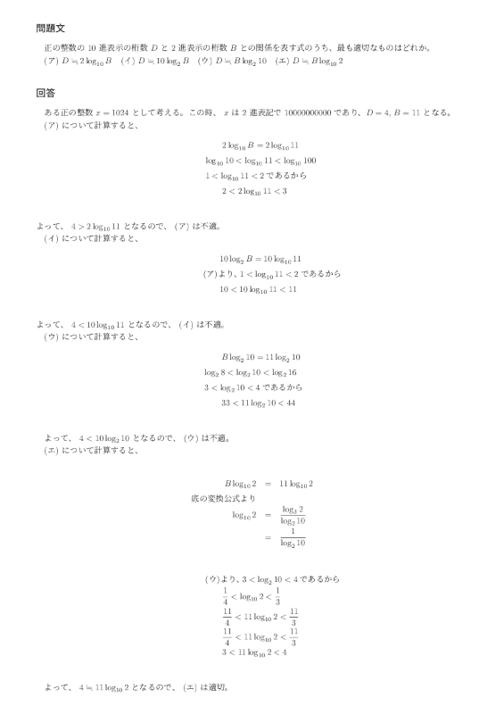
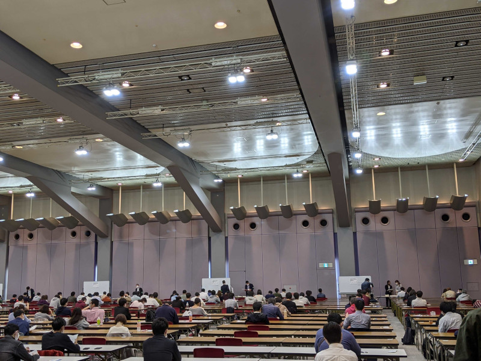

こんにちは。最近、 [Panic! At The Disco](https://panicatthedisco.com/) のアルバム [Pray For the Wicked](https://patd.lnk.to/prayforthewicked) と [Death Of A Bachelor](https://patd.lnk.to/deathofabachelor) を購入した k-so16 です。 Brendon Urie の歌を聴くとテンションが上がりますね(笑)

10/18 に実施された **[応用情報技術者試験](https://www.jitec.ipa.go.jp/1_11seido/ap.html)**  (以下、応用情報と記述) を受験してきました。昨年は [基本情報技術者試験を受験](took-fe-2019-autumn-exam)し、 [無事に合格した](passed-fe-2019-autumn-exam) ので、今年は応用情報に挑戦してみました。

本記事では、基本情報の時と同様に私の受験の所感を中心に、応用情報の試験の雰囲気を紹介します。

## 事前対策

### とにかく過去問を解くべし

応用情報の効率的な対策は、やはり **過去問を解く** ことでしょう。過去問を解くことで、 **何を問われやすいか** や **どのように問われているか** の傾向が掴めてきます。もし特定の分野についての知識が不足していると感じたら、 Web で検索するなどして、 **その分野についての理解を深めて知識を補う** と良いでしょう。

過去問を解くにあたって、 **[応用情報技術者試験ドットコム](https://www.ap-siken.com/)** というサイトを活用しました。 Web で過去問を解くだけでなく、 **解説も掲載されている** ので、なぜ間違えたかなどを解いた後に見返すことができます。

私自身は試験の 1 週間前から、毎日業務後に午前または午後の過去問 1 回分を解くことで対策することにしました。 1 週間前とはいえ、 **毎日過去問を 1 回分解いたらある程度対策できるだろう** という考えのもと、事前対策に取り組みました。 (詳細は後述しますが、結果的に前日の土曜日に頑張っていました)
### 過去問以上の難題

上記の計画のもと、業務後に過去問を解いていたのですが、 **途中で眠気に負けました** (笑) 1 日あたり 1 回分の午前または午後の過去問を解くつもりが、 2, 3 日あたり 1 回分になってしまいました。応用情報の過去問対策以上に眠気対策のほうが難問でした(笑)

基本情報が準備不足という反省があったので、今回こそは頑張ろうと思っていたのですが、さすがに眠気には抗えませんでした。今日こそは、今日こそはとなっていって、最終的に試験前日の土曜日に頑張る、という対策になってしまいました。 **敵は本能にあり!** (笑)

## 試験当日

### 午前試験

応用情報の午前試験は基本情報と同様に **80 問のマークシート形式** です。 **試験時間は 150 分** あり、問題を解くには十分な時間があります。慌てず着実に解きましょう(笑)

基本情報の時と同様に、やはり計算に一番苦戦しました。ここ数ヶ月ほど、およそ週に 1 回、高校数学の復習をしているのですが、問題を解く際には電卓を使わずに自分で計算しています。残念ながら、あまり成果にはつながらなかったようです。

知識を問う問題は、マネジメント系がやや知らないものが多かったのですが、英単語の意味として分解して選択肢から合致しそうなものを類推して解いたりもしていました。もちろん、知っているに越したことはないので、これから応用情報を受験しようと考えている方は、 **過去問を解いたり、知識不足な領域を洗い出して勉強するなどの対策をしっかり講じましょう。**

問 1 で対数の問題が出題されたのですが、対数の計算がすぐにできず、出鼻をくじかれました。一通り問題を解き終わってから着手し直したのですが、 log102 の概算ができず、 0 &lt; log102 &lt; 1 より詳細な値が試験時間内で分からなかったので、いくつかの値で計算を試して、消去法で選ぶことにしました。ちなみに、 **対数の底の置き換えを行えば概算が可能** です。

### 午後試験

午後試験は **必須 1 問** と **選択 4 問** の計 5 問を解く、**記述形式** で実施されます。 **試験時間は午前同様に 150 分**  なのですが、意外と時間に余裕はありません。テキパキ解きましょう(笑)

選択問題はプログラミング、システムアーキテクチャ、ネットワーク、データベースを選択しました。平均で設問 1 つあたり 30 分で解けば良いのですが、事前対策で必須のセキュリティはやや早めに回答でき、プログラミングに少し時間がかかることがわかっていたので、セキュリティ 20 分、プログラミング 40 分、残り設問を 30 分以内を目標として取り組みました。

意外とどの問題も少し文章が長いので、私の場合は **先に設問を見てから、設問の対象の下線部や記号まで読んで回答する** 戦略を取りました。午後試験は午前とは違い、少し記述が含まれるので、その分早く文章を読んで内容を把握する必要があります。 **文章の概要を早く正確に理解する能力** が必要です。

最初のセキュリティの設問は順調に 20 分程度で解き終わったのですが、プログラミングのアルゴリズムの概要と挙動を把握するために計算して時間がかかったのと、 `for` 文でカウントアップされる変数を使えばいいことに気が付かず、計算式でどう表現するか悩んでしまったので、不完全燃焼のまま 40 分使ってしまい、システムアーキテクチャ、ネットワーク、データベースを解いている際も少し気持ちを引きずってしまっていました。結果的に少し早めに解いてプログラミングの設問に戻り、終了間際で気づけたので結果オーライでしょうか。 (正解しているかはわかりませんが...)

## 所感

基本情報の反省を活かして、今回こそはある程度対策しようと思いましたが、なかなか思ったようにことは運びませんでした。全体を通して、準備不足のままの受験になってしまいましたが、基本情報に比べて非常に難易度が高いわけでもないので、 **ある程度対策すれば** それなりに余裕を持って受けられると感じました。

今回は眠気に負けて事前準備がおろそかになってしまったので、もう少し期間に余裕を持たせたほうが良さそうでした。体力が低下しているからか、ここしばらく夕食前後の時間帯に眠くなることが多かったので、体力を落とさないためにも **日頃から適度な運動** をして、 **十分な睡眠** を取り、 **生活リズムを整える** ことも重要だと感じました。 **生活リズムの管理** も試験の事前準備といえるかもしれませんね(笑)

ちなみに、今回の情報技術者試験の合格発表当日は **12/25 (金)** とのことです。合格通知がクリスマスプレゼントになりますように(笑)