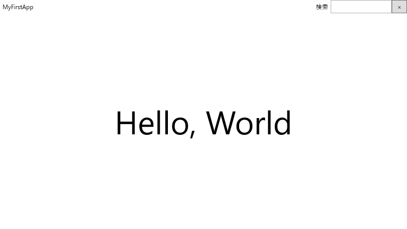
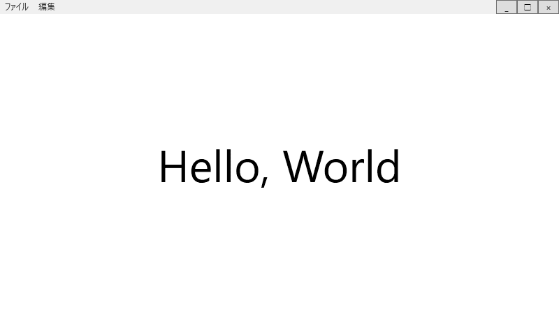
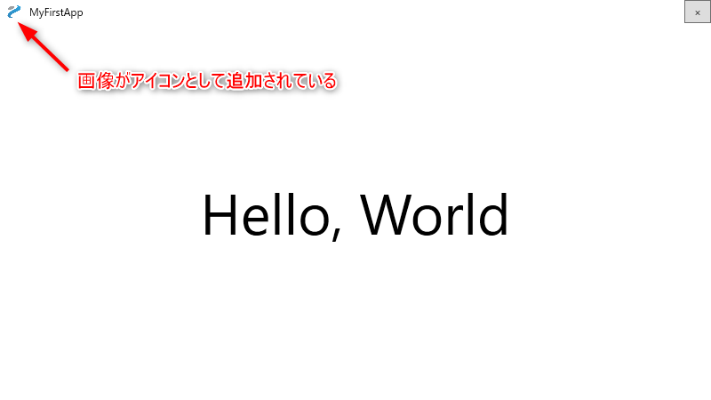

こんにちは。最近、フライパンの買い替えを検討している k-so16 です。使い勝手が良いフライパンに買い替えて、快適な自炊ライフを送りたいものです(笑)

WPF を用いて Windows アプリケーションを作成する際に、タイトルバーに UI コンポーネントを独自で追加するようなカスタマイズしたいことがあります。基本的にはタイトルバーは自動的にデフォルトのものが設定されますが、どのように設定すれば良いか分からなかったため、調べてみました。

本記事では、 WPF でタイトルバーをカスタマイズする方法を紹介します。

本記事で想定する読者層は以下の通りです。

- WPF について基礎的な知識を有している

## タイトルバーをカスタマイズする方法

WPF でタイトルバーをカスタマイズするために **WindowChrome** を利用します。以下では WindowChrome を利用する方法を示したあと、タイトルバーのカスタマイズ例を紹介します。

### WindowChrome の利用

WindowChrome を利用するには、 XAML に以下の設定を追加します。

- `Window` タグに `Style` プロパティを追加
    - 値は `Window.Resource` の `Style` で指定したキーを指定
- `Window.Resources` 内に `WindowChrome` の設定を追加
    - `Style` の `TargetType` に `{x:Type Window}` を指定
    - `Setter` の `Property` に `WindowChrome.WindowChrome`
    - `Setter.Value` タグ内に `WindowChrome` タグを追加

実際に WindowChrome を設定するための XAML のコード例を以下に示します。

```xml
<Window x:Class="MyFirstWpfApp.MainWindow"
        xmlns="http://schemas.microsoft.com/winfx/2006/xaml/presentation"
        xmlns:x="http://schemas.microsoft.com/winfx/2006/xaml"
        xmlns:d="http://schemas.microsoft.com/expression/blend/2008"
        xmlns:mc="http://schemas.openxmlformats.org/markup-compatibility/2006"
        xmlns:local="clr-namespace:MyFirstWpfApp"
        xmlns:System="clr-namespace:System;assembly=mscorlib"
        mc:Ignorable="d"
        Style="{DynamicResource DefaultWindowStyle}"
        Title="MainWindow" Height="450" Width="800">
    <Window.Resources>
        <Style TargetType="{x:Type Window}" x:Key="DefaultWindowStyle">
            <Setter Property="WindowChrome.WindowChrome">
                <Setter.Value>
                    <WindowChrome
                        ResizeBorderThickness="20"
                        UseAeroCaptionButtons="False"/>
                </Setter.Value>
            </Setter>
        </Style>
    </Window.Resources>
```

`Window.Resources` タグの `Style` でキーとして指定した `DefaultWindowStyle` を `Window` タグの `Style` プロパティに指定することで、定義しているスタイルが Window に適用されます。 `Style` 内で `WindowChrome` の設定を加えることで、WindowChrome が利用できるようになります。

実際にはデフォルトのタイトルバーを書き換えているのではなく、 **アプリケーションの UI 領域をタイトルバーにまで拡張** しているため、実際には **カスタマイズするタイトルバーの背後にデフォルトのタイトルバーが存在** します。デフォルトのタイトルバーの制御が有効になっていると、表示上ボタンがなくても、最大化や閉じるボタンが位置する場所をクリックすると、画面サイズが変わったりウィンドウが閉じたりします。

`WindowChrome` のプロパティを設定することで、タイトルバーの制御についての設定ができます。以下に設定できるプロパティの一例を紹介します。

- `ResizeBorderThickness`: ウィンドウ幅を変更できる範囲を設定
- `UseAeroCaptionButtons`: デフォルトのツールバーの有効・無効を設定

### タイトルバーの UI の定義

タイトルバーの UI はアプリケーションの UI 領域で定義します。アプリケーションの UI 領域をタイトルバーの領域とアプリケーション画面の領域にわけて、それぞれの UI を定義します。

以下のコードはタイトルバーの UI のカスタマイズ例です。

```xml
<Grid>
    <Grid.RowDefinitions>
        <RowDefinition Height="Auto"/>
        <RowDefinition/>
    </Grid.RowDefinitions>

    <!-- タイトルバーの UI の定義 -->
    <Grid Grid.Row="0">
        <Grid.ColumnDefinitions>
            <ColumnDefinition/>
            <ColumnDefinition/>
            <ColumnDefinition Width="Auto"/>
        </Grid.ColumnDefinitions>
        <Label x:Name="Title" Content="MyFirstApp" VerticalAlignment="Center"/>
        <Grid HorizontalAlignment="Right" Grid.Column="1">
            <Grid.ColumnDefinitions>
                <ColumnDefinition/>
                <ColumnDefinition/>
            </Grid.ColumnDefinitions>
            <Label Content="検索" Grid.Column="0"/>
            <TextBox Width="120" Grid.Column="1"/>
        </Grid>
        <Button Content="×" Width="30" HorizontalAlignment="Right" Grid.Column="2"/>
    </Grid>
    
    <!-- アプリケーション画面の UI の定義 -->
    <Grid Grid.Row="1">
        <Label Content="Hello, World" FontSize="64" HorizontalAlignment="Center" VerticalAlignment="Center"/>
    </Grid>
</Grid>
```

実際の画面は以下のように表示されます。



`Grid` の領域を縦に 2 分割し、タイトルバーとアプリケーション領域としてそれぞれ UI を定義することでカスタムタイトルバーを生成します。 `Grid.RowDefinitions` の 1 つ目の `RowDefinition` の `Height` プロパティを `Auto` と指定することで、タイトルバーの高さがコンテンツの高さに合わせて自動的に計算されます。また、 `Height` に値を指定してタイトルバーの高さを固定することも可能です。

タイトルバーもアプリケーション領域の UI 定義とまったく同じように UI コンポーネントを設置できます。上記の例では、タイトルバーの左側にアプリケーションのタイトル、右側に閉じるボタンと検索フォームを設置しています。

イベントハンドラを定義していないので、ボタンを押したりフォームに入力しても何も動作しませんが、イベントハンドラを定義することで、イベントごとの処理を定義できます。例えば、閉じるボタンを押した際に、閉じる処理の前に保存などのなんらかの処理をカスタマイズで追加することができます。

## タイトルバーの UI のサンプル

タイトルバーの UI のサンプルを 2 つ、コード例と画面例を併せて紹介します。

- メニューの実装

    大半のデスクトップアプリケーションに組み込まれているメニューは、 `Menu` タグと `MenuItem` タグを利用することで実装できます。 `MenuItem` を入れ子にすることで、多階層のメニューの UI も簡単に実装できます。以下の例ではシンプルに 1 階層のメニューを実装しています。

    - 画面例



    - 実装例

        ```xml
        <Grid Grid.Row="0">
            <Grid.ColumnDefinitions>
                <ColumnDefinition/>
                <ColumnDefinition Width="Auto"/>
                <ColumnDefinition Width="Auto"/>
                <ColumnDefinition Width="Auto"/>
            </Grid.ColumnDefinitions>
            <Menu>
                <MenuItem Header="ファイル">
                    <MenuItem Header="開く"/>
                    <MenuItem Header="保存"/>
                    <MenuItem Header="閉じる"/>
                </MenuItem>
                <MenuItem Header="編集">
                    <MenuItem Header="元に戻す"/>
                    <MenuItem Header="やり直し"/>
                    <MenuItem Header="カット"/>
                    <MenuItem Header="コピー"/>
                    <MenuItem Header="ペースト"/>
                </MenuItem>
            </Menu>
            <Button Content="_" Width="30" HorizontalAlignment="Right" Grid.Column="1"/>
            <Button Content="□" Width="30" HorizontalAlignment="Right" Grid.Column="2"/>
            <Button Content="×" Width="30" HorizontalAlignment="Right" Grid.Column="3"/>
        </Grid>
        ```

- タイトルバーにアイコンを設定する

    `Image` タグを利用することで、タイトルバーにアプリケーションのアイコンを実装できます。以下の例では、プロジェクトフォルダーの下に `Resources` というフォルダーを作成し、 `logo.png` という画像が保存されている想定です。

    - 画面例



    - 実装例

        ```xml
        <Grid Grid.Row="0">
            <Grid.ColumnDefinitions>
                <ColumnDefinition Width="Auto"/>
                <ColumnDefinition/>
                <ColumnDefinition Width="Auto"/>
            </Grid.ColumnDefinitions>
            <Image Source="Resources/logo.png" Width="16" Height="16" HorizontalAlignment="Left" Margin="8,0,4,0"/>
            <Label x:Name="Title" Content="MyFirstApp" VerticalAlignment="Center" Grid.Column="1"/>
            <Button Content="×" Width="30" HorizontalAlignment="Right" Grid.Column="2"/>
        </Grid>
        ```

本記事を執筆する上で以下の記事を参考にしました。

> - [[WPF]wpfで、×ボタンをなくしたウインドウを作る(WindowChrome) - Qiita](https://qiita.com/tera1707/items/ad4437bb64077e214c5e)
> - [WPF 枠なしでリサイズ＆ドラッグ移動可能なウィンドウを作る - OITA: Oika&#39;s Information Technological Activities](https://oita.oika.me/2014/10/27/no-border-window/)
> - [C#のWPFでメニューを作成する - Ararami Studio](https://araramistudio.jimdo.com/2019/11/05/c-%E3%81%AEwpf%E3%81%A7%E3%83%A1%E3%83%8B%E3%83%A5%E3%83%BC%E3%82%92%E4%BD%9C%E6%88%90%E3%81%99%E3%82%8B/)
> - [&raquo; [WPF] Imageコントロールで画像を表示する　技術ブログ](http://blog.pionet.co.jp/experience/archives/2111)

## まとめ

本記事のまとめは以下の通りです。

- WindowChrome を利用してタイトルバーを定義する方法を紹介
- タイトルバーの UI の定義方法を紹介
- タイトルバーの UI の例を紹介

以上、 k-so16 でした。ぜひ WindowChrome を利用して素敵なタイトルバーを作成してみてくださいね。