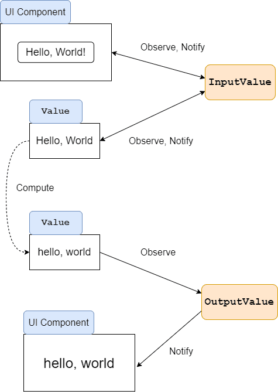

こんにちは。最近、[阪神電車 野田駅](https://rail.hanshin.co.jp/station/noda.html) 前のフジに魅了された k-so16 です。鮮やかなフジの紫色がとても綺麗でした。

ReactiveProperty を利用して MVVM な WPF アプリケーションの開発をしているとき、 **`ReactiveProperty<T>`** の他に **`ReadOnlyReactiveProperty<T>`** があることを [kenzaurous](https://github.com/kenzauros) さんに教えてもらいました。 ReactiveProperty 初心者の自分は違いを理解するのに少し時間を要したので、自分の備忘録も兼ねて記録します。

本記事では **`ReactiveProperty<T>` と `ReadOnlyReactiveProperty<T>` の使い分け方** を紹介します。

本記事で想定する読者層は以下の通りです。

- C# の基礎的な知識を有している
- ReactiveProperty の初歩的な利用方法を知っている

## `ReactiveProperty<T>` と `ReadOnlyReactiveProperty<T>` の違い

`ReactiveProperty<T>` も `ReadOnlyReactiveProperty<T>` もデータの変更を監視する役割は同じです。両者の違いは次の通りです。

- `ReactiveProperty<T>` は値を **直接変更できる**
- `ReadOnlyReactiveProperty<T>` は値を **直接変更できない**

それぞれの使い分け方を説明していきます。

### `ReactiveProperty<T>` を利用する場面

**`ReactiveProperty<T>`** はビューやモデルから、 **監視対象とするデータの値が直接変更される場合** に利用します。例えば、 WPF の `TextBox` の入力データを監視するような場合は、ビューから値が変更されることが考えられるので、 `ReactiveProperty<T>` を用いた監視が適切です。


`ReactiveProperty<T>` で値を変更するには `Value` プロパティを変更します。ビューやモデルから `Value` プロパティを書き換えることで監視対象のデータの値が書き換わり、変更が検知されます。

```cs
class ViewModel
{
    public ReactiveProperty<string> InputValue { get; }

    public ViewModel()
    {
        InputValue = new ReactiveProperty("Hello, World!");
        InputValue.Value = "I'm feeling good :-)";
    }
}
```

### `ReadOnlyReactiveProperty<T>` を利用する場面

身長と体重から BMI を求めるように、 **あるデータに基づいて値が計算されるようなデータを監視** する場合、その値は **直接変更されるべきではない** ので、 **`ReadOnlyReactiveProperty<T>`** を利用します。 `ReactiveProperty<T>` で監視しているデータに基づいて値を自動計算させる場合、 `ReactiveProperty<T>` のインスタンスの　**`Select()`** メソッドで変換処理をしたのち、 **`ToReadOnlyReactiveProperty<T>()`** メソッドを起動します。



以下は `InputValue` の値の文字列を `ToLowerCase()` で小文字に変換して `OutputValue` で監視するコード例です。入力フォームの値の変更と同期して小文字に変換した文字列をラベルなどに出力するような場合に利用できます。

```cs
class ViewModel
{
    public ReactiveProperty<string> InputValue { get; }
    public ReadOnlyReactiveProperty<string> OutputValue { get; }

    public ViewModel()
    {
        InputValue = new ReactiveProperty("Hello, World!");
        OutputValue = InputValue.Select(x => x.ToLowerCase()).ToReadOnlyReactiveProperty();
    }
}
```

なお、 `ReadOnlyReactivePropperty<T>` のインスタンスの `Value` プロパティに値を代入しようとすると、コンパイラがエラーを吐きます。

```cs
// 以下はコンパイラエラーになる
OutputValue.Value = "i'm feeling good :-)";
```

## まとめ

本記事のまとめは以下の通りです。

- `ReactiveProperty<T>` は値を **直接変更できる**
    - `Value` プロパティが更新できる
- `ReadOnlyReactiveProperty<T>` は値を **直接変更できない**
    - `Value` プロパティが更新できない

以上、 k-so16 でした。 `ReactiveProperty<T>` と `ReadOnlyReactiveProperty<T>` を上手に使い分けられるようになりたいですね(笑)

## おまけ

散歩がてら野田駅のフジを見てきました。見頃を迎えた鮮やかなフジの紫色の天井をしばし堪能しつつ、何枚か写真に収めました。

撮影したフジの花の写真を以下に掲載します。


スマートフォンのカメラでも手軽に高画質な写真が撮れるようにはなりましたが、実際に見た感動を写真に収めるのはなかなか難しいですね(笑)