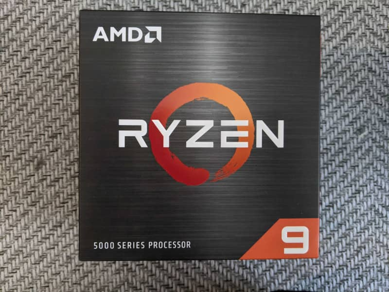
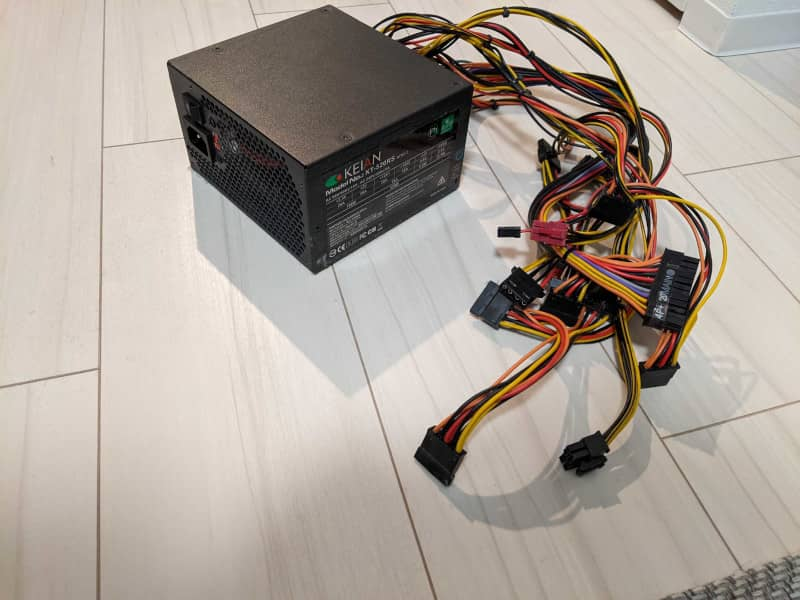

こんにちは。最近、初めて海老チリ作りに挑戦した k-so16 です。チリソースの色こそちょっと暗めでしたが、味は満足出来るものが作れました (笑)

この記事を今読まれているあなた、 **自作 PC** に興味がおありですね? いらっしゃいませ!

筆者は大学 2 年次の夏休みに自作 PC 初デビューをしました。自作 PC について調べて、パーツを購入して、組み立てて電源を入れる **高揚感** は今も鮮明に覚えています。最初組み立てて電源がつかないトラブルに見舞われ、焦燥感に駆られて PC ショップに駆け込んだのも今では良い思い出です(笑)

初めて自作 PC を組み立ててから約 6 年が経ち、そろそろパーツを買い換えようと思い立ちました。初めて組み立てた時と同じように、パーツの検討段階から高揚感が湧き上がっていました。さながら少年に戻ったような気分でした(笑)

本記事と次回記事で **自作 PC の面白さ** を紹介します。自作 PC をどのように始めると挑戦しやすいかについても、筆者の経験をもとに紹介していきます。今回は **PC パーツの概要** についてと **パーツ構成の検討** について説明します。

本記事で想定する読者層は以下の通りです。

- 自作 PC を始めてみたい方
- 自作 PC に挑戦したいけれど決心がつかない方

## 自作 PC のメリット

まず、自作 PC のメリットを考えてみましょう。市販でも様々なスペックの PC は売られていますが、 **自作 PC の方が有利な点** や **自作 PC でしか得られない利点** を以下に列挙してみました。

- 目的などに応じてパーツを **自分好みにカスタムできる**
    - 動画編集やゲーム、 3D モデリングなど **目的に特化した PC** を自分で組み立てられる
- **長期的なコスト** を下げられる (かもしれない)
    - PC を丸ごと買い換えなくても **必要な部品だけ交換すれば良い** のでコストが下がる
    - **愛着がわく** ので長く使うために大切に扱うようになる (はず)
- **PC 内部の知識** がつく
    - **PC がどのような部品で構成されているか** や **各部品がどういった役割を持っているか** を知る機会になる
- **話のネタ** になる (かもしれない)
    - 他人に **自慢** できる
    - 自作 PC を組んだことのある人との **談義が弾む** (かもしれない)
- **達成感** が得られる
    - 自分で PC を組み立てたという **満足感** が得られる

筆者の組み立てた PC は約 6 年が経ちますが、ハイスペックなマシンパワーを要求するアプリケーションでなければ **現役** で十分動かせそうです。ぜひとも **サブマシン** としての活路を見出したいところです。

## 自作 PC の始め方

自作 PC に興味はあるけれど何から始めたら良いか分からないという方も少なくないと思います。筆者が自作 PC を始める時は **[ムック本](https://www.amazon.co.jp/%E8%87%AA%E4%BD%9CPC%E3%83%90%E3%82%A4%E3%83%96%E3%83%AB2014-100-%E3%83%A0%E3%83%83%E3%82%AF%E3%82%B7%E3%83%AA%E3%83%BC%E3%82%BA/dp/4863919514)** を本屋さんで 1 冊購入しました。どのムック本が自分にピッタリ合いそうかは本屋さんで流し読みして決めるのが良いでしょう。

今の時代ならインターネットで調べるという手もありますが、筆者はムック本などの **書籍** をオススメします。情報源に書籍をオススメする理由を以下に列挙します。

- インターネットに比べて書籍の方が自分に合いそうな **情報源が絞り込みやすい**
    - インターネットは **情報量が非常に多い** ので初心者が情報源を絞り込むのは少しハードルが高い
- 出版社を通すので内容のチェックが入る分 **情報の正確性** は高い
    - インターネットの記事には内容のチェックがされていない記事も混在する

### 主な使用用途を決める

自作 PC を組み立てる場合も、市販の PC を買う時と同様に **主な使用用途** を決めておくと良いです。たとえ **主な目的が自作 PC を組むこと** であっても、使用用途によってパーツ構成が変わってくるので、組んだ後、主にどのように使いたいかを考えておきましょう。

使用用途の例を以下に列挙します。

- 快適な開発環境を整える
- ゲーミング PC を組み立てる
- 画像や動画編集に最適な環境を整える
- [MATLAB](https://jp.mathworks.com/products/matlab.html) などを使った数値計算を高速に行いたい
- コストを抑えつつ快適にインターネットのコンテンツを楽しめる PC を組み立てる

### PC のパーツについて知る

PC を組み立てる上で、 **PC のパーツについての知識** は必要不可欠です。 PC のパーツについての知識がないと正しく組み立てられなかったり、故障や破損の原因にも繋がりかねません。事前に **予習** して理解することが重要です。

本節では、主要なパーツの概要について説明します。

#### マザーボード

PC の基盤となるパーツです。後述する CPU やメモリなどのパーツはマザーボードに取り付けます。

マザーボードを選ぶ際には、 **どの規格に対応しているか** をしっかり確認する必要があります。間違った規格の物を選んでしまうと、マザーボードをケースに取り付けられなかったり、パーツをマザーボードに取り付けられないといったことが起こるので **慎重に選ぶ** 必要があります。

基本的には取り付けたいパーツの規格に合ったマザーボードを選ぶのが無難でしょう。また、 PC ケースはマザーボードのサイズの規格に合うものを購入しないと取り付けられないので、その点も注意が必要です。

マザーボードの選択する主な基準は以下の通りです。

- CPU のソケット
    - Intel 製 CPU
        - LGA1200, LGA 775 など
    - AMD 製 CPU
        - AM4, AM3 など
- メモリの規格
    - DDR4
    - DDR3
- マザーボードのサイズ
    - ATX
    - micro ATX
    - mini ITX

#### CPU

PC の頭脳と例えられるパーツで、 **コンピューターの命令を処理** します。一般的には CPU の性能が良いほど、処理が速くなります。

CPU のメーカーとして、 **[Intel](https://www.intel.co.jp/content/www/jp/ja/homepage.html)** の名前を知らない方はほとんどいないと思います。最近は **[AMD](https://www.amd.com/ja)** というメーカーが発売している **[Ryzen](https://www.amd.com/ja/processors/ryzen)** という CPU も注目されています。

マザーボードでの説明でも述べたように、取り付けたい CPU のソケットがマザーボードに対応しているか確認する必要があります。 CPU を中心として組み立てる場合は、 **CPU ソケットに対応するマザーボード** を選ぶ必要があります。

#### メモリ

メモリは **実行中のプログラムや状態を一時的に記憶** しておくためのパーツです。 PC の電源を落とすとメモリに保存されていたデータは失われるので、 **揮発性メモリ** と呼ばれます。後述する HDD や SSD は電源を落としてもデータが保持されるので、 **不揮発性メモリ** と呼ばれます。

メモリは HDD や SSD に比べて **高速に CPU とデータのやり取り** ができるので、メモリの容量が大きければ処理速度が改善する可能性があります。逆にメモリの容量が小さいと、メモリで保持しきれないデータを HDD や SSD に一時的に保存する **スワップ** という処理が起こり、処理が遅くなる場合があります。

メモリにも規格があり、異なる規格のメモリはマザーボードに取り付けられないので注意が必要です。本記事の執筆時点(2020 年 12 月現在)では **DDR4** という規格が最新ですが、 1 世代前の **DDR3** とは **互換性がない** のでメモリやマザーボードは慎重に選びましょう。

#### HDD / SSD

前述のメモリは電源を落とすと記憶されていた内容が消えてしまいます。電源を切っても残すデータは **HDD** (Hard Disk Drive) や **SSD** (Solid State Drive) と呼ばれるパーツに保存されます。

HDD も SSD も不揮発性メモリという役割は同じなのですが、それぞれメリットとデメリットがあります。

- HDD
    - メリット
        - 容量単価が非常に安価
        - 容量の大きい HDD を手軽に入手できる
    - デメリット
        - 読み書きの速度が低速
        - 衝撃に対して弱い
- SSD
    - メリット
        - 読み書きの速度が高速
        - 衝撃に強い
    - デメリット
        - 容量単価が高い
        - 書き込み回数が多くなると寿命が近くなる

SSD と HDD のそれぞれの利点を補いあって利用する方法もあります。例えば、 OS の起動に必要なデータは SSD に保管して、画像や音楽、その他インターネットからダウンロードしたデータなどは HDD に保存するといった使い方が考えられます。このような構成にすると、 OS が速く立ち上がり、かつ大容量のデータ保存領域を安価に実現できます。

#### グラフィックボード

グラフィックボードは文字通り **グラフィックの処理** に特化したパーツです。 CPU にグラフィック処理を行う機能 (**GPU**) が搭載されていれば必ずしも必要なパーツではありませんが、 AMD の CPU は **GPU が搭載されていない** ものもあり、その場合は画面に映像を映すためにグラフィックボードが必要になります。

GPU が搭載されている CPU を使用していてもグラフィックボードを搭載する理由は、 **グラフィックの処理を高速化** させる場合が一般的です。どうしても CPU に搭載されている GPU では処理能力が足りず、グラフィックの描画処理などが重くなりがちです PC の主な使用用途が VR のゲームのような **3D モデルを利用したゲーム** や **3D モデルの開発** などの場合はグラフィックボードの購入を検討すると良いでしょう。

余談ですが、一時期ビットコインなどの **仮想通貨のマイニング処理** を行うためにグラフィックボードの需要が高まり、手に入りづらいということもありました。 GPU をグラフィック処理以外の目的で使う場合もあるようです。

#### OS

**OS** は PC を動かす上でなくてはならない存在です。 OS がないと、せっかく PC を組み立てても使用目的を達成できません。ブラウザや開発環境などのアプリケーションを使うには、当然 OS が必要です。

本記事を読んでいる読者の方々は **Windows** という OS を聞いたことがあるでしょう。 PC でブラウザを使ったり開発環境を起動する前には、必ず Windows などの OS を立ち上げる必要があります。 OS を立ち上げるためには、 PC に **OS をインストール** する必要があります。

世間一般的には Windows が主流だと思いますが、その他の OS を自作 PC にインストールすることも可能です。 **Linux** や **FreeBSD** といった OS を好んで利用している方々は、それぞれの OS のブータブルメディアを作ればインストールすることができます。

以下に自作 PC にインストール可能な OS の例を列挙します。

- Windows
- Linux
    - Ubuntu
    - CentOS
- FreeBSD

基本的には **Windows** のライセンスを購入することをオススメします。非常に多くのソフトウェアが Windows に対応しているので、様々な使用用途に対応できます。ライセンスの種類もいくつかあるので、 **目的** に合わせて検討すると良いでしょう。

> [Windows 10 - Microsoft Store 日本](https://www.microsoft.com/ja-jp/store/b/windows)

余談ですが、 **macOS** はライセンスの関係上 Apple のハードウェア上か仮想マシン上でないと動かすことができないようです。残念ながら自作 PC 上で直接 macOS を動かすことはできなさそうです。

#### その他のパーツ

上記に挙げたパーツ以外にも必要なパーツやカスタムできるパーツなどを紹介します。すべてを挙げると長くなるので、ここでは **電源ユニット** 、 **ケース** 、 **CPU クーラー** について簡単に説明します。

- **電源ユニット**

    PC を動かすには当然 **電源** が必要です。製品によって **電力** が異なるので、 **パーツ構成に必要な電力** を満たすものを選びましょう。

- **ケース**

    **自分好みの外見のケースを選べる** のも自作 PC の醍醐味の 1 つです。ただし、 **マザーボードのサイズ** に合ったケースでないと、マザーボードがケースに取り付けられないので注意が必要です。また、 CPU クーラーやグラフィックボードが収まるサイズかを調べることも重要です。

- **CPU クーラー**

    CPU に付属していることが多い CPU ファンですが、 **より高い冷却能力** が必要な場合は CPU ファンを購入して取り付けることも可能です。また、AMD 製の CPU の中には **CPU ファンが付属していない** ものもあるので、その場合は購入が必須です。

### 組み込むパーツの構成を決める

PC の各パーツについての役割などを一通り理解したら、 **パーツ構成** を考えていきましょう。パーツ構成を考えるのも自作 PC を組み立てる醍醐味の 1 つです。

初心者の方はパーツ構成を考えたら、すぐに購入するのではなく、 **[ドスパラ](https://www.dospara.co.jp/)** や **[ソフマップ](https://www.sofmap.com/)** などの **PC ショップ** で使用目的や予算などを伝えた上で相談すると良いでしょう。というのも、 **パーツの相性** で動作が安定しなかったり、最悪動作しないという可能性が少なからずあるので、店頭で直接相談することが好ましいです。

以下の順序でパーツの構成を検討すると決めやすいでしょう。

1. 主な使用用途を満たすための中心となるパーツを決める
    - 搭載したい CPU やメモリの容量を決める
    - 使用してみたいマザーボードを中心に決める
1. 1 で決めたパーツ構成の規格などに依存するパーツを決める
    - CPU やメモリを決めたらマザーボードを決める
    - マザーボードが決まったらサイズに合うケースを決める
1. その他必要なパーツの候補を検討する

## まとめ

本記事のまとめは以下の通りです。

- 自作 PC のメリットの説明
- 各 PC パーツの概要について説明
- パーツ構成の検討方法について説明

以上、 k-so16 でした。次回記事では **組み立ての流れ** について説明します。ぜひ次回もお楽しみに!