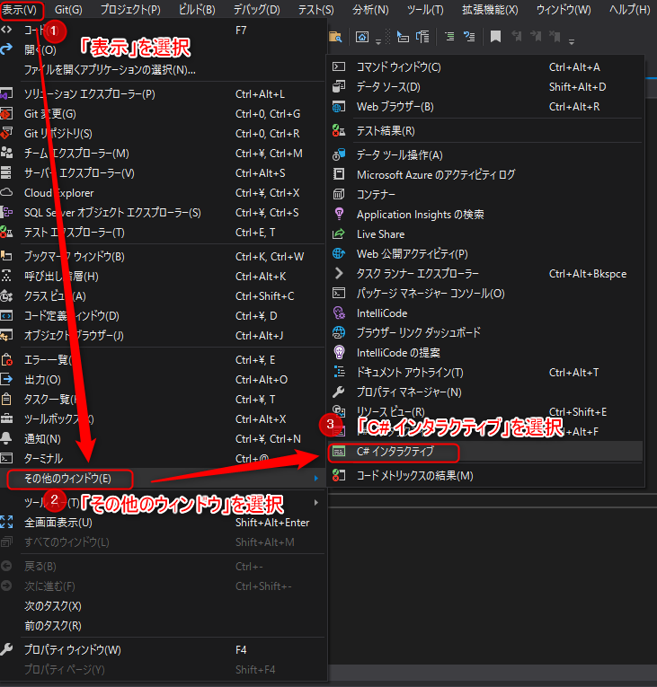
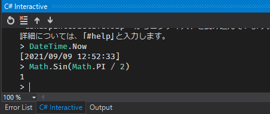
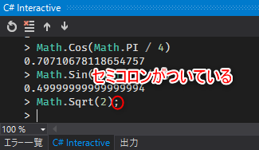
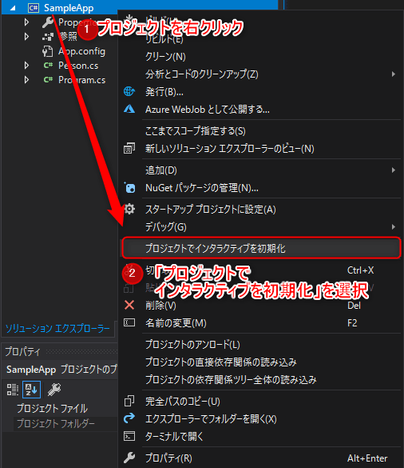
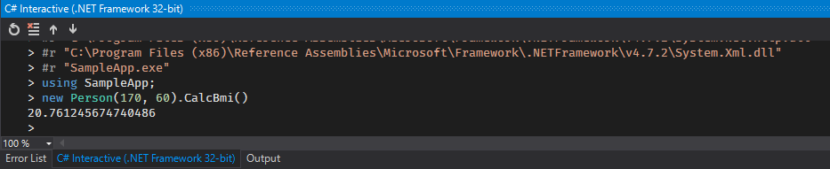

こんにちは。最近、 [T-fal](https://www.t-fal.co.jp/products/pots-pans/stackable/ingenio_royalblue_intense/) のフライパンを購入した k-so16 です。フライパンを買い替えて快適な自炊ライフを手に入れました(笑)

Visual Studio には C# の式や文をインタプリタ上で実行できる **C# Interactive** が存在します。 C# の式の評価結果がどうなるか確認したいときに、わざわざコンパイルをしなくても C# Interactive を利用すれば **結果を即座に確認** できます。

標準ライブラリの動作だけでなく、自作クラスのメソッドの実行結果についても C# Interactive で確認できれば、簡易的なデバッグができて非常に便利です。本記事では **C# Interactive に自作クラスを読み込んで利用する方法** を紹介します。

本記事で想定する読者層は以下の通りです。

- C# の基礎知識を有している
- Visual Studio の基本的な使い方を知っている

## C# Interactive とは

C# Interactive は与えられた C# の式や文を **インタプリタ上で実行** する機能です。 C# Interactive は Visual Studio の **表示** → **その他のウィンドウ** → **C# インタラクティブ** を選択すると起動します。

C# Interactive に式を与えると、`Console.WriteLine()` などの出力メソッドを利用しなくても評価結果が出力されます。

C# Interactive でメソッドの実行結果の動作を確認する際には少し注意が必要です。メソッドの末尾にセミコロン (`;`) をうっかり付けてしまうと、文として評価され、 **C# Interactive 上に評価結果が表示されません。** C# Interactive では文も実行できますが、その際には出力したい評価式を `Console.WriteLine()` などの出力用メソッドの引数に渡す必要があります。

## C# Interactive で自作クラスを読み込む方法

プロジェクト内で作成したクラスを C# Interactive で利用するには、 C# Interactive に使用したいクラスを含むプロジェクトを読み込ませます。C# Interactive にプロジェクトを読み込ませて起動させる手順は次の通りです。

1. ソリューションエクスプローラー上でプロジェクトを右クリック
1. **プロジェクトでインタラクティブを初期化** をクリック

C# Interactive が起動したら、自作クラスのメソッドなどが利用できるようになっているはずです。以下は自作の Person クラスの `CalcBmi()` を C# Interactive で起動した例です。

### 注意点

プロジェクトでインタラクティブを初期化のオプションは **.NET Framework のみ** でしか動作せず、 **.NET Core には非対応** のようです。便利な機能なので、 .NET Core でも利用できるようになってほしいものです。

> [&quot;Initialize interactive with Project&quot; is missing for .Net Core Projects in Visual Studio 2019 - Stack Overflow](https://stackoverflow.com/questions/56042332/initialize-interactive-with-project-is-missing-for-net-core-projects-in-visua)

## まとめ

本記事のまとめは以下の通りです。

- C# Interactive の基本的な使い方を紹介
- C# Interactive で自作クラスを読み込む方法を紹介
    - プロジェクトでインタラクティブを初期化を選択

以上、 k-so16 でした。本記事で読者の方々の Visual Studio ライフが少し豊かになればと思います。