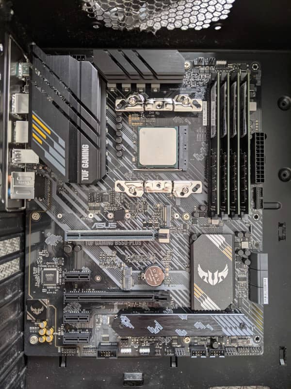
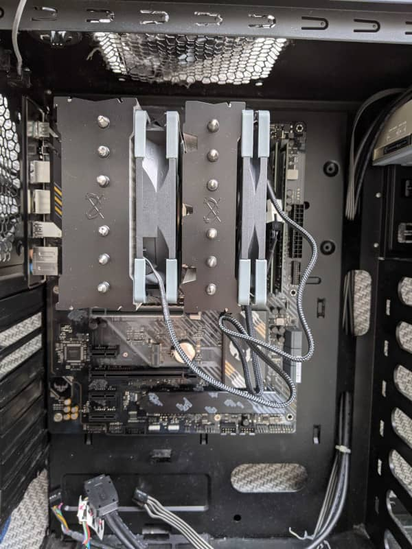
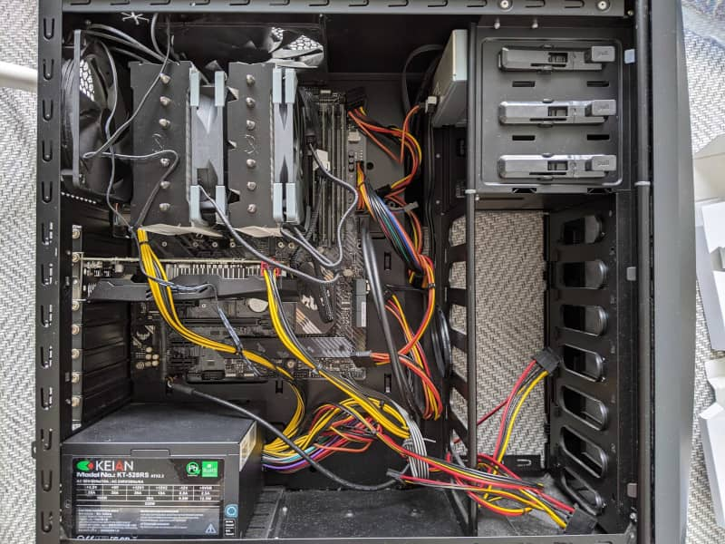

こんにちは。最近、シュークリーム作りに挑戦した k-so16 です。流石に作るのが難しいお菓子なので、残念ながら大失敗してしまいました(笑)

[前回の記事](home-built-pc-parts) に引き続き **自作 PCの面白さ** について紹介します。本記事ではいよいよ **PC の組み立て** の流れについて紹介します。

本記事では組み立ての **おおまかな流れ** の記載にとどめています。より詳細な組み立て作業については、前回の記事で述べたように、 **書籍** などを参考にすると良いでしょう。

## 組み立てに必要なもの

自作 PC を組み立てる上で **最低限必要なもの** は、 **プラスドライバー** です。もっと色々な工具が必要そうに思えますが、基本的にはプラスドライバーがあれば組み立てられます。場合によっては特殊な工具が必要になる可能性もありますが、パーツと一緒に簡易的な工具も付属することが多いので、よほどのことがなければ新たに工具を買い揃える必要はないでしょう。

利用するプラスドライバーは、先端が **磁石** になっているものを使うと非常に便利です。磁力でパーツが壊れないか不安になるかもしれませんが、工具の磁力程度ならまず問題ないでしょう。磁力より **静電気** の方が故障に繋がりやすいので、組み立てる際は **静電気の溜まりにくい服装** が好ましいです。

## 組み立ての流れ

この節では、 PC の組立作業の大まかな流れを、写真とともに説明します。パーツによって細かな配線の違いなどがありますので、実際に組み立てる際には必ず **取扱説明書** を **熟読** した上で作業してください。

1. ケースにマザーボードを取り付ける

    ケースの受けネジ (**六角スペーサー** 写真 ○ 部分) とマザーボードの固定用の穴の位置を合わせて、マザーボードに付属している固定用のネジでしっかりマザーボードをケースに取り付けます。ケースのファンが邪魔な場合、取り外せそうなら取り外してから作業しても良いでしょう。

    ")

1. CPU を取り付ける

    マザーボードを取り付けたら、 **CPU ソケット** (写真 □ 部分) に CPU を取り付けます。取り付ける **向き** が決まっていますので、マザーボードの **取扱説明書** に従って取り付けてください。誤った向きで無理やり差し込むと **故障** につながるおそれがあります。

    ")

    また、 CPU や CPU ソケットの **ピン** が曲がったり折れたりしてしまうと **正常に起動しなくなる** 可能性がありますので、慎重に取り扱いましょう。

1. メモリを取り付ける

    CPU を取り付けたら、 CPU ファンを取り付ける前にメモリを取りつけると作業がしやすいでしょう。マザーボードの **取扱説明書** に従って、 **メモリスロット** (写真 □ 部分) にメモリを差し込みます。メモリも差し込む **向き** がありますので、必ず正しい向きで差し込むようにしましょう。

    ")

    メモリを扱う際には特に静電気に気をつけましょう。静電気がメモリに流れてしまうとメモリが故障するおそれがあります。必ず金属にふれるなどして **電気を逃した** あと、メモリの取り付け作業に取り掛かりましょう。

    CPU とメモリをマザーボードに取り付けると次の写真のようになります。 CPU やメモリがしっかり差し込まれていて、浮き上がっていないかなどを確認しましょう。

    

1. CPU ファンを取り付ける

    CPU とメモリを取り付けたら、 CPU ファンを取り付けます。 **CPU に付属しているファン** の場合、 **CPU の説明書** を、 **CPU ファンを別で購入** した場合は **付属の説明書** に従って取り付けます。

    

    なお、ファンの種類によってはマザーボードのケースを取り付ける前に一部の固定用の金具などを先に装着した方が作業がしやすい場合があります。各パーツの取扱説明書を先に読んで作業順序を考えると作業しやすいでしょう。

1. 電源やケースの配線をする

    CPU ファンの取り付けが終わったら、電源やケースの線をマザーボードに配線します。配線場所を間違えないように **マザーボード** や **電源ユニット**、**ケース** の **取扱説明書** をしっかり読んで作業しましょう。

    

   写真は配線を整える前の状態なので美しくありませんが、問題なく起動までたどり着けたら **配線を綺麗に整える** と良いでしょう。美的センスが問われますね(笑)

1. SSD やグラフィックボードなどその他のパーツを取り付ける

    電源とケースの配線が終わったら、 SSD やグラフィックボードなどの **その他のパーツ** を取り付けます。筆者は組み立てやすさの関係上、先にグラフィックボード (配線後の写真 CPU ファンの下部分) を取り付けています。状況に応じて組み立てる順序を工夫してみましょう。

## 電源投入とトラブルの対処

組み立て終わったら、キーボードとマウス、モニターを接続して電源を入れてみましょう。 **BIOS** または **UEFI** の画面が立ち上がったら OS のインストール作業に移りましょう。基本的にインストール用の CD-ROM や USB などの起動メディアがささっていれば **自動的にインストーラーなどが立ち上がる** はずです。

正常に BIOS や UEFI の画面に辿り着かなかった場合、すぐに初期不良を疑うのではなく、 **ケアレスミス** をしていないか確認しましょう。以下に動作不良の例と確認事項を簡単に列挙します。

- **電源がつかない**
    - 電源が **コンセントにつながっている** か
    - **電源ユニットのスイッチが ON** に倒れているか
    - マザーボードと電源およびケースの **配線間違い** はないか
- **電源はつくがファンが回らない**
    - ファンはマザーボードに **正しく配線されている** か
    - ファンに **ケーブルが引っかかっていない** か
- **電源はつくが画面に何も映らない**
    - **モニターの電源が ON** になっているか
    - モニターと PC が **ケーブルで繋がっている** か
    - CPU やメモリがマザーボードに **しっかり差し込まれている** か
    - メモリを複数挿している場合は **1 枚だけ** スロットに挿して起動するか

電源がついてファンは回っているのに画面が映らない場合、エラーを目で確認できず、特に原因の特定が困難です。マザーボードによっては CPU やメモリになんらかの問題が生じている場合、 **LED の点灯** によってエラーを知らせる機能を持つものもあります。マザーボードがハードウェア的にエラーを知らせる機能を持っているか、 **取扱説明書** を確認すると良いでしょう。

動作不良に対して一通り対処を試みた上でも解決しない場合、購入した PC ショップに相談に行くと良いでしょう。 **トラブルの内容** と、 **試みた対処の結果** を店員に伝えるとよりスムーズに調査が進むと思います。

### 実際のトラブル例

筆者自身も自作 PC を組み立てたり、パーツを交換する上でいくつかトラブルに見舞われました。実際に筆者が遭遇したトラブルの事例について紹介します。

- **電源ボタンを押しても起動しない**
    
    初めて自作 PC を組み立てて、期待に胸を膨らませながら電源ボタンを押すも、無情にも PC は起動しませんでした。 **コンセントも電源ユニットのスイッチが ON になっている** ことも確認し、 **配線が間違っていない** ことも確認しても状況は変わりませんでした。なんとなく **電源ボタンを押した際の手応えがない** と感じていましたが、当時はあまりよく分からなかったので、パーツを購入した PC ショップで診てもらうことにしました。

    - 原因: 電源ボタンの感圧スイッチが奥に入り込んでしまった

        ディスクドライブを取り付ける際にスイッチがケース奥側に入り込んでしまって電源がつかなくなっていました。電源ボタンの手応えが感じられない原因がまさにこれでした。

    - 解決方法: PC ショップに持っていって直してもらった

        めり込んだスイッチを直してもらい、無事電源が立ち上がり、電源ボタンを押した際の手応えも戻ってきました。

- **メモリを正しく読み込めず UEFI が起動しない** (マザーボード交換時 1 回目)
    
    マザーボード、 CPU, メモリを新調してパーツ交換をしたのですが、電源を入れると CPU ファンは回れど画面に何も映りませんでした。しばらく原因が分からなかったのですが、マザーボードの取扱説明書を読んでみると、 **POST** (Power On Self Test) でエラーが発生した際に、 **マザーボードの LED が点灯** して何が原因で起動しないかを知る手段が用意されていることが分かりました。実際にマザーボードの LED を見てみると、 **メモリの読み込み** に問題があるようでした。

    - 試したこと
        - メモリを **1 枚だけ** スロットに挿した状態で起動を試みる

            いずれのスロットに メモリを 1 枚だけ挿しても起動しませんでした。複数枚メモリを購入していたので、それぞれのメモリを 1 枚だけ挿し替えても解決しませんでした。

        - CPU を挿し直して起動を試みる

            POST エラーはメモリを示していたのですが、インターネットで調べてみるとメモリではなく CPU を挿し直すと解決することもあるという情報を見つけたので、ダメ元で試してみました。残念ながら解決はしませんでした。

    - 推測される原因: CPU ソケットにグリスが入り込んでしまった

        PC ショップに持っていって診てもらった結果、 **CPU グリスの塗りすぎ** によってグリスがはみ出し、マザーボードの CPU ソケットにも入り込んでしまって CPU のピンがマザーボードと **適切に通電していなかった** のが原因のようとのことでした。

    - 解決方法: CPU は **工業用アルコール** でグリスを慎重に取り除いてマザーボードは買い直し

        CPU のピンに付着した CPU グリスは工業用アルコールで取り除けば動作するようになるかもしれないと PC ショップの店員さんにアドバイスをもらいましたが、マザーボードの方は取り除くのは難しそうだと言われました。仕方ないのでマザーボードは買い直すことにしました。痛い出費でした...

    - その他

        使う CPU の関係上 **BIOS のアップデート** が必要だったので、グリスの塗りすぎ関係なく起動トラブルは起きる運命だったようです...

        - マザーボード: [ASUS PRIME B550-PLUS](https://www.asus.com/jp/Motherboards/PRIME-B550-PLUS/) (Amazon で購入)
        - CPU: [AMD Ryzen 9 5950X](https://www.amd.com/ja/products/cpu/amd-ryzen-9-5950x) (Amazon で購入)

        マザーボードを潰したと分かったその日はずっと凹んでました (T_T)

- **メモリを正しく読み込めず UEFI が起動しない** (マザーボード交換時 2 回目)

    マザーボードをダメにしてずっと落ち込んでいるわけにもいかないので、 PC ショップで買い直しに行きました。今度こそ問題なく立ち上がるだろうと思ったら、再び POST エラーが発生してしましました。この時点で既に心が折れかけていました(笑)

    - 試したこと

        - メモリを **1 枚だけ** スロットに挿した状態で起動を試みる

            やっと UEFI の画面を拝むことができ、自室には安堵の声が広がりました(笑) この時点で最低限の動作環境が確保できました。

        - メモリを **2 枚** スロットに挿して起動を試みる

            再び UEFI の画面が表示されました。メモリも 2 枚認識されていることも確認できました。

        - メモリを **4 枚** スロットに挿して起動を試みる

            残りの 2 枚の対を挿すと起動しませんでした。この時点でメモリの故障かマザーボードのメモリスロットの初期不良を疑い始めました。

        - 同じスロットにメモリをそれぞれ挿して **いずれかのメモリが壊れているか調べる**

            4 枚すべてのメモリについて、動作するスロットに差し込んで起動を確認すると、 **どのメモリも壊れていない** ことが分かりました。

        - メモリを **3 枚** スロットに挿して起動を試みる

            メモリを挿すスロットの組み合わせを変えて試したところ、 **起動する組み合わせ** と **起動しない組み合わせ** を見つけられました。つまり、 **挿すと起動しなくなるスロット** が見つかりました。

        -  **不良と思われるスロットだけにメモリを挿して** 起動を試みる

            **POST エラーが発生** して起動しませんでした。 **マザーボードの初期不良** が疑われたので PC ショップに持ち込むことに決めました。

    - 推測される原因: マザーボードとメモリの **相性問題**

        マザーボードを購入した PC ショップで診てもらったところ、マザーボードとメモリの **相性問題** と推測されることが分かりました。 **他のメーカーのメモリを 4 枚**、マザーボードの全スロットに挿した状態では問題なく起動できることが確認できたので、マザーボードのメモリスロットが潰れているわけでもなかったようです。

        - マザーボード: [ASUS TUF GAMING B550-PLUS](https://www.asus.com/jp/Motherboards/TUF-GAMING-B550-PLUS/) (PC ショップで購入)
        - メモリ: [PATRIOT DDR4 32GB 3200MHz](https://info.patriotmemory.com/patriot-signature-line-ddr4-computer-memory) (Amazon で購入)

    - 解決方法: **未解決**

        ひとまず購入したメモリでも 3 スロットは問題なく認識できたので、 96GB で **妥協** しました。 **ロマン** を追い求めて **メモリ 128GB 搭載のマシン** を実現してみたかったですが、使う分には 96 GB でも十分すぎるほどなので、完璧な解決はせず妥協することにしました。

    - その他

        昔に比べて現在の自作 PC はパーツの相性問題は起こりづらいと聞いたことがありますが、まさか自分が相性問題に遭遇するとは思いませんでした。 **パーツの相性の確認** は大切ですね (^^;)

        BIOS のバージョンを上げたら解決する **かもしれない** とのアドバイスも PC ショップの店員さんからいただいたので、調査してみて有効そうなら試したいと思います。

- **既設の SSD にインストールされている Windows 10 が起動しない** (マザーボード交換後)

    マザーボードと CPU を交換したので、 OS が問題なく立ち上がるか少々不安もありつつ、なんだかんだ Windows なら起動するだろうと思っていましたが、困ったことに起動しませんでした。ディスクは認識していること UEFI の画面でを確認していたので、原因を探ってみることにしました。

    - 原因: 既設の SSD のパーティションが **MBR** 形式になっていた

        Windows をインストールした時に使用していたマザーボードが **BIOS モード** で起動する設定になっており、 Windows 10 をインストールした際のパーティションが **MBR** 形式になっていました。交換後のマザーボードは **UEFI モード** なので、パーティションが **GPT** でないと起動しません。

    - 解決方法: Windows のコマンド **`mbr2gpt`** を使ってパーティションを **MBR から GPT 形式に変換** した

        Windows 10 のインストールメディアを起動し、コマンドプロンプトを開いて `mbr2gpt` を実行し、Windows 10 のインストールされているディスクドライブのパーティションを MBR から GPT 形式に変換しました。再起動後、無事既設の Windows 10 が問題なく立ち上がることが確認できました。

    - その他

        ひとまず起動できるようになったのは良いのですが、 MBR や GPT について知識が非常に浅いので、調査してしっかり理解をしたいと思います。

        今回はパーティションの形式を変換して解決しましたが、 UEFI の設定画面から BIOS モードで起動できるように設定を変更したら MBR のディスクも起動できるはずです。

        別の HDD にインストールしている Ubuntu は特にパーティションの形式を変換しなくても起動できました。交換後の起動直後はネットワークに繋がりませんでしたが、 NIC のドライバーを手動でインストールすることで解決しました。なぜ Ubuntu はパーティションの形式の変換が不要だったかについても調べてみたいと思います。

先ほども記述しましたが、正常に動作しない場合は何らかの組み立てミスをしていることが多いです。まずは原因が何かを探るために、問題を切り分けることが重要です。

## まとめ

本記事のまとめは以下の通りです。

- 自作 PC に必要なものを紹介
- パーツの組み立ての流れを説明
- 動作確認と問題と対処方法の例を紹介
- 実際のトラブルの事例と解決方法を紹介

以上、 k-so16 でした。前回記事とあわせてここまで読まれた読者のあなたは、おそらく既に自作 PC への挑戦に決心がついたかと思います。 **ようこそ、自作 PC の世界へ!**