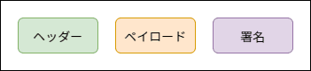

新年あけましておめでとうございます。 k-so16 です。本年も何卒よろしくお願いいたします。

Express で認証機能を実装する際には **[Passport](http://www.passportjs.org/)** が広く利用されています。Passport を利用した認証の実装例多くは **セッション** による認証なのですが、 **[JSON Web Tokens](https://jwt.io/)** (以降 JWT と表記) による認証を実現するにはどうすれば良いかを調べてみました。

本記事では Express で **JWT による API の認証機能の実現方法** について紹介します。なお、本記事のコード例では、 **ES6** の構文で記述しています。

本記事で想定する読者層は以下の通りです。

- Web の認証に関する基礎知識を有している
- Express および Passport の基礎知識を有している
- JWT の認証方式についての基礎知識を有している

## パッケージのインストール

Express で JWT 認証を実装するためには、以下のパッケージを導入します。本記事では、ログインに成功したら JWT のトークンを JSON 形式で返すことを想定します。

- [Passport](http://www.passportjs.org): Passport 本体
- [passport-local](http://www.passportjs.org/packages/passport-local/): ログインの実装に利用
- [passport-jwt](http://www.passportjs.org/packages/passport-jwt/): JWT の検証処理に利用
- [jsonwebtoken](https://github.com/auth0/node-jsonwebtoken): JWT のトークン生成に利用

## JWT による認証の流れ

まず、 JWT による認証の流れを確認します。ここでは、ログイン前の処理の流れと、ログイン中のユーザーの検証の流れについてそれぞれ説明します。

### ログインまでの流れ

JWT を用いた認証でも、ログイン時はセッションによる認証と同様にログインに必要な認証情報を **入力フォーム** や **API** などを介して送信します。ログインに成功すると、 **JWT のトークン** がサーバーから送信されます。ログイン状態を維持するためには **クライアント側で JWT のトークンを保持** する必要があります。

認証情報の送信から JWT のトークンの発行までの処理の流れは以下の通りです。

1. クライアントがログインに必要な認証情報を HTTP リクエストとして送信する
1. サーバーは受け取った認証情報が正しいか検証する
1. 認証情報が正しければ JWT を生成して HTTP レスポンスとして返す


JWT のトークンはヘッダー、ペイロード、電子署名をドット (`.`) で連結した文字列の構成になっています。 **電子署名** がトークンに含まれることで、トークンの内容が改ざんされてもサーバー側で **改ざんを検知** できます。



> [【JWT】 入門 - Qiita](https://qiita.com/Naoto9282/items/8427918564400968bd2b)

### ログイン中のユーザーの検証の流れ

ログイン後、クライアントはサーバーから JWT を受け取った JWT のトークンをサーバーに送信することでセッションによる認証同様にログイン状態を維持します。 JWT のトークンが正しく検証されれば、ログイン中のユーザーとして処理が実行されます。セッションによる認証と異なる点は、サーバーが **認証用のトークンを保持せず**、受信した JWT を検証してログイン中のユーザーを判別することです。

ログイン中のユーザーの検証処理の流れは以下の通りです。

1. クライアントは JWT のトークンを HTTP リクエストに付与して送信する
1. サーバーは 受け取った JWT を検証する
1. 検証した JWT が正しければ同一ユーザーとして処理を継続する


## JWT トークンによるログイン

ログイン処理を実装するには、次の 2 点を実装します。

1. ログインのリクエストを受け取る **ルーティング処理**
    - ミドルウェアに Passport の **`authenticate()`** を指定して認証処理を実行
1. 受け取ったユーザー名とパスワードの **認証処理**
    - Passport の `use()` メソッドに認証処理が定義された passport-local の **`Strategy`** のインスタンスを指定

以降では認証情報は **ユーザー名** (`username`) と **パスワード** (`password`) を受け取ることを想定します。

### ログイン処理のルーティングの定義

ログイン処理をするためには、 Express 側でログインのためのルーティングを設定しておく必要があります。ルーティングの設定自体は Express の通常のルーティングと同様に行います。

ログイン処理を行うには、 Passport の `authenticate()` メソッドをミドルウェアとして設定します。ログインに成功すると `Request` オブジェクトの **`user`** プロパティに認証されたユーザー情報が自動的に格納されます。

`authenticate()` メソッドの第 1 引数には、使用する `Strategy` のラベル文字列を指定します。このラベル文字列を設定することで、どの `Strategy` を使うかを指定できます。

第 2 引数にはオプションを指定できます。オプションの例は次の通りです。

- `session`: セッションの有効化を設定
- `successRedirect`: ログイン成功時のリダイレクト先
- `failureRedirect`: ログイン失敗時のリダイレクト先

本記事では、ログインに成功したら JWT のトークンを JSON 形式で返すことを想定しているので、 jsonwebtoken の **`sign()`** メソッドを用いて JWT トークンを求め、 JSON 形式でレスポンスを返却します。

`sign()` の第 1 引数には JWT のトークンにする対象のオブジェクトを指定します。第 2 引数はシークレット文字列を指定します。このシークレットは後述の **passport-jwt** の `Strategy` のオプションの **`secretOrKey` と一致** させます。

以下はログイン処理の実装例です。

```js
const router = express.Router();
router.post('/login',
  passport.authenticate('login', { session: false, failWithError: true }), // authenticate メソッドでログイン処理を実行する
  (req, res) => {
    const user = req.user; // ログインに成功したら req.user にユーザー情報が格納される
    const token = jwt.sign(user, 'secret'); // JWT トークンを作成する
    res.json({ token });
  },
  (err, req, res, next) => {
    if (err || !req.user) {
      res.status(401).send('Unauthorized');
    } else {
      next(err);
    }
  });
```

`authenticate()` のオプションで **`failWithError`** を指定すると、エラーハンドラーを独自で実装できるようです。ただし、 GitHub の Issue のコメントのみで、ドキュメントには記載されていないようです。

> [passport authenticate with support for XHR · Issue #126 · jaredhanson/passport](https://github.com/jaredhanson/passport/issues/126#issuecomment-32333163)

### ログイン処理の定義

ログイン処理を定義する場合には、 passport-local の `Strategy` を Passport の **`use()`** メソッドに指定します。 `use()` メソッドの第 1 引数にはルーティングのミドルウェアに指定した `authenticate()` メソッドの第 1 引数と同じ文字列を指定します。

第 2 引数には **passport-local** の **`Strategy` のインスタンス** を指定します。 基本的にはここで `Strategy` のインスタンスを生成します。

`Strategy` のコンストラクタの第 1 引数はオプションを指定できます。設定できるオプションの例は次の通りです。

- `usernameField`: ユーザー名のフィールド名
    - デフォルト値は `username`
- `passwordField`: パスワードのフィールド名
    - デフォルト値は `password`
- `passReqToCallback`: ログイン処理を定義するコールバック関数で `Request` オブジェクトを取得するか設定
    - `true` の場合、コールバック関数の第 1 引数に `Request` オブジェクトを受け取る

第 2 引数は認証処理を定義したコールバックを指定します。コールバックの引数には **ユーザー名** (`username`) 、 **パスワード** (`password`) 、次の処理に移るための **コールバック関数** (`done`) を指定します。 `passReqToCallback` を有効にした場合は、第 1 引数に **`Request` オブジェクト** (`req`) を指定します。 

`done()` の第 2 引数にデータを渡すと、 `Request` オブジェクトの **`user`** プロパティに追加されるので、必要なユーザー情報を設定しましょう。また、認証が失敗した場合は第 2 引数に **`false`** を指定します。また、独自のエラーメッセージを追加したい場合は、第 3 引数に `message` プロパティを持つオブジェクトを指定します。

第 1 引数には基本的に `null` を指定します。 Passport のドキュメントによると、データベースに接続できないなどの **サーバーエラー** が発生した場合、第 1 引数に `Error` オブジェクトを受け取って処理すべきであり、通常の認証の失敗はサーバーエラーではないので `null` を指定することが推奨されています。

```js
const LocalStrategy = passportLocal.Strategy;
passport.use('login', new LocalStrategy({
  session: false,
  passReqToCallback: true,
}, async(req, username, password, done) => {
  // ユーザーを取得
  const user = await User.findOne({ where: { username } });
  // ユーザー名とパスワードを検証
  if (username === user?.username && password === user?.password) {
    const { id, username, name } = user;
    done(null, { id, username, name });
  } else {
    done(null, false, { message: 'ユーザー名またはパスワードが違います。' });
  }
});
```

## JWT トークンの検証

JWT による認証ではセッションを張らず、またサーバー側でトークンを保持しないので、 **HTTP リクエストで送られる JWT のトークンを検証** することでログイン中のユーザーを検証します。  **passport-jwt** を利用することで、受信した JWT トークンを検証し、ログイン中のユーザーであるかを判定できます。

passport-jwt を利用する際もログイン同様に、 Passport の **`use()`** メソッドに **passport-jwt** の **`Strategy` のインスタンス** を渡します。

passport-jwt の `Strategy` も passport-local 同様に、第 1 引数にオプションが指定できます。

- `secretOrKey`: シークレット文字列を指定
    - 前述の jsonwebtoken の `sign()` メソッドの第 2 引数と同じ値を設定
- `jwtFromRequest`: JWT をリクエストから取得する方法を指定
    - Bearer トークンから取得する場合は passport-jwt の **`ExtractJwt.fromAuthHeaderAsBearerToken()`** メソッドを利用

第 2 引数には **検証処理を定義したコールバック関数** を指定します。コールバック関数の第 1 引数には **JWT からデコードされたデータのオブジェクト** (`jwtPayload`) が、第 2 引数には 次の処理に移るためのコールバック関数 (`done`) が格納されます。 `done()` は **ログイン処理と同様の方法で使用** します。

```js
import passport from 'passport';
import passportJwt from 'passport-jwt';

const JwtStrategy = passportJwt.Strategy;
const ExtractJwt = passportJwt.ExtractJwt;
passport.use('verify', new JwtStrategy({
  secretOrKey: 'secret',
  jwtFromRequest: ExtractJwt.fromAuthHeaderAsBearerToken(), // JWT を Bearer トークンとして認証する
}, (jwtPayload, done) => {
  // JWT からデコードされたデータを利用してログイン中のユーザーか検証
  const user = User.findById(jwtPayload.id);
  if (user) {
    done(null, user);
  } else {
    done(null, false);
  }
}));
```

## まとめ

本記事のまとめは以下の通りです。

- JWT 認証方法の概要を説明
- Express と Passport で JWT を用いた認証方法を説明
    - **passport-local** によるログイン処理を紹介
    - **passport-jwt** による認証中のユーザーの検証処理を紹介

以上、 k-so16 でした。 Express で JWT 認証を実装したいと思っている方々の助けになれば幸いです。