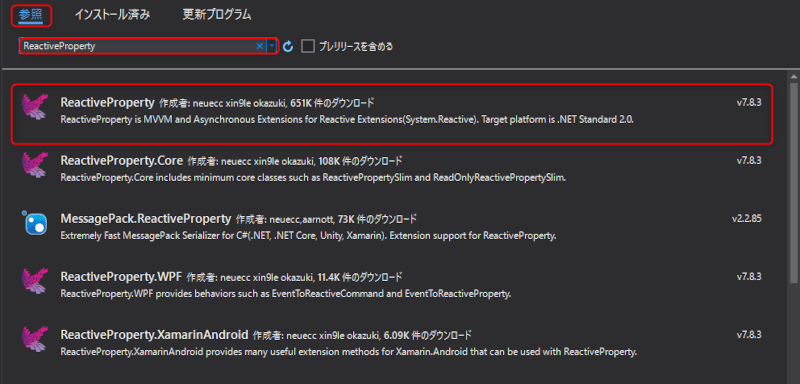

こんにちは。最近、 27 歳の誕生日を迎えた k-so16 です。 27 という数字は 3<sup>3</sup> と、底と指数ともに 3 で共通していて特別な数字だなと感じています(笑)

WPF を利用して Windows のプログラムの作成に取り組んでいるのですが、 UI コンポーネントとデータを **MVVM** のように制御したいと思い、 **[Reactive Property](https://github.com/runceel/ReactiveProperty)** を利用してみることにしました。

私自身、 WPF での開発経験がなく ReactiveProperty も初めて触ったので、 WPF の UI コンポーネントとデータをバインドするための基本的な書き方を把握するのも苦労しました。

本記事では、 WPF で ReactiveProperty を利用する基礎的な方法を紹介します。

本記事の想定する読者層は以下の通りです。

- C# の基礎的な知識を有している
- MVVM に関する基礎知識を有している
- WPF での開発経験がほとんどない

## 開発環境

本記事で想定する開発環境は以下の通りです。

- Visual Studio 2019
- .NET 5.0
- ReactiveProperty 7.8.3

## ReactiveProperty とは

ReactiveProperty は WPF において **MVVM** を実現するためのサードパーティ製のライブラリです。画面での変更をモデルに反映したり、逆にモデルの変更を検知して画面に反映するといった処理を簡単に記述できます。

MVVM のアーキテクチャを採用している有名なフレームワークに **[Vue.js](https://vuejs.org/)** があります。 Vue.js に馴染みのある方なら、 ReactiveProperty の便利さが容易に想像できることと思います。

## WPF プロジェクトの作成

Visual Studio から WPF のプロジェクトを作成する方法を説明します。

まず Visual Studio を開き、 **新しいプロジェクトの作成** を選択し、プロジェクトのテンプレート一覧から **WPF アプリケーション** を選択ます。


プロジェクト名やプロジェクトの保存先の設定画面に遷移したら、それぞれの項目について設定を行います。ソリューション名はプロジェクト名を入力すると自動的に入力されます。


追加情報は特に変更する必要はないので、 **作成** ボタンを押します。これで WPF プロジェクトの作成が完了します。


## ReactiveProperty のインストール

ソリューションエクスプローラーから、 **依存関係** を右クリックし、 **NuGet パッケージの管理** を選択します。


**参照** タブを選択し、 **ReactiveProperty** と検索してください。検索結果の一番上に **ReactiveProperty** と表示されるはずなので、それを選択してインストールします。特に事情がなければ最新版をインストールしましょう。




## View の編集

画面の UI の配置は **`MainWindow.xaml`** を編集します。 Visual Studio で `MainWindow.xaml` を開くと、上半分に画面のプレビューが、下半分に **XAML** と呼ばれる、ビューの UI の配置などを定義するための XML 形式の Markup が表示されます。


入力用の `TextBox` と出力用の `Label` をビューに配置してみましょう。 `MainWindow.xaml` の `Grid` の中を以下のように編集します。

```xml
<Grid>
  <Grid.RowDefinitions>
    <RowDefinition Height="*"/>
    <RowDefinition Height="*"/>
  </Grid.RowDefinitions>
  <TextBox Text="これは入力用の TextBox です。" Width="400" Height="40" Grid.Row="0"/>
  <Label Content="これは出力用の Label です。" Height="40" Width="400" Grid.Row="1"/>
</Grid>
```

画面のプレビューが以下の画像のように表示されるはずです。


デバッグ実行すると、実際に動作する際の画面が確認できます。


## ViewModel の作成

ビューとデータをバインドするための `ViewModel` クラスを作成します。本記事では `ViewModels` フォルダーを作成し、その中に `ViewModel` クラスを作成することとします。

作成手順は次の通りです。

1. **プロジェクトを右クリック** して「**追加**」を選択し「**新しいフォルダー**」を選択
    - フォルダー名を `ViewModels` として作成


1. **`ViewModels` フォルダーを右クリック** して「**追加**」を選択し「**クラス**」を選択


1. `ViewModel.cs` という名前で C# クラスファイルを作成


`ViewModel` クラスのファイルを作成したら、クラスファイルを選択して編集画面を開きます。 `ViewModel` クラスの作成の流れは次の通りです。

1. `ReactiveProperty<T>` のプロパティを作成
1. コンストラクタで `ReactiveProperty<T>` のインスタンスを設定
    - View や Model からデータを変更されるものは `ReactiveProperty<T>` のインスタンスを作成
    - あるデータの変更にあわせて値を再計算する場合は `ToReactiveProperty<T>()` メソッドを利用

実際にコード例を見てみましょう。以下のコードは入力フォームのデータを監視するための `InputValue` と、出力用のデータを監視するための `OutputValue` を設定した例です。

```cs
using Reactive.Bindings;

namespace MyFirstWpfApp.ViewModels
{
    class ViewModel
    {
        public ReactiveProperty<string> InputValue { get; }
        public ReactiveProperty<string> OutputValue { get; }

        public ViewModel()
        {
            InputValue = new ReactiveProperty<string>();
            OutputValue = InputValue.ToReactiveProperty();
        }
    }
}
```

`InputValue`, `OutputValue` ともに監視するデータ型は `string` なので、 `ReactiveProperty<string>` 型のプロパティとして宣言しています。

`InputValue` は **フォームの値が変更されたことを監視する** ために `ReactiveProperty<string>` のインスタンスをコンストラクタから生成しています。一方で、 `OutputValue` は `InputValue` のデータに依存して値を求めるので、 `InputValue` のインスタンスが持つ `ToReactiveProperty()` メソッドを利用しています。

上記の例では、 `OutputValue` のデータは `InputValue` のデータの値がそのまま反映されますが、なんらかの変換処理をはさみたい場合は、 `Select()` メソッドを利用します。 LINQ の `Select()` と同様に、引数にラムダ式を指定することで、任意の変換処理を実行した結果を求めることもできます。

```cs
OutputValue = InputValue.Select(x => x.ToUpper()).ToReactiveProperty();
```

## バインディングの設定

`ViewModel` クラスを作成したら、データとビューの **バインディング** を設定します。バインディングするためには、 `ViewModel` のインスタンスをビューのプロパティに設定し、ビューのプロパティに `ViewModel` クラスで定義した `ReactiveProperty` のプロパティをバインドします。

まず `ViewModel` のインスタンスをビューにバインドするために `MainWindow` クラスのコンストラクタで `DataContext` プロパティに `ViewModel` のインスタンスを設定します。 `MainWindow.xaml.cs` を以下にように編集します。

```cs
using MyFirstWpfApp.ViewModels;
using System.Windows;

namespace MyFirstWpfApp
{
    public partial class MainWindow : Window
    {
        public MainWindow()
        {
            InitializeComponent();
            DataContext = new ViewModel();
        }
    }
}
```

次に、ビューの各コンポーネントにそれぞれデータバインディングを設定します。 `ReactiveProperty` のプロパティをビューにバインドする際には、 `ReactiveProperty` のプロパティそのものではなく、 `Value` プロパティをビューに対してバインドします。

今回は `TextBox` と `Label` に対してそれぞれ `InputValue` と `OutputValue` をバインドします。先ほど `MainWindow.xaml` に追加した `TextBox` と `Label` を以下のように編集してください。

```xml
<TextBox Text="{Binding InputValue.Value, UpdateSourceTrigger=PropertyChanged}" Width="400" Height="40" Grid.Row="0"/>
<Label Content="{Binding OutputValue.Value}" Height="40" Width="400" Grid.Row="1"/>
```

`TextBox` の `Binding` の後ろに記述されている `UpdateSourceTrigger=PropertyChanged` は、フォームの値が変更されたら即時に変更内容を反映します。

実際に実行すると、 `TextBox` に入力された内容が `Label` に自動的に反映されることを確認できるはずです。


ReactiveProperty を利用することで、手軽に簡単に MVVM のように UI コンポーネントとデータを制御できました。複雑な WPF アプリケーションを開発するには、 ReactiveProperty は不可欠といっても過言ではないですね(笑)

## まとめ

本記事のまとめは以下の通りです。

- ReactiveProperty についての概要の紹介
- 簡単な例を用いた ReactiveProperty の基本的な使い方の説明

以上、 k-so16 でした。 ReactiveProperty が使いこなせるようになれば、より WPF の開発をスムーズに行えそうですね (笑)