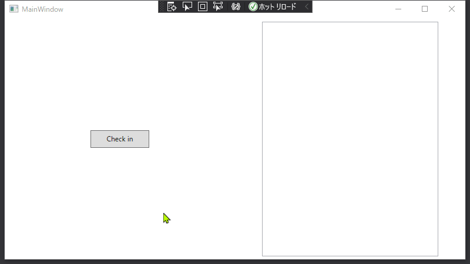
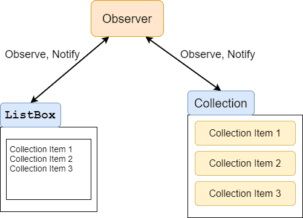

こんにちは。最近、 [Kero Kero Bonito](https://www.sonymusic.co.jp/artist/kerokerobonito/) の [Flamingo](https://open.spotify.com/album/2xLjorF0M6LHPqk2qmZJOV) という曲に少しハマっている k-so16 です。なぜか面白く感じてついつい何回も聴いてしまいます(笑)

WPF 開発をしていて、MVVM のように Collection への要素の追加を監視して `ListBox` に即座に反映したいという場面に遭遇しました。 WPF 開発初心者の私は [kenzauros](https://github.com/kenzauros) さんにヒントをもらって実現方法を調べてみることにしました。

Collection の `Add()` は同じ Collection のインスタンスに要素を追加しているので、 **Collection の参照自体は変更されません。** つまり、 `Observable<T>` で Collection を監視しても、 `Add()` による変更は検知されず、 `ListBox` に変更が反映されません。そのため、 **Collection の要素を監視対象** とする必要があります。

本記事では、 Collection に要素が追加された際に即座に `ListBox` に反映する方法を紹介します。

想定する読者層は以下の通りです。

- C# について基本的な知識を有している
- WPF の基礎的な知識を有している
- ReactiveProperty について基礎的な知識を有している

## 要素の追加を `ListBox` に即時反映する方法

Collection への要素の追加を監視して `ListBox` などの UI コンポーネントに通知する方法は以下の 2 通りが存在します。

- **`ObservableCollection<T>`** を利用する方法
- **`ReactiveCollection<T>`** を利用する方法

以降の節では、それぞれの方法について、簡単なサンプルを用いて説明します。

### 作成するプログラム

作成するサンプルプログラムとして、 `Check in` ボタンが押されたら、チェックイン時刻を `ListBox` に記録として追加するようなプログラムの作成を考えます。動作のイメージは以下の GIF アニメーションの通りです。

[caption id="attachment_16386" align="aligncenter" width="800"]<a href="images/wpf-mvvm-for-listbox-1.gif"></a> 動作イメージ[/caption]

実装方針としては、 `ObservableCollection<T>`, `ReactiveCollection<T>` ともにチェックイン履歴は文字列の Collection として保持し、 `Check in` ボタンを押したらこの Collection に記録の文字列が追加されることを想定します。 Collection に要素が追加されたら、 MVVM のように変更を検知して、 `ListBox` に追加された内容が反映させます。

[caption id="attachment_16387" align="aligncenter" width="501"]<a href="images/wpf-mvvm-for-listbox-2.png"></a> Collection と ListBox の変更検知のモデル[/caption]

### `ObservableCollection<T>` を利用する方法

**`ObservableCollection<T>`** を `ListBox` の **`ItemSource`** プロパティにバインドすることで、要素が追加された際に即時的に `ListBox` にも反映されます。ボタンが押された際に `ObservableCollection<T>` のインスタンスメソッド **`Add()`** を利用することで、要素が追加され、さらに `ListBox` にも即座に追加内容が表示されます。

`ViewModel` の実装例は以下の通りです。

```cs
class ViewModel
{
    public ObservableCollection<string> CheckInLog { get; }
    public ReactiveCommand CheckInCommand { get; }

    public ViewModel()
    {
        CheckInLog = new ObservableCollection<string>();
        CheckInCommand = new ReactiveCommand();
        CheckInCommand.Subscribe(() =>
        {
            CheckInLog.Add($"Checked in at {DateTime.Now}.");
        });
    }
}
```

`Button` がクリックされた際の Command として、 `CheckInCommand` を定義します。 `Subscribe()` の `Action` 内で `ObservableCollection<string>` の要素を追加すると `ListBox` にも即座に反映されます。

XAML の `Window` タグの内側は以下の通りです。

```xml
<Grid>
    <Grid.ColumnDefinitions>
        <ColumnDefinition Width="*"/>
        <ColumnDefinition Width="*"/>
    </Grid.ColumnDefinitions>
    <Button Content="Check in" Width="100" Height="30" Command="{Binding CheckInCommand}"/>
    <ListBox ItemsSource="{Binding CheckInLog}" Grid.Column="1" Width="300" Height="400"></ListBox>
</Grid>
```

`ObservableCollection<T>` のインスタンスを `ListBox` の `ItemSource` プロパティにバインドし、 `Add()` を実行するだけで自動的に要素の追加が `ListBox` にも反映されるので、簡単に実現できることが実感できるかと思います。

### `ReactiveCollection<T>` を利用する方法

ReactiveProperty にも `ObservableCollection<T>` のように、 Collection の要素の変更を監視するクラスとして、 **`ReactiveCollection<T>`** が用意されています。 `ObservableCollection<T>` と同様に `ReactiveProperty<T>` を `ListBox` の `ItemSource` プロパティにバインドすることで、要素が追加された際に即時的に `ListBox` にも反映されます。

`ReactiveCommand` の `ToReactiveProperty<T>()` のように **`ToReactiveCollection<T>()`** も用意されており、 **`Select()`** で変換して要素として追加できるので、 ReactiveProperty に慣れている方には使い勝手が良いのではないでしょうか?

`ReactiveCollection<T>` を用いた場合の `ViewModel` クラスの定義は以下の通りです。

```cs
class ViewModel
{
    public ReactiveCommand CheckInCommand { get; }
    public ReactiveCollection<string> CheckInLog { get; }

    public ViewModel()
    {
        CheckInCommand = new ReactiveCommand();
        CheckInLog = CheckInCommand.Select(_ => $"Checked in at {DateTime.Now}.")
            .ToReactiveCollection();
    }
}
```

要素を追加する `Add()` メソッドを用いなくても、 `ReactiveCommand` の `ToReactiveCollection()` で `ReactiveCollection<string>()` に変換することで、 Command が実行されると要素が追加されます。

XAML は `ObservableCollection<T>` のコード例と同じなので、この節では割愛します。

`ReactivePropertry<T>` を使って UI コンポーネントの変更を監視している場合、 `ListBox` などの Collection を扱う際に `ReactiveCollection<T>` を用いることで **コードの記述が統一的に書ける** はずなので、 **可読性を向上** させられそうですね。

## `ObservableCollection<T>` と `ReactiveCollection<T>` の使い分け

上記のサンプルプログラムのように、 **Collection の末尾に要素を追加** する場合は `ReactiveCollection<T>` が適しています。追加する要素を `Select()` を利用して記述できるので、 `ObservableCollection<T>` に比べてシンプルに書けます。一方で、要素を Collection の途中に追加したり、並び替えや要素の編集には `ReactiveCollection<T>` は不向きです。

`ObservableCollection<T>` は `Subscribe()` の引数に指定する `Action` 内に処理を記述するので、 **Collection の要素の入れ替えや編集など** を記述する場合に適しています。 Collection の要素に対して処理を加えたい場合は `ObservableCollection<T>` を利用するとよいでしょう。

本記事を執筆する上で以下の記事を参考にしました。

> - [[C# WPF] ObservableCollectionをListBoxとBindingする &#8211; Pelican Philosophy](https://www.peliphilo.net/archives/2222)
> - [MVVM をリアクティブプログラミングで快適に ReactiveProperty オーバービュー 2020 年版 中編 - Qiita](https://qiita.com/okazuki/items/dae37c42776727e6c8a5#reactivecollection)

## まとめ

本記事のまとめは以下の通りです。

- Collection への要素の追加を即座に `ListBox` に反映する方法を紹介
    - `ObservableCollection<T>` を利用する方法
    - `ReactiveCollection<T>` を利用する方法

以上、 k-so16 でした。 Collection は便利な反面、扱いが時々難しいこともあって面白いですね(笑)