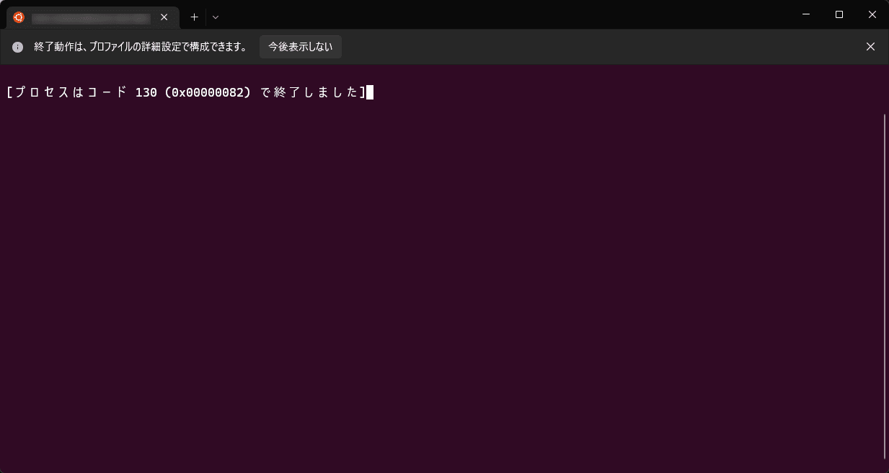
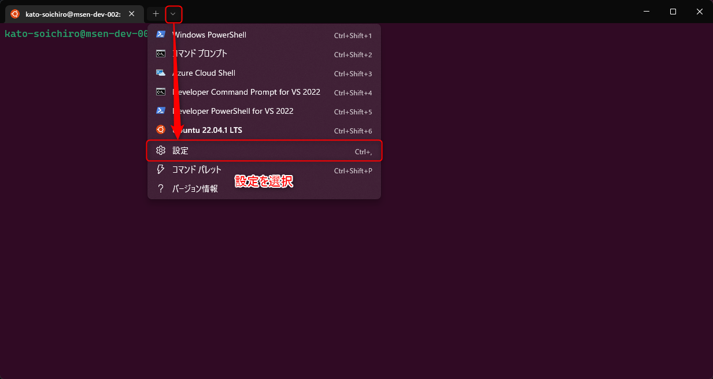
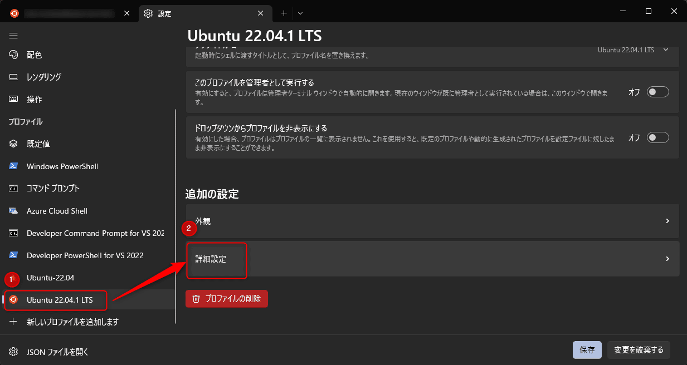
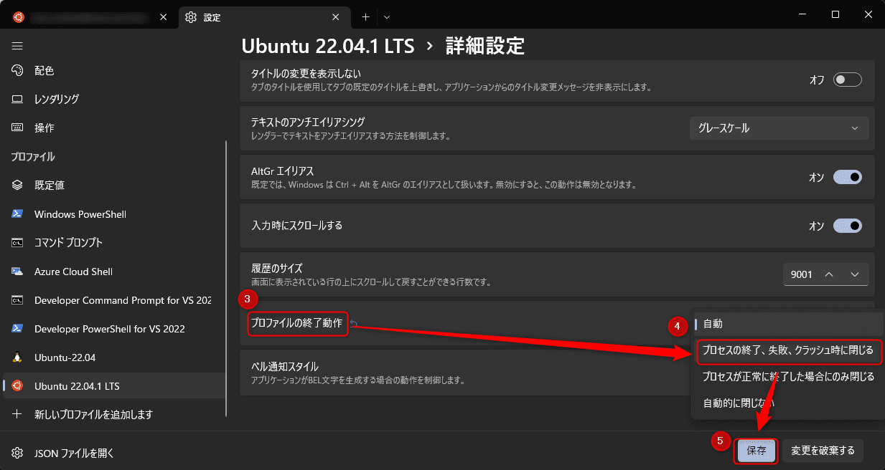

こんにちは。最近、ランニングの記録アプリに [Strava](https://www.strava.com/) を使い始めた k-so16 です。
[Xiaomi のスマートバンド](https://www.mi.com/jp/mi-smart-band-6/) の workout の記録を連携できたり、 PC のブラウザからも記録を確認できることから、アプリを変えることにしました (笑)

WSL のターミナルに [Windows Terminal](https://apps.microsoft.com/store/detail/windows-terminal/9N0DX20HK701) を利用しているのですが、終了コードが 0 以外の状態で Ctrl-D で `exit` すると、画像のように「*プロセスはコード 130 (0x00000082) で終了しました*」と表示され、ウィンドウが閉じてくれません。



たとえば、ローカルサーバーを停止するために Ctrl+C を押した後に Ctrl-D で `exit` しようとすると、メッセージが表示されてウィンドウが閉じられません。
プロセスを止めてウィンドウを閉じたいだけなのに、ウィンドウが閉じずちょっとしたストレスになっていました。

本記事では、 **終了コードにかかわらず、 `exit` した際にウィンドウを閉じる方法** を紹介します。
なお、複数タブが開いている場合は、現在開いているタブが閉じられるようになります。

本記事で想定する読者層は以下の通りです。

- WSL についての基礎知識を有している
- Linux の終了コードについての知識を有している

## Windows Terminal が自動的に閉じないケース

`exit` する際に、直前の終了コードが `0` 以外の場合、メッセージが表示されてウィンドウが閉じられません。
一般的に、コマンドの失敗などによって終了コードが `0` 以外になりますが、 Ctrl-C が入力された場合も終了コードが変化するようです。

Linux で Ctrl-C を入力した直後の終了コードを確認してみると、 `130` になっていました。

```sh
$ ^C
$ echo $?
130
$
```

`ls` などを実行して `exit` する直前の終了コードを 0 にすれば、 Ctrl-D で `exit` すると同時にウィンドウも閉じられるのですが、わざわざ別のコマンドを実行するのは少し手間に感じます。
そもそもコマンドを実行し忘れる可能性もあります。

## 解決方法

Windows Terminal の詳細設定から、 WSL の終了時の動作を指定できます。
「*プロファイルの終了動作*」の設定を「**プロセスの終了、失敗、クラッシュ時に閉じる**」にすることで、終了コードによらずウィンドウが閉じられるようになります。

設定手順を以下に記載します。

1. 以下の画面のように操作するか Ctrl+, を押して「*設定*」を開きます。

    

1. Windows Terminal の設定を開いて対象のディストリビューションを選択する
    - 画像例では "Ubuntu 22.04.1 LTS" を選択
1. 「*詳細設定*」を選択する

    

1. 「*プロファイルの終了動作*」の設定のドロップダウンを選択する
    - 初期値は「**自動**」
1. 「**プロセスの終了、失敗、クラッシュ時に閉じる**」を選択する

    

これで無事に Ctrl-C を押した直後に `exit` してもウィンドウが閉じるようになりました。

## まとめ

本記事のまとめは以下の通りです。

- 終了コードによらず WSL の終了と同時に Windows Terminal のウィンドウと閉じる方法を紹介
    - 「*プロファイルの終了動作*」の設定を「**プロセスの終了、失敗、クラッシュ時に閉じる**」に変更

以上、 k-so16 でした。
どなたかの快適な WSL ライフに貢献できていれば幸いです。
