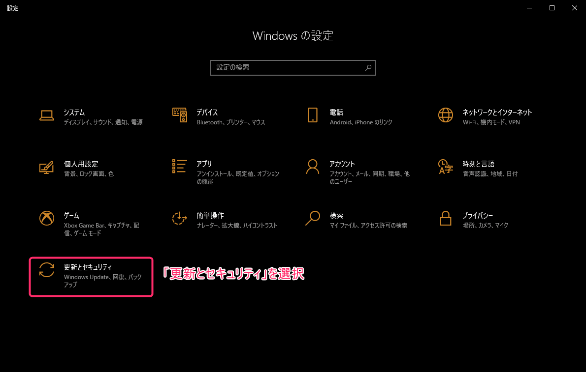
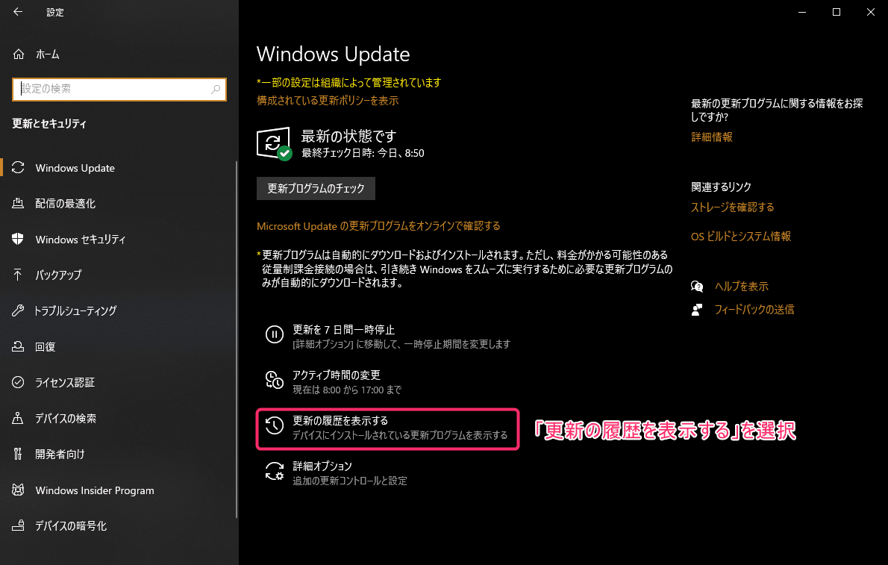
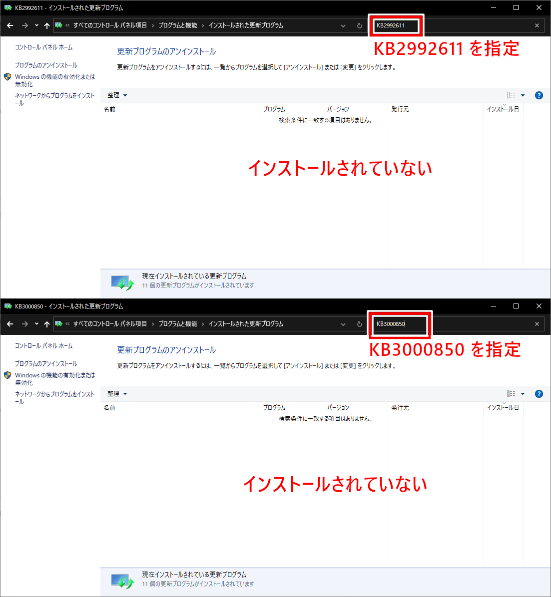

こんにちは。
最近、 [Kingdom Hearts](https://www.jp.square-enix.com/kingdom/) に再燃している k-so16 です。
20 年経っても色あせない名作を楽しんでいます(笑)

Windows では、 Git の認証情報は **資格情報マネージャー** で保持されます。
Git で認証が必要な際に、毎回パスワードやアクセストークンを入力しなくても自動で認証を通してくれます。


基本的に、認証情報は 1 度入力すれば再度認証を求められることはないのですが、なぜか私の環境では再起動すると毎回認証を求められました。
*認証情報が保存されていないのではないか* と思い、資格情報マネージャーを開こうとしたところ、エラーが発生しました。

本記事では、発生したエラーの内容と、エラーの解決方法について紹介します。
なお、エラーが発生した際の OS のバージョンは **Windows 10 21H2** でした。

## エラーの内容

資格情報マネージャーを開こうとした際に表示されたエラーの内容は以下の通りです。

- エラーコード: `0x80090345`
- エラーメッセージ
    ```
    要求された操作を完了できませんでした。
    コンピューターが委任に対して信頼されていて、
    現在のユーザーアカウントが委任を許可するように構成されている必要があります。
    ```

エラーメッセージを読む限りでは、ログイン中のユーザーではアクセス権限がないと言っているようです。
ログインしているユーザーには管理者権限が付与されているので、権限はあるはずなのですが、なぜかエラーが表示されました。

## 対処方法

エラーメッセージの内容から原因が推測できなかったので、エラーコードを Google で検索してみました。
すると、以下の記事がヒットしました。

> [資格情報マネジャーのエラー(エラーコード:0x80090345) - ふりばの雑記](https://freebird0213.livedoor.blog/archives/13501375.html)

上記の記事では、対処方法が 2 つ紹介されていました。

- レジストリの設定
- Windows Update 更新プログラムの削除

以降の節では、参考記事をもとに私が実際に試した対処方法の手順を紹介します。

### Windows Update 更新プログラムの削除

まず更新プログラムの削除を試しました。
以下の更新プログラムが原因で資格情報マネージャーが開けない可能性があるらしいです。

- *KB2992611*
- *KB3000850*

これらの更新プログラムがインストールされていないか確認し、あれば削除してみることにしました。

#### 更新プログラムの確認手順

1. スタートメニューから *設定* を開き、 **更新とセキュリティ** を選択します。
    
1. *Windows Update* の画面に表示される **更新の履歴を表示する** を選択してください。
    
1. *更新の履歴を表示する* 画面が開いたら、 **更新プログラムをアンインストールする** という項目を選択します。
    
1. 別ウィンドウで開かれる *更新プログラムのアンインストール* の画面で対象の更新プログラムを検索します。
    

私の環境下では、どちらの更新プログラムもインストールされていませんでした。

### レジストリの設定

更新プログラムが見つからなかったので、次にレジストリの設定変更を試しました。

Windows キーと `R` キーを同時に押すと *ファイル名を指定して実行* という画面が表示されます。
画面上の *名前* に **`regedit`** と入力して OK を押します。
すると、レジストリエディターが開くはずです。


レジストリエディターが開いたら、以下のレジストリを開きます。

```
HKEY_LOCAL_MACHINE\SOFTWARE\Microsoft\Cryptography\Protect\Providers\df9d8cd0-1501-11d1-8c7a-00c04fc297eb
```

設定などを変更していなければ、データの値が設定されていない、 `REG_SZ` という種類の *既定* の項目のみ表示されているはずです。
右クリックで *新規* → *DWORD (32 ビット) 値*を選択します。
名前は **`ProtectionPolicy`** を設定します。


新規作成された `ProtectionPolicy` の値が `0` になっているので、値を変更します。
変更するには、 `ProtectionPolicy` を選択した状態で右クリックし、 **「修正」** を選択します。


編集画面が表示されるので、値のデータを **`1`** を設定します。


設定が完了したら Windows を再起動します。
再起動後、無事にコントロールパネルから資格情報マネージャーが開けるようになりました。


## その他に解決したトラブル

資格情報マネージャーが開けるようになったことで、今まで抱えていた不便な現象も解消されました。

- 起動のたびに認証を求められる
    - パソコン版 Google ドライブ
    - Slack
    - Google, GitHub などのブラウザのログインセッション

どうやら、今まで資格情報マネージャーにアクセスできないことで、これらの認証情報が保持されないことが原因のようでした。
資格情報マネージャーにアクセスできるようになったことで、再起動後に毎回認証を求められなくなりました。

## まとめ

本記事のまとめは以下の通りです。

- 資格情報マネージャーが開けないエラーへの対処方法の紹介
    - 更新プログラムのアンインストール方法の紹介
    - レジストリの設定方法の紹介

以上、 k-so16 でした。
原因は分からないままですが、問題は解決したので一件落着としました(笑)
