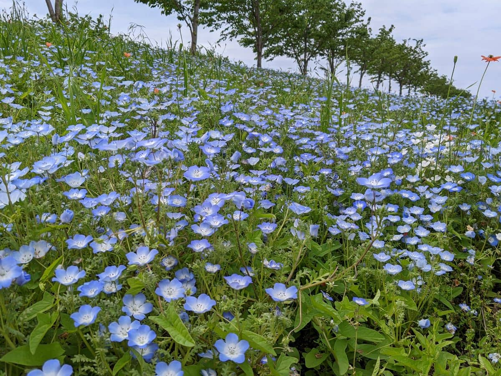

こんにちは。最近、舞洲の[ネモフィラ祭り](https://seasidepark.maishima.com/nemophila/) に行った k-so16 です。
一面鮮やかな青色の花がとてもキレイに咲き誇っていて感動しました。

2023/5/11 に開催された [AWS構築・開発の技術勉強会](https://beyondjapan.connpass.com/event/280427/) に参加しました。
本記事では、当日のイベントの概要について紹介します。

## 概要

今回のイベントでは、  *AWS を利用したシステム開発やインフラ構築にまつわる技術* を扱う勉強会でした。
初心者から上級者まで、幅広い層がターゲットのイベントでした。

今回のイベントでは以下の内容の発表を聴講しました。

- セッション枠
    - AWS を利用したオブザーバービリティの実現
    - App Runner と Terraform を利用した AWS コンテナーの実行環境構築
- LT 枠
    - AWS 未経験からデータ分析基盤を構築した話
    - Hugo で作ったブログに閲覧数ランキングの表示を追加した話

本記事では、特におもしろいと感じた、ブログに閲覧数ランキングを追加した発表について紹介します。

[Hugo](https://gohugo.io/) は Go 言語で作られた *静的サイトジェネレーター* です。
静的なコンテンツを配信するため、 WordPress などの CMS より処理が速いですが、 **ページを動的に変更できません。**

AWS を使って、 Hugo で作ったブログに閲覧数ランキングを表示する方法について紹介されていました。
なお、閲覧数のデータは [Google Analytics](https://analytics.google.com/) から取得したそうです。

次の流れで閲覧数ランキングの表示の追加を実現したとのことでした。
なお、実現する上で *コードはほとんど書いていない* そうです。

1. **Amazon AppFlow** を利用して Google Analytics の閲覧数データを S3 に保存
2. **Glue DataBrew** を利用して閲覧数をソートして上位 5 件に絞り込んだデータを S3 に保存
3. **Amazon EventBridge Scheduler** のスケジュール実行で Amplify の StartJob で再ビルドを定期的に実行
4. Hugo の機能で S3 に保存したデータをロードしてウィジェットを作成
5. StartJob でビルドしたものを **Amplify Hosting** にデプロイ

*静的サイトジェネレーターで作成したブログ* に、**動的な要素である閲覧数のランキングの表示を追加する** 方法を、 AWS のサービスを駆使して実現している点がおもしろいと感じました。
特に、 **コードをほとんど書かずに機能を実現した** 点に関心しました。

## 懇親会

発表後の懇親会では、登壇者の話を聞く機会が得られ、とても良い刺激になりました。
他の参加者の方と交流したり、登壇者の方の話を聞いたりと、とても良い機会となりました。

自分がおもしろいと感じた発表の登壇者の方の話を聞く機会も得られ、 *機能の実現までの苦労話* も聞けました。
発表内容以外の雑談も楽しめました。

## 所感

今回の勉強会に参加して、 AWS のサービスを使ってできることをいろいろ学ぶことができました。
AWS コンテナー実行環境を App Runner と Terraform で構築する方法やデータ分析基盤を構築する方法など、 **自分が知らないことを知る良い機会** となりました。
今回学んだ内容をいずれ活かしていければと思います。

約 3 年ぶりに現地開催の外部勉強会に参加して、あらためて *現地開催ならではの良さ* を実感しました。
発表で登壇者がおもしろいことを言った際に、他の聴講者の笑い声が聞こえることで、 **周りのリアクション** がわかり、より楽しく勉強会に参加できました。
懇親会で他の参加者の方と話す機会もあり、とても良い刺激となりました。

今回の勉強会を機に、 AWS の技術についても習得できればと思います。
以上、 k-so16 でした。

## おまけ

舞洲のネモフィラ祭りの様子を掲載します。
残念ながら、曇天とスッキリしない空模様でしたが、それでも一面に広がる鮮やかな景色を堪能できました。

