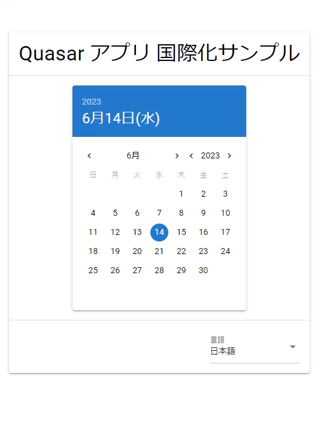

こんにちは。最近、雨の日が増えて少し気分が下がり気味な k-so16 です。梅雨時なのでしかたないのですが、天気のいい日のほうが気分はあがりますね。

[Quasar](https://quasar.dev/) でアプリケーションの国際化に対応するためには、 **[Vue I18n](https://kazupon.github.io/vue-i18n/)** を利用します。また、 **Quasar のコンポーネント自身も国際化に対応** しています。

本記事では、 **Quasar で作成したアプリケーションに国際化の設定をする方法** を紹介します。

本記事の対象読者は以下の通りです。

- Quasar についての基礎知識を有している
- Vue I18n の基礎的な使い方を知っている

## 実行環境

本記事を執筆する際に動作を確認した環境は以下の通りです。

- Vue: 3.3.4
- Quasar: 2.12.0
- Vue I18n: 9.2.2

## 国際化 (Internationalization) とは

アプリケーションを地域や国、言語の違いを問わず利用できるようにすることを **国際化** (Internationalization) といいます。たとえば、 *ユーザーが日本語の利用者* ならアプリケーションの言語を **日本語** で表示し、 *韓国語の利用者* なら **韓国語** で表示するように、 **そのユーザーに合わせた言語で表示する** ことが挙げられます。

言語のほかにも、 **文字の向き** や **気温や距離などの単位** の切り替えなども、国際化の対応範囲とされています。

国際化はしばしば **i18n** と省略されることがあります。これは、 *internationalization の先頭の文字 i と末尾の文字 n の間に 18 文字ある* ので、 i18n と省略されます。 i18n という表記の由来がわかって、個人的にスッキリしました (笑)

## 国際化の設定

Quasar でアプリケーションの国際化を設定する際に、次の 2 つの方法で設定できます。

- アプリケーションを表示した際のデフォルトの表示言語の設定
- 選択された言語に表示を切り替える設定

以降では、まずデフォルトの表示言語の設定方法を紹介し、その次に選択された言語に表示を切り替える方法を紹介します。

### デフォルトの表示言語の設定方法

Quasar では、アプリケーションを表示した際のデフォルトの表示言語を簡単に設定できます。

表示言語の指定には次の 2 つの点で指定します。

- **アプリケーション本体** の表示言語
    - Vue I18n を利用して翻訳内容を表示
- **Quasar コンポーネント自身** の表示言語
    - Quasar の設定ファイルで表示言語を指定

アプリケーション本体の表示言語は、 *アプリケーション自体のタイトルやボタン、ラベルなどに表示する言語* です。 **これらの翻訳の表示内容は開発者で定義します。**

Quasar コンポーネント自身の表示言語は、 Quasar の **Date Picker** や **Pagination** など、 *すでに Quasar のコンポーネントで表示されている言語* です。 **これらの翻訳の表示内容は Quasar のコンポーネントですでに定義されています。**

#### Vue I18n の設定

アプリケーション本体の翻訳ファイルは、 **`src/i18n`** の下に作成します。 Quasar のプロジェクトを作成すると、 *`src/i18n/en-US/index.js`* というファイルが作成されています。これは英語の翻訳ファイルのテンプレートとして自動的に作成されています。

本記事では、英語と日本語の翻訳ファイルを作成することとします。英語の翻訳ファイルは *`src/i18n/en-US/index.js`*, 日本語の翻訳ファイルは *`src/i18n/ja-JP/index.js`* にそれぞれ以下のように作成します。

- *英語の翻訳ファイル*
```js{numberLines:1}:title=src/i18n/en-US/index.js
export default {
  appTitle: 'Quasar App Localization Sample',
  language: 'Language',
};
```
- *日本語の翻訳ファイル*
```js{numberLines:1}:title=src/i18n/ja-JP/index.js
export default {
  appTitle: 'Quasar アプリ 国際化サンプル',
  language: '言語',
};
```

翻訳ファイルを作成したら、 `src/i18n/index.js` で翻訳データを `export` するように記述します。

```js{numberLines:1}:title=src/i18n/index.js
import enUS from './en-US';
import jaJP from './ja-JP';

export default {
  'en-US': enUS,
  'ja-JP': jaJP,
};
```

最後に、 `src/boot/i18n/index.js` の **`createI18n()`** の **`locale`** オプションに、 `export` した際のキーを文字列で指定します。今回は *日本語をデフォルトの表示言語として指定する* ために、 `locale` オプションに **`ja-JP`** を指定します。

```js{numberLines:1}{2}:title=src/boot/i18n/index.js
const i18n = createI18n({
  locale: 'ja-JP',
  globalInjection: true,
  messages,
});
```

#### Quasar の設定

Quasar のコンポーネントで表示するデフォルトの言語を設定するには、 **`quasar.config.js`** を編集します。

言語の設定は **`framework` プロパティの `lang` プロパティに表示言語を指定するだけ** です。 `lang` プロパティが設定されていない場合は追加します。なお、 *`lang` プロパティが未定義の場合は、自動的に英語 (`en-US`) が指定されます。*

本記事では、 Quasar コンポーネントのデフォルト言語を日本語に設定することとします。日本語を指定するには、 `lang` プロパティの値に `ja` を指定します。

```js{numberLines:1}{2}:title=quasar.config.js
framework: {
  lang: 'ja',
},
```

### 選択された言語への表示の切り替え方法

現在表示されている言語から、ユーザーが選択した言語に切り替えることもできます。表示言語を動的に切り替える際にも、次の 2 点をそれぞれ設定する必要があります。

- **アプリケーション本体の表示言語の切り替え** の設定
- **Quasar コンポーネント自身の表示言語の切り替え** の設定

#### アプリケーション本体の表示言語の切り替え

アプリケーション本体の表示言語を切り替えるには、 **Vue I18n** を利用します。 **Composition API と Options API で書き方が異なる** ので、それぞれの書き方を紹介します。

#### Composition API の場合

Composition API を利用する場合は、次の手順で表示言語を動的に切り替えられます。

1. `vue-i18n` パッケージから **`useI18n`** を読み込む
2. `useI18n()` から **`locale`** プロパティを取得する
3. 1 で取得した `locale` の `value` に切り替える言語を指定する

表示言語を英語 (`en-US`) に切り替えるコード例は以下の通りです。

```js{numberLines:1}:title=Composition&nbsp;API&nbsp;で表示言語を切り替える方法
import { useI18n } from 'vue-i18n';

const { locale } = useI18n({ useScope: 'global' });
locale.value = 'en-US';
```

#### Options API の場合

Options API を利用する場合は、 Vue インスタンスの **`$i18n.locale`** プロパティに切り替える言語を指定するだけで、表示言語を切り替えられます。

表示言語を英語 (`en-US`) に切り替えるコード例は以下の通りです。

```js{numberLines:1}:title=Options&nbsp;API&nbsp;で表示言語を切り替える方法
this.$i18n.locale = 'en-US';
```

#### Quasar コンポーネントの表示言語の切り替え

Quasar のコンポーネントの表示言語を切り替えるには、 **Quasar の言語パッケージ** を読み込み、 Quasar の **`lang.set()`** メソッドに渡します。 *こちらも若干 Composition API と Optional API で記述方法が違う* ので、それぞれの書き方を紹介します。

#### Composition API の場合

Composition API を利用する場合は、次の手順で表示言語を動的に切り替えられます。

1. `quasar` パッケージから **`useQuasar`** を読み込む
2. `useQuasar()` が返却するオブジェクトを変数に格納する
    - コード例の場合は `$q` が格納先の変数
3. `import()` で **`quasar/lang/${切り替え対象の言語}`** を読み込む
4. `then()` メソッド内で読み込んだモジュールを 2 で取得したオブジェクトの **`lang.set()`** メソッドの引数に渡して実行する

表示言語を英語 (`en-US`) に切り替えるコード例は以下の通りです。

```js{numberLines:1}:title=Composition&nbsp;API&nbsp;で表示言語を切り替える方法
import { useQuasar } from 'quasar'

const $q = useQuasar();
const lang = 'en-US';
import(`quasar/lang/${lang}`).then((x) => {
  $q.lang.set(x.default);
});
```

#### Options API の場合

Options API を利用する場合は、 Vue インスタンスの **`$q.lang.set()`** メソッドが利用できます。表示言語の切り替え手順は次の通りです。

1. `import()` で **`quasar/lang/${切り替え対象の言語}`** を読み込む
2. `then()` メソッド内で読み込んだモジュールを **`this.$q.lang.set()`** の引数に渡して実行する

表示言語を英語 (`en-US`) に切り替えるコード例は以下の通りです。

```js{numberLines:1}:title=Options&nbsp;API&nbsp;で表示言語を切り替える方法
const lang = 'en-US';
import(`quasar/lang/${lang}`).then((x) => {
  this.$q.lang.set(x.default);
});
```

## アプリケーションの言語切り替えの実装例

実際に言語を切り替える実装例を紹介します。実装例のコードは、 Quasar の Card コンポーネントに、タイトルと Date Picker を表示し、表示言語を選択するコンボボックスを配置しています。 **コンボボックスの値が変わると、表示言語も切り替わります。**

実装例のコードの挙動は次の通りです。コンボボックスから言語を切り替えると、タイトルと Date Picker がそれぞれ指定した言語の表示に切り替わります。



実装例は以下の通りです。 *L.46 でアプリケーション本体の言語* (タイトルの表示言語) が、  *L.49 で Quasar のコンポーネントの言語* (Date Picker の表示言語) が切り替わります。

```html{numberLines:1}{46,49}:title=言語切り替えの実装例
<template>
  <q-page class="flex flex-center">
    <q-card>
      <q-card-section>
        <div class="text-h4">{{ $t('appTitle') }}</div>
      </q-card-section>
      <q-separator  />
      <q-card-section class="flex flex-center">
        <q-date mask="YYYY-MM-DD" v-model="date" />
      </q-card-section>
      <q-separator  />
      <q-card-section class="flex justify-end">
        <q-select
          style="width: 150px;"
          v-model="language"
          :options="langOptions"
          :label="$t('language')"
          />
      </q-card-section>
    </q-card>
  </q-page>
</template>

<script>
import { defineComponent, ref, watch } from 'vue';
import { useQuasar } from 'quasar';
import { useI18n } from 'vue-i18n';

export default defineComponent({
  name: 'IndexPage',
  setup() {
    const dateTime = new Date().toISOString();
    const hyphenedDate = dateTime.replace(/(\d{4}-\d{2}-\d{2})T.+$/, '$1');
    const date = ref(hyphenedDate);

    const langOptions = ref([
      { label: 'English', value: 'en-US', lang: 'en-US' },
      { label: '日本語', value: 'ja-JP', lang: 'ja' },
    ]);
    const language = ref({ label: '日本語', value: 'ja-JP', lang: 'ja' });

    const { locale } = useI18n({ useScope: 'global' });
    const $q = useQuasar();
    watch(language, (newLang) => {
      console.log(newLang.lang);
      locale.value = newLang.value;
      import(`quasar/lang/${newLang.lang}`)
        .then((lang) => {
          $q.lang.set(lang.default);
        })
        .catch((reason) => console.log(reason));
    });

    return { date, language, langOptions };
  },
});
</script>
```

## まとめ

本記事のまとめは以下の通りです。

- Quasar アプリケーションでの国際化対応について紹介
    - アプリケーション本体の国際化
    - Quasar コンポーネントの国際化
- 初期表示時の表示言語の設定方法を紹介
- アプリケーションで表示言語を切り替える方法を紹介
    - **Vue I18n** でアプリケーション本体の言語を切り替え
    - **Quasar の言語パッケージ** を読み込みコンポーネントの言語を切り替え

以上、 k-so16 でした。 Quasar で開発したアプリの国際化対応を考えている方のお役に立てれば幸いです。
