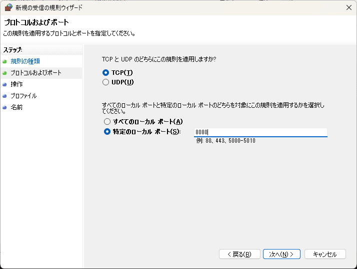
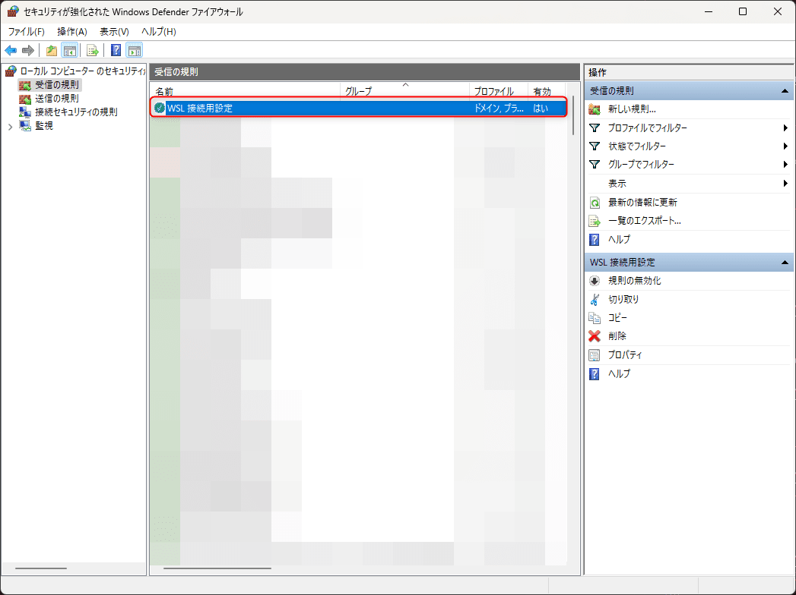

こんにちは。最近、人生で初めてカラオケへ歌いに行った k-so16 です。歌い慣れていないので、歌うことがとても難しく感じましたが、ワイワイ盛り上がって楽しめました (笑)

Web アプリケーションを開発する際に、 **Windows Subsystem for Linux** (以降 WSL と表記) 上で動かしている Ubuntu を利用しています。プログラムの動作を確認する際には、 Ubuntu で開発用サーバーを起動し、 Windows 側のブラウザから `localhost` 経由でアクセスします。

マルチプラットフォームな Web アプリケーションの場合、 PC だけでなく、スマホの実機での動作を確認したいことがあります。スマホを同じネットワークに接続し、 *開発環境の Windows の IP アドレスとポート番号を指定* すれば接続できるように思えます。

しかし、 WSL 上の Linux でホストしているサーバーに接続するためには、 **Windows から WSL に通信をプロキシさせる** 必要があります。

本記事では、 **WSL 上の Linux でホストしているサーバーに、スマホなどの別端末からアクセスする方法** を紹介します。

本記事で想定する読者層は以下の通りです。

- ネットワークの基礎知識を有している
- WSL についての基礎知識を有している

## 動作環境

本記事では、以下の環境で動作を確認しました。

- OS: Windows 11 Pro
    - バージョン: 22H2
- WSL2
    - カーネルバージョン: 5.15.90.1
    - OS: Ubuntu 22.04.3 LTS

## 別端末からのアクセスを許可する手順

外部端末から WSL 上の Linux にアクセスするには、次の 2 つの設定が必要です。

- 外部端末から Windows への通信を許可する
- 外部端末から Windows への通信を WSL にプロキシする

### 外部端末から Windows への通信を許可する

外部端末から Windows の端末への通信を許可するためには、ファイアウォールの設定で **通信を許可** する必要があります。設定手順は次の通りです。

1. **セキュリティが強化された Windows Defender ファイアウォール** を起動する。
2. **受信の規則** を選択したあと、 **新しい規則** を選択する。
    
3. 規則の種類に「**ポート**」を選択する。
    
4. 許可したいプロトコルに応じて TCP か UDP を選択する。
5. 通信を待ち受けるポート番号を「**特定のローカル ポート**」で指定する。
    
6. 操作の項目で「**接続を許可する**」を選択する。
    
7. プロファイルの項目で設定を適用するネットワーク環境にチェックを入れる。
    
8. 設定した内容を識別するための名前を入力する。
    

設定が完了すると、ファイアウォールの設定画面にさきほどの設定内容が追加されます。



### 外部端末からの通信を WSL にプロキシする

#### Linux の IP アドレスの確認

Windows がホストしているサーバーにアクセスするのであれば、ファイアウォールで通信を許可すれば、外部端末からもアクセスできるようになります。しかし、 WSL 上の Linux がホストしているサーバーにアクセスするには、 **Windows から WSL に通信をプロキシ** する設定が必要です。

Windows から WSL に通信をプロキシするためには、まず **WSL 上の Linux に設定されている IP アドレス** を確認します。 Linux で IP アドレスを確認するには、 **`ip` コマンド** を利用します。

```bash:title=Linux&nbsp;の&nbsp;IP&nbsp;アドレスを確認
ip addr
```

上記のコマンドを実行すると、以下のような結果が返ってくるはずです。筆者の環境では、 `lo` と `eth0` の 2 つのネットワークインタフェースの情報が返ってきました。

```{numberLines:1}{9}:title=ip&nbsp;addr&nbsp;コマンドの実行結果例
1: lo: <LOOPBACK,UP,LOWER_UP> mtu 65536 qdisc noqueue state UNKNOWN group default qlen 1000
    link/loopback 00:00:00:00:00:00 brd 00:00:00:00:00:00
    inet 127.0.0.1/8 scope host lo
       valid_lft forever preferred_lft forever
    inet6 ::1/128 scope host
       valid_lft forever preferred_lft forever
2: eth0: <BROADCAST,MULTICAST,UP,LOWER_UP> mtu 1500 qdisc mq state UP group default qlen 1000
    link/ether 00:15:5d:10:c6:31 brd ff:ff:ff:ff:ff:ff
    inet 172.18.183.30/20 brd 172.18.191.255 scope global eth0
       valid_lft forever preferred_lft forever
    inet6 fe80::215:5dff:fe10:c631/64 scope link
       valid_lft forever preferred_lft forever
```

各ネットワークインタフェースの情報のうち、 **`inet`** の項目が IP アドレスです。上記の例の場合、 `lo` と `eth0` に IP アドレスが振られています。 `lo` で設定されている IP アドレスはループバックアドレスのため、 *9 行目が Linux に設定されている IP アドレス (`172.18.183.30`)* であることがわかります。

#### WSL への通信のプロキシを設定

Linux の IP アドレスを確認したら、 Windows から WSL へ通信をプロキシする設定を追加します。通信をプロキシするためには、 Windows の **`netsh` コマンド** を利用します。

`netsh` にはいくつかサブコマンドがあり、さまざまなネットワーク設定を操作できます。通信のプロキシ設定を追加するには、サブコマンド **`interface portproxy add`** を利用します。今回は IPv4 のアドレスどうしで通信をプロキシするため、 *`v4tov4`* を指定します。

なお、設定を追加するためには **管理者として実行** する必要があります。また、 `netsh` は Windows のコマンドのため、 *コマンドプロンプト* や *PowerShell* で実行します。

```powershell:title=Windows&nbsp;から&nbsp;WSL&nbsp;上の&nbsp;Linux&nbsp;に通信をプロキシする設定を追加するコマンド
netsh interface portproxy add v4tov4 listenport=<Windows 側のポート番号> listenaddress=<接続を受け付ける IP アドレス> connectport=<Linux 側のポート番号> connectaddress=<Linux の IP アドレス>
```

**`listenport`** には *Windows 側で通信をリッスンするポート番号* を指定し、 **`connectport`** には *Linux 側で通信をリッスンしているポート番号* を指定します。 `listenport` と `connectport` どうしで同じポート番号も指定できます。

**`listenaddress`** には *接続を受け付ける IP アドレス* を指定し、 **`connectaddress`** には `ip` コマンドで確認した *Linux の IP アドレス* を指定します。接続元の IP アドレスを絞り込みたいという理由がなければ、 `listenaddress` はどの IP からも受け付けるよう `0.0.0.0` を指定すると良いでしょう。

実際の設定例を見てみましょう。 Windows の 8080 番ポートから、 IP アドレスが `172.18.183.30` の Linux の 80 番ポートに接続する設定を追加するコマンド例は次の通りです。

```powershell:title=通信のプロキシする設定を追加するコマンド例
netsh interface portproxy add v4tov4 listenport=8080 listenaddress=0.0.0.0 connectport=80 connectaddress=172.18.183.30
```

これで 外部端末から WSL の OS 上のサーバーへアクセスできるようになりました。接続する際には、 **Windows 側の IP アドレスとポート番号** を指定します。たとえば、 Windows の IP アドレスが `192.168.0.100` の場合、上記で設定した Linux へ接続するためには、 `192.168.0.100:8080` に接続します。正しく設定ができていれば、レスポンスが返ってくるはずです。

本記事を執筆する上で、以下の記事を参考にしました。

> - [WSL2のサービスにスマホや他のPCからアクセスできるようにするには | 日記というほどでも](https://denor.jp/wsl2%E3%81%AE%E3%82%B5%E3%83%BC%E3%83%93%E3%82%B9%E3%81%AB%E3%82%B9%E3%83%9E%E3%83%9B%E3%82%84%E4%BB%96%E3%81%AEpc%E3%81%8B%E3%82%89%E3%82%A2%E3%82%AF%E3%82%BB%E3%82%B9%E3%81%A7%E3%81%8D%E3%82%8B)

## まとめ

本記事のまとめは以下の通りです。

- 外部端末から WSL 上の OS に通信する方法を紹介
    - Windows のファイアウォールの設定方法を説明
    - Windows から WSL に通信をプロキシする設定の追加方法を説明

以上、 k-so16 でした。外部の端末から WSL 上の Linux に接続するには少し手間がかかると感じました (笑)