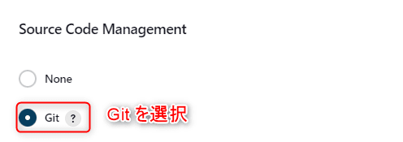
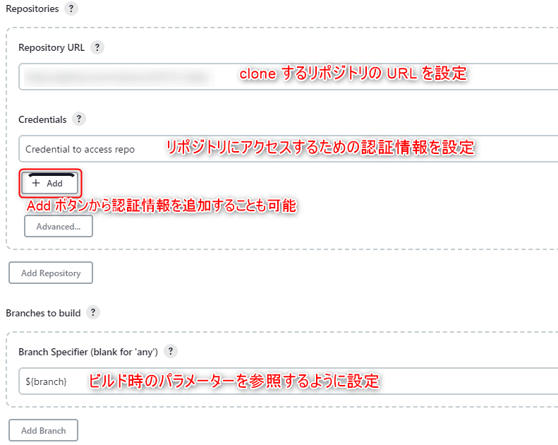
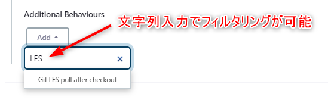
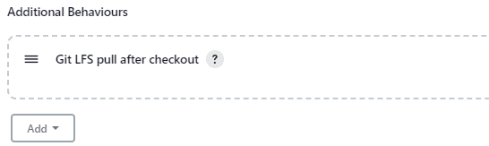

こんにちは。最近、 [Obsidian](https://obsidian.md/) というメモアプリを使い始めた k-so16 です。
メモを *Markdown* で書けて、さらにエディターを **Vim キーバインド** にも設定できるのがとても魅力的です。

MSEN では、デプロイツールに **[Jenkins](https://www.jenkins.io/)** を利用しています。
最近自分が携わっているプロジェクトでも Jenkins を利用してデプロイを行っています。

そのプロジェクトで Jenkins のジョブを見直す機会があり、改善点を見つけたので、自身の学習も兼ねて Jenkins のジョブを作り直してみることにしました。
自身で Jenkins のジョブを作成したことがなかったので、自身の学習を兼ねてローカル環境に Jenkins の Docker コンテナーを作成してジョブを作成することにしました。

作成したジョブを実行したところ、 コンソールログに以下のエラーメッセージが出力されており、ジョブが失敗していました。

> Error downloading object: path/to/image.png ({short hash}): Smudge error: Error path/to/image.png ({long hash}): batch response: Bad credentials

原因を調べてみると、 **Git LFS** で管理されているファイルの checkout に失敗していました。

本記事では、 **Git LFS を利用したリポジトリの checkout が Jenkins 上で失敗する場合の対処方法** を紹介します。

本記事で想定する読者層は以下の通りです。

- Jenkins の基礎知識を有している
- Git についての基礎知識を有している

## 実行環境

本記事を執筆する際に動作を確認した環境は以下の通りです。

- Jenkins: 2.377
    - Jenkins の Docker イメージ: `jenkins/jenkins:2.377-slim-jdk17`
- Docker: 20.10.22

## 症状

### Jenkins のジョブの設定

プロジェクトのリポジトリを Jenkins の workspace へ clone するために、 "*Source Code Management*" で **Git** を選択して、次のように設定しました。

- Repository URL: 対象のプロジェクトのリポジトリ URL
- Credentials: プロジェクトのリポジトリにアクセスするための認証情報を設定
    - Jenkins にあらかじめ認証情報を登録したものを設定
- Branches to build: ビルド時のパラメーターを設定
    - General で設定したパラメーターを指定 (画像の例の場合は `branch`)





Git の設定をしている際に、 *ビルド時に設定されたパラメーターを "Branches to build" の項目に設定できるのか疑問* でした。
Branch Specifier の隣にあるヘルプボタンを押して内容を読むと、 **`${パラメーター名}`** と記述することでパラメーターを参照できると記載されていました。
ビルド時のパラメーターも指定できることに感動しました (笑)

### エラーの内容

設定したジョブを実行したところ、早々にビルドに失敗していました。
ジョブ実行時のコンソールの出力ログを見てみると、 *リポジトリの checkout で失敗* しているようでした。

```{numberLines:1}:title=コンソールログに出力されたエラーメッセージ
Checking out Revision {commit hash} (origin/{branch})
 > git config core.sparsecheckout # timeout=10
 > git checkout -f {commit hash} # timeout=10
FATAL: Could not checkout {commit hash}
hudson.plugins.git.GitException: Command "git checkout -f {commit hash}" returned status code 128:
stdout:
stderr: path/to/image.png (44 KB)
Error downloading object: path/to/image.png ({short hash}): Smudge error: Error path/to/image.png ({long hash}): batch response: Bad credentials

Errors logged to '/var/jenkins_home/workspace/{project name}/.git/lfs/logs/20230201T040755.922440205.log'.
Use `git lfs logs last` to view the log.
error: external filter 'git-lfs filter-process' failed
fatal: path/to/image.png: smudge filter lfs failed
```

上記のログの 5 行目のように、エラーメッセージに *`Bad credentials`* と出力されていました。
Git の認証情報の設定が間違っているのかとも思いましたが、 *リポジトリ内のファイルパスは取得できているので、認証情報は合っているはず* です。

## 解決方法

エラーメッセージで検索し、 Jenkins で同様のエラーが発生している issue を見つけました。

> [Jenkins pipeline - smudge filter lfs failed · Issue #4248 · git-lfs/git-lfs](https://github.com/git-lfs/git-lfs/issues/4248)

コメントを読んでいくと、失敗していた原因が書かれていました。

> The GitLFS option was not enabled on the job config. So when it was trying to download the files it was failing.
>
> GitLFS オプションがジョブの設定で有効になっていなかったから、ファイルをダウンロードしてコケていた。

Git の設定項目を見直し、 **Additional Behaviours** という項目を見つけました。
Add ボタンを押し、 *LFS* という文字列でフィルターしてみると、 **Git LFS pull after checkout** という項目が見つかりました。



*Additional Behaviours* に **Git LFS pull after checkout** を追加し、ジョブの変更内容を保存します。



再度ビルドしてみると、無事にジョブが完了しました。
成功したジョブのコンソール出力を確認すると、 *Git LFS を有効化してから checkout* していることが確認できました。

```{numberLines:1}{2}:title=成功時のコンソールログの抜粋
Checking out Revision {commit hash} (origin/{branch})
Enabling Git LFS pull
 > git config core.sparsecheckout # timeout=10
 > git checkout -f {commit hash} # timeout=10
 > git config --get remote.origin.url # timeout=10
```

## まとめ

本記事のまとめは以下の通りです。

- Git LFS を利用したリポジトリの checkout が Jenkins 上で失敗する場合の対処方法を紹介
    - *Additional Behaviours* に **Git LFS pull after checkout** を追加

以上、 k-so16 でした。
本記事が Jenkins の Git 設定で困っている方のお役に立てば幸いです。
