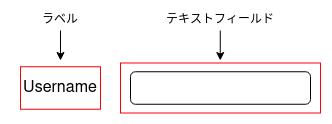
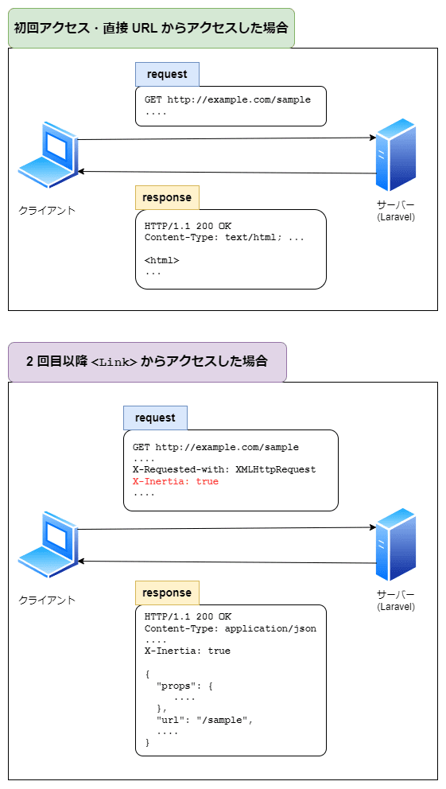

こんにちは。最近、久々に [コメダ珈琲店](https://www.komeda.co.jp/) へ行った k-so16 です。大きなフィッシュバーガーをおいしくいただきました (笑)

2023/6/24 に博多で開催された **[PHP カンファレンス福岡 2023](https://phpcon.fukuoka.jp/2023/)** に参加しました。本記事では、当日のイベントの概要と、聴講したセッションの一部について紹介します。

## イベントの概要

PHP カンファレンス福岡 2023 は 4 年ぶりに *オフラインで開催* されました。当日は一般参加者だけで 130 名、スタッフや登壇者、スポンサーも合わせると **270 人** も来場したとのことです。

登壇者の応募も **239 件** あったとのことでした。登壇された方々も、北は北海道から南は沖縄と、全国各地から参加されていました。

## セッション

### DOM のテストがどんどん書きたくなる Testing Library の世界への招待

#### 概要

テストを書くことにも *労力* と *時間* という **コスト** がかかります。払ったコストに対してパフォーマンスが見合わなければ、テストは書かれなくなります。

発表では、まずテストによって何を得るかという目的について述べられた後、 Web UI のテストをどのように書くのが良いかについて発表されていました。

#### テストの目的

この発表では、テストは、実装したプログラムが期待通りに動くかわからないという不安を取り除くために行うと述べられていました。本番で動かす必要があり、失敗するかもしれないという **不安を取り除くため** にテストをします。開発者がテストによって得ようとしているものは **安心** であると述べられていました。

テストがあることで安心できる理由は **テストが通ればその挙動は本番でも正しく動くはず** と思えるからとのことでした。少ないテストでより多くの安心を得られるテストが **コスパの高いテスト** といえます。ソフトウェアのデリバリーの前に、 **本番環境の再現度が近い状態** でテストかがテストのパフォーマンスを左右すると述べられていました。

#### Web UI のテスト

Web UI のテストが書かれない理由として、 **すぐ壊れる** という理由が挙げられます。テストがすぐ壊れる理由として、 *UI の変更の多さ* が考えられます。しかし、 UI の変更があったとしても、 **ユーザーが使い続けられるのであれば、テストが壊れているのは本番の再現からかけ離れている** テストであると述べられていました。UI のテストを本番の再現に近付けるには、テキストを読んだり、ボタンをクリックするなど、 **ユーザーが可能なことだけでテストする** 必要があります。

UI テストのパフォーマンスを向上させるライブラリーとして、 **[Testing Library](https://testing-library.com/)** が紹介されていました。このライブラリーの設計思想のひとつとして、 **ユーザーが使用する手段** によるテストが書きやすくあるべきということが挙げられています。

Testing Library において、ユーザーが知覚できる要素は **クエリー** を通して取得します。たとえば、入力フォームをテストするには、次の情報をもとにテストします。

- テキストフィールドがあること
- テキストフィールドにラベルがついていること

Testing Library のクエリーを利用することで、ユーザーの知覚できる情報が変わらければテストが壊れなくなるため、 **壊れにくい** UI のテストを実現できます。

#### 所感

UI のテストをほとんど書くことがなかったので、 **Testing Library** はとても興味深いと感じました。まずは何か小さなプロジェクトで使ってみて、有用だと思ったら積極的に利用していきたいですね。

難点を挙げるとすれば、ライブラリー自体の名前が Testing Library ですので、 **情報の検索がたいへんそう** なことかなと思います (笑)

これまでテストのコストパフォーマンスについて、あまり意識したことがありませんでした。最初はプロダクションコードとテストを両方書いていても、 *だんだんとプロダクションコードの修正にテストが追いつかなくなる* といった経験があります。テストを書く際には、 **メンテナンスも含めたコストパフォーマンス** を意識したいと思いました。

### あなたの PHP アプリ、ログはでてますか？あるいはログをだしてますか？

#### 概要

ログが確認された後には、 *何らかのアクション* につながります。そのためには、ログに **意味のある情報** を出力する必要があります。

発表では、どのような情報が必要であるかという **ログ設計** について説明されたあと、アクションにつなげるためにはどのようなことを考えるべきかについて述べられていました。

#### ログとは

ログとは、 **何らかのイベントが発生した際に記録される情報** です。たとえば、 Web ページにアクセスされた際には、そのページのパスや日時などの情報が記録されます。

また、ログのデータは構造化されています。一般的には一行で記録されることが多いですが、 JSON などの処理しやすい構造として記録される場合もあります。

ひとことにログといっても、アプリケーションが出力するログから、 Apache のアクセスログなど、さまざまなものがあります。この発表では、アプリケーションが出力するログに焦点を合わせられていました。

#### ログの設計

アプリケーションのログを出力する際には、次のことを意識することが重要であると述べられていました。

- 何のために出力するか
- 「いつ」「どこで」「何が」とった情報が明確になっているか
- 「何を」「どうするか」は決まっているか

ログを確認して、発生した事象の **再現** や **原因調査** をできることが重要だと述べられていました。たとえば、「エラーが発生しました」というメッセージだけでは、何が原因で発生したかや、エラーを再現するための情報が不足しています。調査や再現が可能な、 **具体的な情報** をログとして残すことが重要であるとのことでした。

#### ログが読まれたあとのアクション

ログは出力されるだけで良いわけではなく、 **そのログを見てアクションに移れる** ことも重要だと述べられていました。アクションにつなげるためには、手順書などの **対応方法が記載されているものと結び付く情報** も載せると良いと主張されていました。

必要なアクションが決まることで、初めてログのレベルが決まるとも述べられていました。適切なログレベルが設定されていないと、緊急で対応が必要なものか、要観察なものなのかなどが判断できず、ログが読まれず対応を必要とするものをスルーしてしまう可能性があります。そのため、 **ログレベルも適切に設定する** ことも重要であると主張されていました。

#### 所感

この発表を聴講して、ログでどのような情報が必要かということをあらためて考えさせられました。特に、 **出力されたログを見てアクションに移せるか** という点について、今後意識していきたいと思いました。まだ自身の理解が浅い部分も多いように感じるので、まずは **再現や調査が可能なログを出せているか** を意識したいと思います。そのうえで、アクションに移せるログを出すには何が必要かも考えたいと思います。

ほかにも、 **ロガーの拡張** や **ログの分析** についても述べられていましたが、知識や経験不足から、ぼんやりとしたイメージしかつかめてませんでした。このあたりについても、今後経験を積んでいって、振り返ったときに内容を理解できているようになりたいと思います。

### Laravel x Inertia.js 「現代のモノリス方式」によるお手軽SPA開発

#### 概要

Laravel で SPA を開発する際には、フロントエンドとバックエンドを別々の構成にして開発することがあります。フロントエンドとバックエンドを分けることで、それぞれの開発に集中できる反面、開発コストがかかる **デメリット** もあります。

発表では、 SPA の開発コストをさげる方法として **[Inertia.js](https://inertiajs.com/)** が紹介されていました。 Inertia.js の特徴と動作の概要についても説明されていました。

#### Laravel を利用した SPA のアプリケーション構成

Laravel を利用して SPA を開発する場合、バックエンドに Laravel を利用し、フロントエンドに Vue や React を利用する構成になることがあります。利点としてバックエンドとフロントエンドが **疎結合** になり、それぞれの開発に集中できることが挙げられます。

一方で、 API スキーマを管理する必要があったり、 *開発スピードの初速が遅い* といったことがデメリットとして挙げられていました。また、フロントエンドとバックエンドを分けることで、 *互いの開発に無関心* にもなりえます。

疎結合な構成にも上記のようなデメリットがあるため、規模やスケジュールによってはフロントエンドとバックエンドを分ける構成は **コストが見合わない** 場合もあります。

#### Inertia.js を用いた SPA 開発

Laravel を利用して SPA を開発する際に、 **Inertia.js** を使うことで、 *フロントエンドとバックエンドを分けずに SPA を実現できる* と紹介されていました。 Inertia.js を利用すると、直接 Vue などのコンポーネントを描画できたり Laravel でセットした変数を参照したりできるそうです。 Inertia.js が提供する **`Inertia::render()`** を利用すると、 blade を書くようにフロントエンドの開発ができると述べられていました。

Inertia.js は **現代のモノリス** を提唱しており、疎結合とは正反対の **密結合** な構成になります。バックエンドとフロントエンドを密結合にすることで、 API 通信を意識することなく SPA の開発が可能になると述べられていました。

#### Inertia.js の動作の概要

Inertia.js が提供する **`<Link>`** コンポーネントを利用すると、クリックした際に **XHR 通信** を行ってデータを取得します。受け取ったデータの内容をもとにページの内容を書き換えることで、ページ遷移を実現します。

また、通信する際には HTTP ヘッダーに `X-Inertia: true` が付与されます。 Laravel は *HTTP ヘッダーに `X-Inertia: true` が含まれていれば Inertia.js からのアクセスと判定* し、 **JSON** をレスポンスとして返します。それ以外の通信の場合は **DOM** を返します。

#### Inertia.js を導入するメリットとデメリット

Inertia.js を導入するメリットとデメリットについても発表で述べられていました。メリットとデメリットは以下の通りとのことでした。

- メリット
    - 1 つのリポジトリ内でアプリケーションが完結するため、管理が楽
    - 開発速度が速い
    - バックエンドとフロントエンドの開発がそれぞれ見えやすい
    - エコシステムや Inertia.js が提供するコンポーネントが優秀
- デメリット
    - Laravel のユニットテストは API のほうが書きやすい
    - API のスキーマによるモックや型定義の恩恵が受けられない
    - Web アプリ以外に展開しようとすると基本的に作り直しになる

手軽に SPA を作成できるメリットがある分、 Web アプリ以外にも展開することを考えている場合は導入するか慎重に検討したほうが良いとのことでした。

#### 所感

Inertia.js というライブラリーを初めて聞いたので、とても新鮮に感じました。特に、 **あえてモノリスに作る** という点に興味を持ちました。 API とフロントエンドで別々に開発する際に、リポジトリを別々に分けて管理する必要もあるので、 **同じリポジトリ内でアプリケーションが完結する** 点でも管理が楽になりそうだと感じました。

デメリットで Web アプリ以外に展開しようとする場合は、 **ほとんど全部作り直し** になってしまうと述べられていたので、導入するかは慎重に検討する必要がありそうです。小さなプロジェクトで速く SPA を開発したいという場面では、積極的に導入できたらと思います。

## 全体の所感

全体を通して、非常に良い刺激を受けられたので、参加して良かったと感じます。 Inertia.js や Testing Library といった、自分にとって初耳のライブラリーを知ることができたり、ログ設計について考えさせられたりと、自分にとって多くの収穫が得られました。 *触ってみたいと思える技術をたくさん知った* ので、機会を見つけて **積極的に利用してみたい** と思います。

**4 年ぶりの開催** であったこともあり、多くの方が参加されていました。九州の方はもちろんのこと、関西や関東、北海道や沖縄と **全国各地** から参加されていて驚きました。当日は登壇者と話せる場も設けられており、そちらも非常に賑わいをみせていました。

懇親会にも参加し、いろいろな方々と話す機会も得られました。立食パーティー形式で行われた懇親会には、おそらく 100 名を超える方々が参加していたように見えました。ちょっとした雑談から、技術的な議論など、さまざまな会話を楽しめました。

今回は聴講での参加でしたが、いずれは **登壇者** として参加したいと思います。そのためにも、よりさまざまな技術についての知識や経験を積んでいきたいと思います。

## 謝辞

今回の非常に有意義なカンファレンスを主催してくださった実行委員の皆様、有益な発表をしていただいた登壇者の皆様、カンファレンス実施に寄与しているスポンサー企業様方にこの場をお借りして御礼申し上げます。