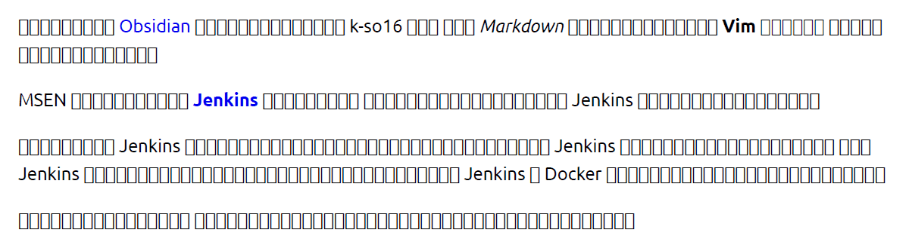
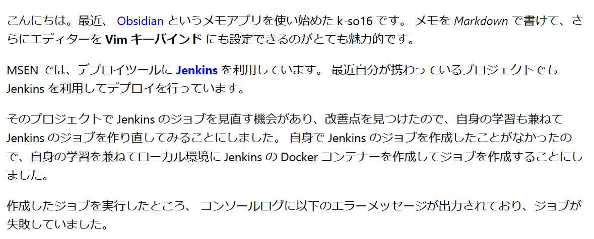

こんにちは。
最近、花粉症に少し悩まされている k-so16 です。
常備している鼻炎薬の力を借りてなんとか乗り切っています(笑)

業務で説明書などのドキュメントを作成する際に、 VS Code の **[Markdown PDF](https://marketplace.visualstudio.com/items?itemName=yzane.markdown-pdf)** というプラグインを利用して Markdown から PDF に変換して作成しています。

*WSL 上に保存している Markdown ファイル* を Markdown PDF で PDF に変換しようとしたところと、エラーが発生し、 PDF が出力されませんでした。
Windows 側から VS Code を開いて Markdown PDF を利用することで PDF に変換できるのですが、その都度 VS Code を開く環境を変えるのは面倒です。

本記事では、 **WSL 環境で Markdown PDF から PDF を生成する際に発生したエラー** と、その **解決方法** について紹介します。

本記事で想定する読者層は以下の通りです。

- WSL 環境で VS Code を起動する方法を知っている
- VS Code の Markdown PDF の利用方法を知っている

## 実行環境

本記事で動作を確認した環境は以下の通りです。

- Windows 11 Pro 22H2
- Windows Subsystem for Linux Version 2
    - Ubuntu 22.04.1 LTS
- Visual Studio Code Version: 1.76.2
    - Markdown PDF v1.4.4

## 出力されたエラーの内容

WSL 上で起動した VS Code から Markdown PDF の PDF 出力機能を利用しようとしたところ、以下のエラーメッセージが表示されました。

```:title=エラーメッセージ
Error: Failed to launch the browser process!
/home/k-so16/.vscode-server/extensions/yzane.markdown-pdf-1.4.4/node_modules/puppeteer-core/.local-chromium/linux-722234/chrome-linux/chrome:
error while loading shared libraries: libX11-xcb.so.1:
cannot open shared object file: No such file or directory
```

*`libX11-xcb.so.1` というライブラリが存在しない* ため、エラーが発生しているようでした。

## 解決方法

結論を述べると、以下の手順で WSL 環境からも Markdown PDF を利用して PDF が出力できるようになりました。

1. 依存パッケージのインストール
2. WSL の日本語フォントの設定

### 依存パッケージのインストール

依存するパッケージが不足していてエラーが発生しているので、必要な依存パッケージをインストールします。
以下のコマンドを実行することで、必要な依存パッケージをインストールできます。

```bash:title=依存パッケージのインストール
sudo apt-get install gconf-service libasound2 libatk1.0-0 libc6 libcairo2 libcups2 \
  libdbus-1-3 libexpat1 libfontconfig1 libgcc1 libgconf-2-4 \
  libgdk-pixbuf2.0-0 libglib2.0-0 libgtk-3-0 libnspr4 libpango-1.0-0 \
  libpangocairo-1.0-0 libstdc++6 libx11-6 libx11-xcb1 libxcb1 libxcomposite1 \
  libxcursor1 libxdamage1 libxext6 libxfixes3 libxi6 \
  libxrandr2 libxrender1 libxss1 libxtst6 ca-certificates \
  fonts-liberation libappindicator1 libnss3 lsb-release xdg-utils wget
```

エラーメッセージには `libX11-xcb.so.1` が見つからないと書かれていましたが、ほかにもパッケージのインストールが必要でした。
それにしても、必要なパッケージが多いですね😅

### 日本語フォントのインストール

依存パッケージのインストールで、 PDF は出力されるようになりましたが、日本語の部分がお豆腐になっていました。
これは *日本語フォントが入っていない* ことが原因です。



解決するには日本語フォントをインストールする方法もありますが、 なんと **Windows にインストールされているフォントを利用する** こともできます。
Windows にインストールされているフォントを利用するには、 **`/etc/fonts/local.conf`** を下記のように編集します。

```xml:title=/etc/fonts/local.conf
<?xml version="1.0"?>
<!DOCTYPE fontconfig SYSTEM "fonts.dtd">
<fontconfig>
    <dir>/mnt/c/Windows/Fonts</dir>
</fontconfig>
```

設定後、再度 PDF を出力すると、無事に日本語フォントが表示されるようになりました。



本記事を執筆する上で、下記の記事を参考にしました。

> - [How to fix puppetteer error while loading shared libraries: libX11-xcb.so.1: cannot open shared object file: No such file or directory | by Steve Mak | Medium](https://medium.com/@ssmak/how-to-fix-puppetteer-error-while-loading-shared-libraries-libx11-xcb-so-1-c1918b75acc3)
> - [Win11のWSL2 (WSLg)を日本語化 &#038; Mozcで日本語入力 | AsTechLog](https://astherier.com/blog/2021/07/windows11-wsl2-wslg-japanese/#toc_id_3_2)

## まとめ

本記事のまとめは以下の通りです。

- VS Code で Markdown PDF から PDF が出力できない際の解決方法を紹介
    - 依存パッケージをインストール
    - 日本語フォントを設定

以上、 k-so16 でした。
本記事が同じ症状で困っている方の役に立てば幸いです。