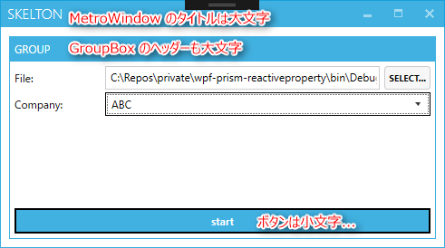
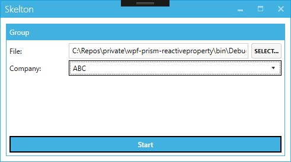

こんにちは、kenzauros です。

WPF でとりあえずソフトを作るときに便利なのが Metro 調の UI にしてくれて、いくつかの有用な UI コントロールを提供してくれる **[MahApps.Metro](http://mahapps.com/)** です。

特にウィンドウの外観を今風にしてくれる MetroWindow は割と優秀なので、これだけ使っている、という方もいらっしゃると思います。

しかし、そんな MahApps さんはいろいろな理由から「とりあえず」の領域を出られない子です。今回はその中の一つの理由と対策をご紹介します。

## MahApps.Metro のイマイチなタイポグラフィ

使わせていただいていて、こういうのもなんですが、*正直デザイン的にはあんまりイケていません*。そもそも Windows 8 の Metro UI 自体が不評だったんだと思いますが、それよりもさらになんか（略

配色やスタイルも全体的にイマイチなんですが、それよりも困った要素があります。それがタイポグラフィ。つまり文字のデザインです。

下記のサンプルアプリのスクリーンショットをご覧ください。



**ウィンドウ (MetroWindow) やグループボックス (GroupBox) のタイトルが大文字化される**のに加え、**ボタンに至ってはキャプションがなぜか小文字化**されます。

まだ大文字になるほうはわかりますが、ボタンでわざわざ小文字になるのは理解できません。いずれにしろ強調する部分は自分で選びたいので、勝手に変換されるのは迷惑です。

## 勝手に大文字や小文字になるのを防ぐ

基本的には作りこまれたライブラリですので、変換を止めるための方法はちゃんと存在します。

### ウィンドウ (MetroWindow)

これは MetroWindow のプロパティに `TitleCaps` というプロパティがあるので、これを下記のように `false` にすれば OK です。

```xml
<Controls:MetroWindow xmlns:Controls="http://metro.mahapps.com/winfx/xaml/controls"
                      TitleCaps="False"
                      Title="Skelton">
```

### グループボックス (GroupBox) や ボタン (Button)

その他のコントロールの場合は `Controls:ControlsHelper.ContentCharacterCasing="Normal"` をコントロールに設定します。余分な記述が増えてしまうのが残念です。

```xml
<Button Content="Start"
        Controls:ControlsHelper.ContentCharacterCasing="Normal"
        Command="{Binding StartCommand}"
        Style="{StaticResource AccentedSquareButtonStyle}"/>
```

GroupBox に関しては App.xaml や Window.Resource などで下記のようにスタイルを上書きしておけば、各コントロールに記述する必要はありません。

```xml
<Style TargetType="GroupBox" BasedOn="{StaticResource MetroGroupBox}">
    <Setter Property="Controls:ControlsHelper.ContentCharacterCasing" Value="Normal"/>
</Style>
```

Button は標準スタイルと `AccentedSquareButtonStyle` のようなスタイルの 2 種類があるので、一括指定はうまくいきませんでした。冗長ですが、個別に記述しましょう。

### 適用後

すべて適用したあとのアフターなスクリーンショットです。



## 参考

参考にしたのはおなじみ Stack Overflow です。

* [wpf - Button with MahApps style show only lower case latters - Stack Overflow](http://stackoverflow.com/questions/31638190/button-with-mahapps-style-show-only-lower-case-latters)
* [.net - Mahapps - How to set Proper Case in Titles - Stack Overflow](http://stackoverflow.com/questions/20595209/mahapps-how-to-set-proper-case-in-titles)


## Windows プログラマーの憂鬱

個人的には WPF というプログラミングスタイルは割と好きで、バインディングの動きなんかもお気に入りです。

しかし、いかんせんデザインがイケてない。標準のコントロールの見た目は、Windows フォームアプリのほうがまだマシだったぐらいです。

ロジックを意識しすぎて、デザインがおろそか、という Microsoft あるあるです。 Windows と同じ。

技術 (technology) は芸術 (art) とともにあるべきですし、美しさを伴わない技術は流行りません。

あ、そうか、だから WPF は流行らないのか。。。ま、それでも現状では Windows アプリを作るのに WPF 以外は考えにくいんですけどね！(笑)
