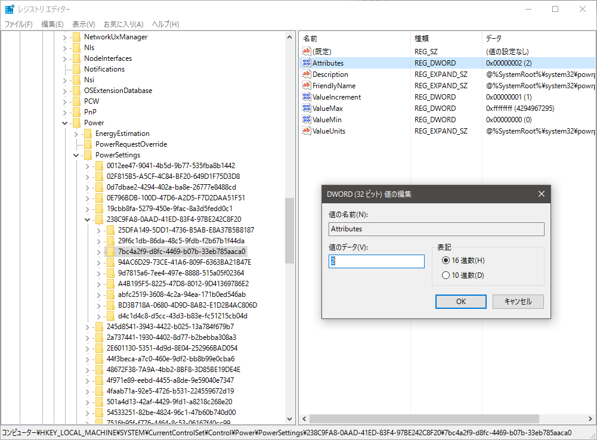
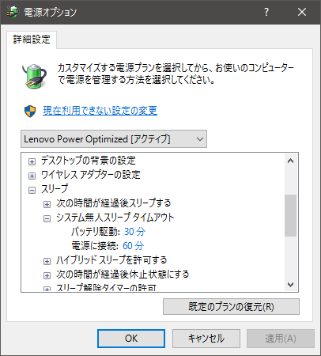

ThinkPad X1 Yoga に OneLink+ ドックをつないで使っていますが、なぜか数分するとパソコンがスリープになる現象があって、トイレにいっている間にスリープになるのでけっこうストレスでした。

やっと解決方法を探し当てたので、まとめておきます。

## 環境

* ThinkPad X1 Yoga (2016) + OneLink+ Dock
* Windows 10 Pro

## 現象

* **PC を操作せずに数分経つと自動でスリープ**になる。
* **Windows の電源オプションでは自動スリープは無効**になっている。
* （私は意識していませんでしたが）**USB のマウスやキーボードで復帰させた場合のみ起こる**
* スリープから復帰後、イベントビューアーで Kernel-Power イベントを見てみると `スリープの理由: システム アイドル` というログが記録されている。

## 原因

根本的な原因は Windows の**システム無人スリープ タイムアウト (System unattended sleep timeout)** です。

[Power Options - Add "System unattended sleep timeout" - Windows 7 Help Forums](http://www.sevenforums.com/tutorials/246364-power-options-add-system-unattended-sleep-timeout.html) によると

> "System unattended sleep timeout" is how many minutes the system will wait idle after waking up in an unattended state before automatically going back to sleep or hibernation.

つまり「**システムがスリープを無人で解除したとき、スリープに戻るまでの時間**」らしいです。電源ボタンで復帰させていない場合、「システムがスリープを無人で解除したとき」として扱われるようです。完全なる Windows の罠。

そして、この値、**標準では数分に設定されている**ようです。さらに困ったことに、なぜか**この設定はデフォルトでは Windows の電源オプションに表示されていない**ので、普通に設定していたのではどうがんばっても無理です。

というわけで、レジストリを書き換えて、設定を表示させてやるところからはじめなければなりません。

## 解決方法

### 1. レジストリを書き換え

Windows キーかスタートボタンを押して regedit + Enter でレジストリエディターを起動します。 UAC ユーザーアカウント制御のダイアログが表示されたら [はい] をクリックします。

レジストリエディターが起動したら下記のキーを開きます。GUID っぽいのが含まれていますが、どの端末でも共通のキーのようです。
```
HKEY_LOCAL_MACHINE\SYSTEM\CurrentControlSet\Control\Power\PowerSettings\238C9FA8-0AAD-41ED-83F4-97BE242C8F20\7bc4a2f9-d8fc-4469-b07b-33eb785aaca0
```



右側にある **Attributes をダブルクリックし、値を 2 に書き換え**ます。終わったらレジストリエディターを閉じます。

### 2. 電源オプションを変更する

電源マークを右クリックするなどして**電源オプション**を開きます。


スリープの下に **システム無人タイムアウト** が出現しているはずなので、これの時間を長めに設定します。



[OK] を押して完了です。おそらくこれですぐにスリープすることはなくなったはずです。

## 参考

* [PCが勝手にスリープ状態になる。](https://social.technet.microsoft.com/Forums/ja-JP/52336ed1-6471-49c9-8930-d831f7c5c8d7/pc?forum=w8itpro)
* [Steady assimilation: [note] Win10のモニタOFFタイムアウト設定を無視する現象の修正方法](http://steadyassimilation.blogspot.jp/2015/09/note-win10off.html)
* [Power Options - Add "System unattended sleep timeout" - Windows 7 Help Forums](http://www.sevenforums.com/tutorials/246364-power-options-add-system-unattended-sleep-timeout.html)
* [Windowsスマートチューニング (201) Vista/Win 7編: 「システム無人スリープタイムアウト」を使用可能にする | マイナビニュース](http://news.mynavi.jp/column/windows/201/)
