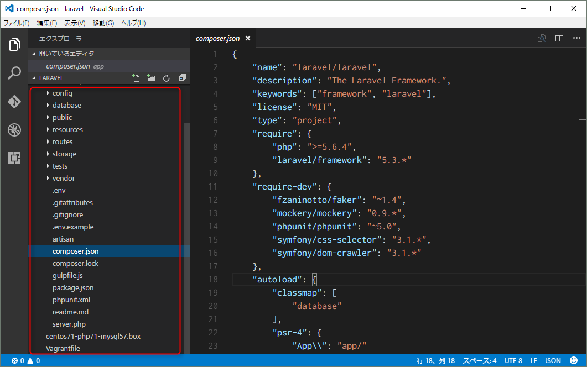
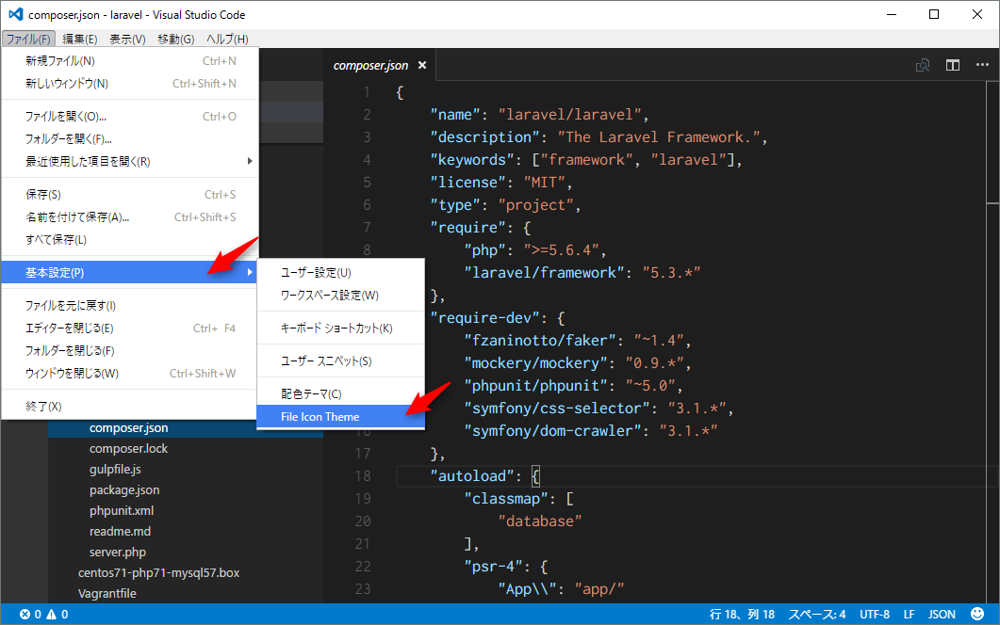
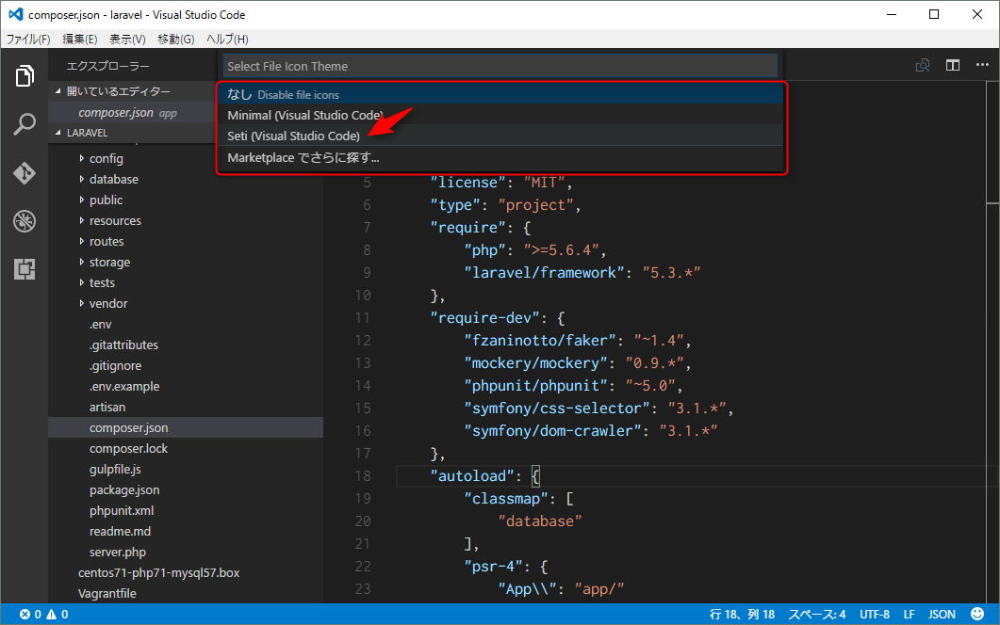
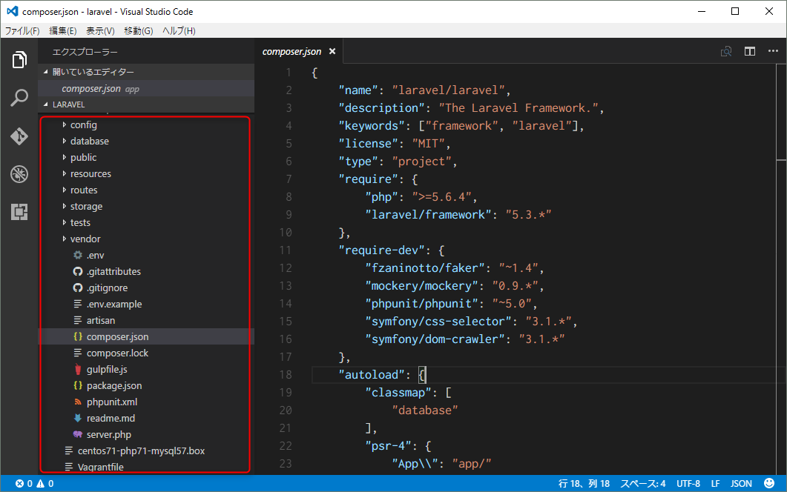

こんにちは、 kenzauros です！みなさん、エディターはなにをお使いですか？私は、去年は Atom 派でしたが今年は **Visual Studio Code** 派です。

## Visual Studio Code

Microsoft が Visual Studio 以外に軽量エディタを作った！と一時期話題になった Visual Studio Code ですが、最近は特に話題もなく落ち着いています。

ただ、地道にアップデートは続いていて、ちょくちょくアップデートのお知らせがきます。どうやら月一でアップデートしているようです。

Atom と同じ Electron ベースで更新も速く、プラグインにも対応したので、これからもっと強力に（重く？）なっていくはずです。

そんなわけで 2016 年 8 月のアップデートが届きました。その中に「ファイルアイコン表示」が含まれています。

* [Visual Studio Code August 2016 1.5](https://code.visualstudio.com/updates/v1_5)

## いままでなかったアイコン表示

**ファイルアイコン表示**は拡張子に応じて、種類を表すアイコンをファイル名の横に表示してくれる機能です。

Atom などはプラグインで対応していたのですが、 Code は元々プラグイン機能が非対応だったこともあって、今まで実装されていませんでした。

↑のようにプロジェクトエクスプローラーは殺風景で、同じような名前のファイル名が多いと、開き間違えも多かったのです。

なにより...**かわいくなかったのです！**

しかし、今回のアップデートでかわいくない Code さんとはオサラバです。

## アイコン表示の設定方法

メニューから [ファイル] → [基本設定] → [File Icon Theme] を選択します。

プロンプトに現れたメニューから **Seti (Visual Studio Code)** を選択します。

するとなんということでしょう！アイコンが表示されたではありませんか！

ちょっとだけかわいくなりました。パチパチ！

## "Code" の憂鬱

Code さんのイマイチなところはその名前です。

"Code" という普通名詞を選んでしまったことで、ググりにくいことこの上なし！毎回 "Visual Studio Code" と打つのはめんどくさいです。

普通名詞だった "Atom" は、今や技術系の単語と合わせれば、ちゃんと Atom 系の記事がでるようになりましたが、 "Code" は広すぎてむずかしいのではないかと思います。

うーむ。。。
