4 月に **ThinkPad X1 Yoga** を購入し、メインマシンとして使っていますが、いくつか不具合というか困ったこともあります。

その一つが**「スリープにしたのに予期せずシャットダウンされている」**ことです。

## カーネルパワー 41 問題

私はスリープ派なので、再起動は週に一回ぐらいです。この「勝手にシャットダウン」現象が発生すると作業状態が保存されないので不便だし、データ消失もありえるので避けたいところです。

毎日スリープにしていますが毎日起こるわけではなく何日かに一回、ということが多いです。

調べていくとどうやら **Kernel-Power 41 問題** あるいは **KP41 病**として有名な Windows の病気のようです。

### イベントビューアで Kernel-Power 41 を確認

とりあえずイベントビューアーを見てみます。

Windows 10 では、スタートボタンを右クリックして**イベントビューアー**をクリックするのが一番速いでしょう。余談ですが、[Windows の用語は 2008 年から長音表記が変更になりました](http://www.atmarkit.co.jp/news/200807/25/microsoft.html)ので、イベントビューアーは「イベントビューア」ではありません(笑)

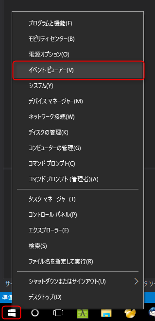

管理イベントの要約のところに **イベントの種類＝重大** というのが 1 件以上あれば + を押して開いてみます。

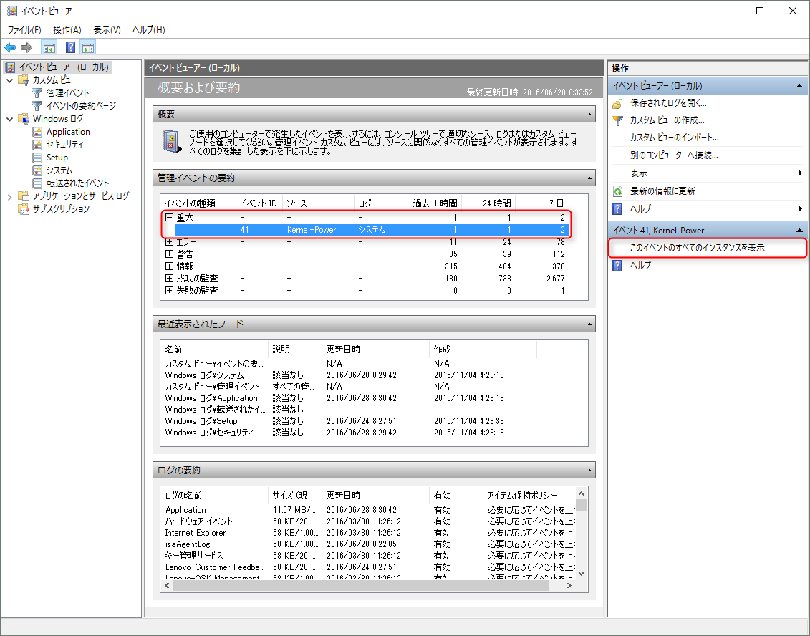

今回の問題が発生している場合は **イベント ID: 41, ソース: Kernel-Power** というのが存在しています。

その行を選択して **このイベントのすべてのインスタンスを表示** をクリックします。するとこのイベント ID で発生したイベントログが一覧で表示されます。

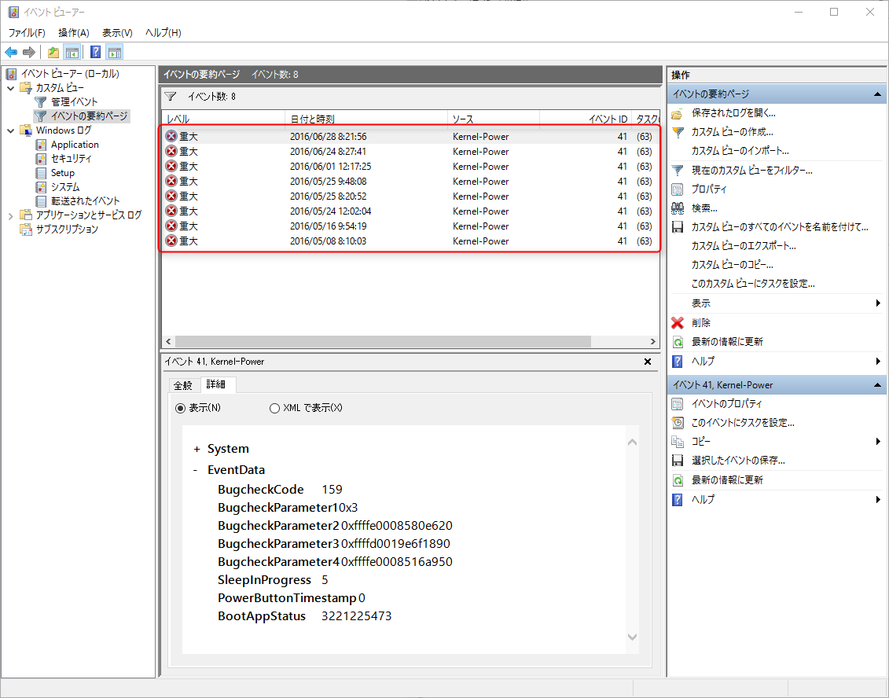

今回の場合、8 回発生していることがわかります。手元に届いたのが 4 月 5 日なので一ヶ月程度は何事もなかったようです。その後も発生頻度はまばらなのでどのようなタイミングで起こっているのかは、はっきりしません。

### Kernel-Power 41 の前のイベントを確認

直近で起こった Kernel-Power 41 からスリープまでをさかのぼって見てみると下記のような電源関係のログが記録されていました。

```
2016/06/27 18:00:19 Kernel-Power (42) システムがスリープ状態になります。スリープの理由: アプリケーション API
2016/06/27 18:00:28 Kernel-Power (107) システムがスリープ状態から再開されました。
2016/06/27 21:00:20 Kernel-Power (131) ファームウェア S3 回数。ResumeCount: 2、FullResume: 373、AverageResume: 347
2016/06/27 21:00:20 Kernel-Power (130) ファームウェア S3 回数。SuspendStart: 67279970、SuspendEnd: 67279977
2016/06/27 21:00:23 Kernel-Power (42) システムがスリープ状態になります。スリープの理由: スリープ状態から休止 - 固定タイムアウト
2016/06/28 08:21:53 Kernel-Boot (16) Windows はエラー ステータス 0xC0000001 の休止状態から再開できませんでした。
2016/06/28 08:22:05 EventLog (6008) 以前のシステム シャットダウン ( ‎2016/‎06/‎27 17:26:00) は予期されていませんでした。
2016/06/28 08:21:56 Kernel-Power (41) システムは正常にシャットダウンする前に再起動しました。このエラーは、システムの応答の停止、クラッシュ、または予期しない電源の遮断により発生する可能性があります。
```

スリープに入ったのは 18:00 でしたので、どうやら **スリープ→スリープ(再開)→休止状態→休止状態から復帰できずにクラッシュ→再起動** という流れのようです。

たしかにスリープ→休止状態は電源の設定で 180 分に設定されているので、21 時に休止状態へ移行しているのは正常動作です。問題はその**休止状態から正常に復帰できずに再起動になってしまっている**ところのようです。しかし、明確な理由は不明です。。。

とりあえずネットで検索してみると休止状態に入らないようにする以外に **Windows 高速スタートアップを無効にする** という対策が一般的なようです。

## Windows 10 で高速スタートアップを無効にする

### 高速スタートアップってなんやねん

詳細な説明は @IT でも見ていただくとして、 **高速スタートアップ は Windows 8 から搭載された起動時間高速化の仕組み**で、 Windows 7 から 8 になったときに「妙に起動が速くなったなー」と思わせたアレです。

* [Windows 8レボリューション：第17回　素早い起動を可能にする「高速スタートアップ」 - ＠IT](http://www.atmarkit.co.jp/ait/articles/1303/21/news107.html)

具体的には「シャットダウン」したときに、従来の「完全なシャットダウン」の代わりに「休止状態」レベルにしておくことで**高速な起動をしているように見せています**。以前から「休止状態」は存在したわけで、別段この手法が目新しいわけではないのですが、従来の「休止状態」ではユーザーセッションなども保存されていたのに比べると少し「ディープな休止状態」と呼べます。**「従来の休止状態」と「完全なシャットダウン」の中間ぐらい**でしょうか。

さて、そんな気の利いた (?) 機能ですが、やはり環境によっては悪さをしているみたいで、調べれば「高速スタートアップ 無効化」は頻出検索ワードのようです(笑)

### 電源オプションから高速スタートアップを無効化

というわけでなんとなくこれが原因っぽいので、**高速スタートアップを無効化**します。

電源オプションから設定しますので、イベントビューアと同様にスタートボタンの右クリックから**電源オプション**を開きます。

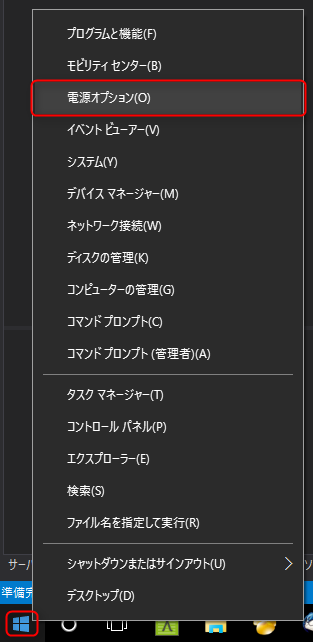

高速スタートアップの設定はなぜか電源ボタンの動作の設定に含まれていますので、 **電源ボタンの動作を選択する** をクリックします。

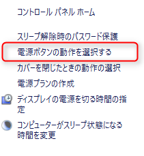

電源ボタンの定義とパスワード保護の有効化というややこしい名前のページが開くので、これまたややこしい**現在利用可能ではない設定を変更します**というリンクをクリックします。

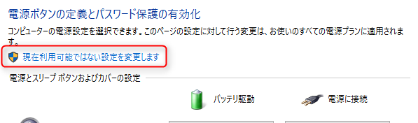

これで画面下部のシャットダウン設定が操作できるようになるので、**高速スタートアップを有効にするチェックを外します**。

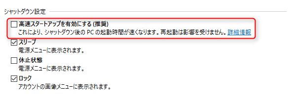

これで**変更を保存して再起動**します。

完了です。ちなみに設定を戻すときは同様の手順で ↑ のチェックを戻して再起動しましょう。

### 高速スタートアップを無効にしても問題ないのか

高速スタートアップを無効にすると当然シャットダウンからの起動が遅くなるはずです（「再起動」はそもそも完全シャットダウン→起動の処理らしいので影響ありません）。

早速無効にしてからシャットダウン→起動をしたところ、**ログイン画面が表示されるまでの起動時間は 25 秒**でした。元々の起動時間を計っていなかったので、比較できないのですが、 30 秒以内で起動するならさほどストレスはありません。そもそも起動するのは 1 週間に 1 回だけですし。

これでしばらく様子を見てみます。 (2016/6/28)

## 2016/6/29 再発

翌日再発しました(笑)

ひょっとして設定がうまくできなかったのかと思い、電源オプションを見直しましたが、高速スタートアップは無効になったままです。イベントログも昨日の状態と変わりません。

休止状態からの復帰に失敗していることは間違いなさそうなので、次は電源オプションから **スリープ - 次の時間が経過後休止状態にする を 0分 (なし)** にしてみました。

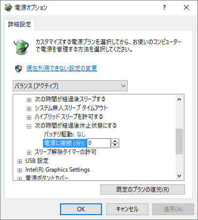

これで再度様子を見てみます。 (2016/6/29)

## 2016/7/1 再発

再発しました！(笑)

この記事を書き始めてから頻度が上がった気がします...orz

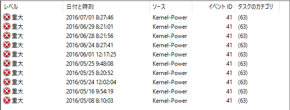

さて、今回はイベントログを確認したところ今度は休止状態に入った形跡はありません。

ということは**休止状態、高速スタートアップともに無関係**ということになります。他に目立ったイベントログもないので、原因がさっぱりわかりません。

気を取り直して、再度 Kernel-Power 41 のログを見直してみます。詳細タブには BugcheckCode という KP41 が起こった原因を示す値が記録されています。ここ最近起きている KP41 ではこの数値が 159 になっていました。

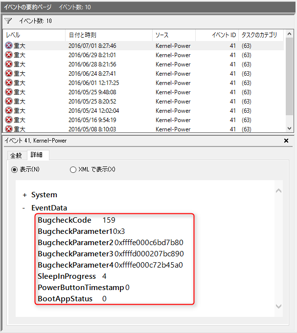

159 は 16 進数で 0x9F です。ん...？なんか見覚えがあるような。で、ググってみると案の定「ブルースクリーン」の文字が。そういえばそうです。**0x0000009F** といえば、なんかドライバーとがバグってブルースクリーンがでるときによくある DRIVER_POWER_STATE_FAILURE というアレです。

[(Developer Content) Bug Check 0x9F: DRIVER_POWER_STATE_FAILURE - Windows 10 hardware dev](https://msdn.microsoft.com/en-us/library/windows/hardware/ff559329%28v=vs.85%29.aspx?f=255&MSPPError=-2147217396)

ということは夜知らない間にブルースクリーンになっていた、ということですね。

さらに BugcheckCode の下の BugcheckParameter1 というのが 0x3 なのでこの部分を見てみると

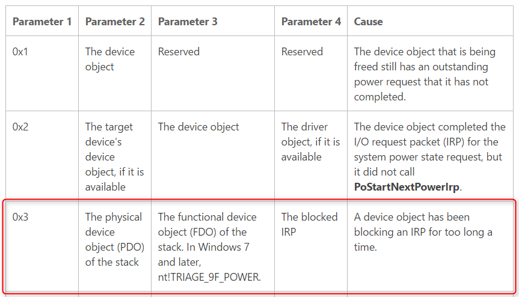

> Cause: A device object has been blocking an IRP for too long a time.

うん、これだけではさっぱりわかりません。仕方がないのでブルースクリーン (BSoD: Blue Screen of Death) の詳細情報を表示してくれる BlueScreenView をダウンロードします。日本語翻訳ファイルもあります。

* [BlueScreenView ダウンロードページ](http://www.nirsoft.net/utils/blue_screen_view.html#DownloadLinks)

起動した画面がこちら。今までのクラッシュ時のダンプファイルが表示されています。

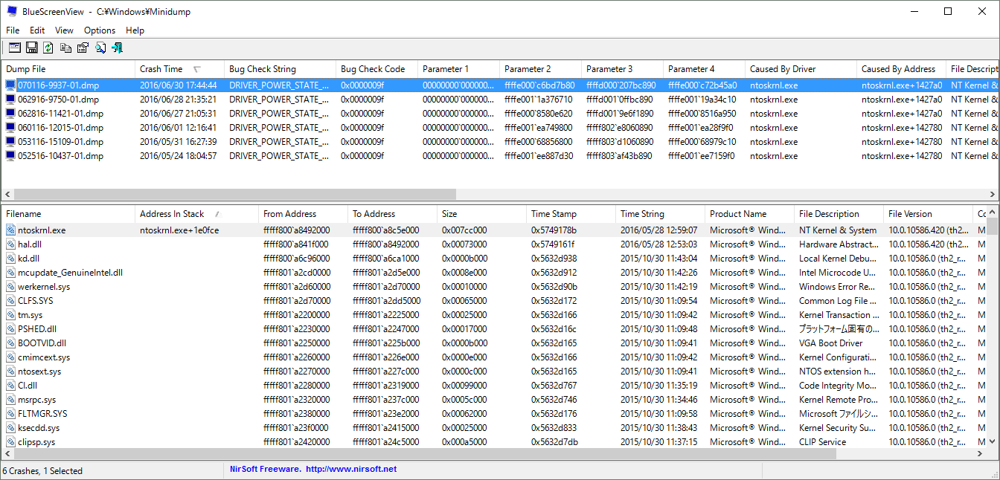

昨日発生しているものを見てみるとたしかにスリープにした時刻付近に発生しています。原因のドライバー (Caused By Driver) を見てみると ntoskrnl.exe とあります。

ん…？ NT OS Kernel...？なんということでしょう。OS のカーネルではありませんか(´・ω・`)

うん、原因不明ですね(笑)

こうなるともはや試行錯誤するありません。。。とりあえずパソコン（というか Dock）に刺さっていた USB ケーブルをすべて抜いてみました。これでまた様子を見てみることにします。

## 2016/7/7 再発

再発しました(笑)

しばらく大丈夫だったので、お？と思っていましたが、やはりダメでしたorz

**Lenovo Companion** で更新をチェックしたところグラフィックのドライバーの新しいバージョンがでていましたので、更新してみました。


## まとめ

2016/7/28 現在、とりあえず改善したようです。

* 「Kernel-Power (41) システムは正常にシャットダウンする前に再起動しました。」が発生する場合は**高速スタートアップを無効にする**
* 06/29 だけではダメでした。**自動的に休止状態に移行するのを停止**しました
* 07/01 が、これもダメでした。なんらかのデバイスの影響でブルースクリーンになっていることはわかったので、とりあえず **USB ケーブルをすべて抜きました**
* 07/07 が、やはりダメなので、グラフィックドライバーを更新して様子をみます。
* 07/28 ↑以来、症状は発生していません。
* まだ予断は許せませんが(笑)、とりあえず**ドライバー更新**はやはり鉄則なようです。
