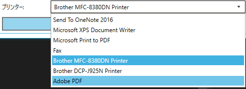

こんにちは、最近は WPF プログラマーのけんけんです。業務アプリを作っていると避けて通れないのが**「印刷」**です。

そもそもちゃんとした印刷用のライブラリもそんなに提供されていないし、ライセンスの問題でライブラリが使えない、なんてことも多く悩ましい部分です。

## Excel を使ったテンプレート印刷

そんな印刷の中でも比較的敷居の低いのが、**Excel を使った印刷**です。「パソコンなんだから Excel ぐらいだいたい入ってるやろ」という強引な前提のもと、Excel で作ったテンプレートに値を流し込んで印刷しちゃう方法です。開発者にとってはアプリ側で印刷のデザインを考えずに済みますし、ユーザーにとっても簡単にレイアウトを変更できるという点で、双方にとってそれなりにメリットのある手法です。

C# 側からの Excel の制御は `Microsoft.Office.Interop.Excel` 名前空間のクラスを使って行いますが、そのあたりはまた別の機会にまとめるとして、今回は**コンピュータにインストールされているプリンター名の一覧を取得して、選択できるようにする方法**をご紹介します。

## プリンター選択コンボボックスを作る

下図のようなプリンター選択用のコンボボックス (ComboBox) を作ります。なお、コントロールがリストボックス (ListBox) でも同じように実装できます。

<a href="images/printer-selector-in-wpf-1.png"></a>

System.Drawing.Printing 名前空間にある [PrinterSettings](https://msdn.microsoft.com/ja-jp/library/system.drawing.printing.printersettings(v=vs.110).aspx) クラスの [InstalledPrinters](https://msdn.microsoft.com/ja-jp/library/system.drawing.printing.printersettings.installedprinters(v=vs.110).aspx) スタティックプロパティを利用します。そのまんまな名前でわかりやすい。

### 1. 参照の追加

プロジェクトの参照設定から **System.Drawing への参照を追加**します。GDI+ のライブラリである System.Drawing.dll を WPF 利用することには多少違和感がありますが、残念ながら WPF にはそのあたりの機能がありませんので、目をつぶりましょう。

### 2. 名前空間宣言の追加

XAML のルートタグに下記の XML Namespace エイリアスを追加します。これがないと `名前空間プレフィックス "Printing" が定義されていません。` などと怒られることになります。

```
xmlns:Printing="clr-namespace:System.Drawing.Printing;assembly=System.Drawing"
```

### 3. コンボボックスの ItemsSource に PrinterSettings.InstalledPrinters を設定する

あとは適当に ComboBox を配置して、 `ItemsSource` に `{x:Static Printing:PrinterSettings.InstalledPrinters}` を指定します。
```
<ComboBox ItemsSource="{x:Static Printing:PrinterSettings.InstalledPrinters}"
          SelectedItem="{Binding SelectedPrinter}"/>
```

ちなみに InstalledPrinters プロパティで得られるのはプリンター名だけで、型は PrinterSettings.StringCollection という専用のクラスですが、 ICollection や IEnumerable を実装しているので、通常の string 型配列と同様に扱えます。

SelectedItem には ViewModel などのバインディング先のプロパティを指定すれば OK です。コンボボックスで選択が変更されるとプリンター名がこのバインディング先に代入されます。

余談ですが、昔々コンボボックスをコソボボックスだと思ってて、なんか物騒なコントロールだな～、とか思ってました(笑)

## Excel で指定したプリンターを使って印刷する

Excel の操作については省きますが、印刷するときは Workbook クラスか Worksheet クラスの **PrintOutEx メソッドの第 5 引数に ActivePrinter という引数があり、これにプリンター名を string で渡せば OK** です。

```
// using 追加しておく
using Microsoft.Office.Interop.Excel;

// Excel ファイルを開いて印刷する
var printerName = SelectedPrinter;
var application = new Application();
var workbook = application.Workbooks.Open(filename);
workbook.PrintOutEx(ActivePrinter: printerName);
```

以前は COM 系のメソッド呼び出し時は指定しない引数には下記 1 行目のようにすべて `Type.Missing` を渡す必要がありましたが、最近は**名前付き引数が利用できるので、2 行目のように引数名を指定するだけで他の引数は省略できます**。エクセレント。

```
// やたら冗長な Type.Missing
workbook.PrintOutEx(Type.Missing, Type.Missing, Type.Missing, Type.Missing, printerName, Type.Missing, Type.Missing, Type.Missing);
// 名前付き引数でエレガントに
workbook.PrintOutEx(ActivePrinter: printerName);
```

## あとがき


仕方ないとは思うのですが、 Web でも Windows でも「印刷」周辺の機能は重視されないので、実装するとなるとけっこう泥臭いですよね。いわゆる業務アプリを作るときは避けては通れない道だし...。

紙に印刷するかどうかは別として、「ドキュメントとして出力する」というのは重要な機能だと思うんですけどねぇ。

今日はめっちゃ蒸し暑かったです。梅雨ですねぇ。みなさまご自愛くださいませ。