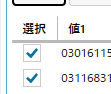

WPF でソフトを作っていると標準のコントロールで足りないことがよくあります。

DataGrid の ComboBox や CheckBox もその一つで、イケてないコントロールの代表格です。おまけに [MahApps.Metro](http://mahapps.com/) のようなコントロールライブラリでもなかなか補完できないのが困った点です。

目新しいことではないですが、 DataGrid を使うときにいつも忘れてしまうので、メモついでにスニペットをご紹介します。

## 使えない DataGridCheckBoxColumn

WPF の DataGrid には [DataGridCheckBoxColumn](https://msdn.microsoft.com/ja-jp/library/system.windows.controls.datagridcheckboxcolumn(v=vs.110).aspx) というそのままな名前の列があり、これを使うと簡単にチェックボックスが表示できます。

まぁ、表示するだけなら問題ないんですが、普通チェックボックスを置くときは有効・無効を切り替えたりしたいときだと思うので、クリックでチェックの入り切りをしたい...ですよね？！

でもたかがそれだけのことができないのです。この子は。

**チェックを入れたり外したりするのに2クリック必要**です。1クリックではセルが選択されるだけでなにも起こらず、やっとこさ次のクリックで反応します。これがまぁ直感的でなくてかなりストレスです。なんなんだこの実装は。

## DataGridTemplateColumn で実装

ということで、 DataGridCheckBoxColumn とは楽しい時間を過ごせそうにないので、 [DataGridTemplateColumn](https://msdn.microsoft.com/ja-jp/library/system.windows.controls.datagridtemplatecolumn(v=vs.110).aspx) を使って、直接 CheckBox を配置してしまうのが、定石です。いつも忘れるけど。

```
<DataGridTemplateColumn IsReadOnly="True" Header="選択">
    <DataGridTemplateColumn.CellTemplate>
        <DataTemplate>
            <CheckBox IsChecked="{Binding IsSelected.Value, Mode=TwoWay, UpdateSourceTrigger=PropertyChanged}"
                      HorizontalAlignment="Center" VerticalAlignment="Center"/>
        </DataTemplate>
    </DataGridTemplateColumn.CellTemplate>
</DataGridTemplateColumn>
```

ミソは `UpdateSourceTrigger=PropertyChanged` です。これをしておかないとチェック ON/OFF してもバインド先が書き換わりませんので、ハマります。もちろん `Mode=TwoWay` もお忘れなく。



## でも長い

でも本来なら `<DataGridCheckBoxColumn>` だけで済むはずなのになぜこんなに冗長な記述をせにゃいかんのか。

**Microsoft だから。**

ちなみに ComboBox の場合も `DataTemplate` の中に ComboBox を置いてやれば OK です。

それでは楽しい WPF ライフをお過ごしください。