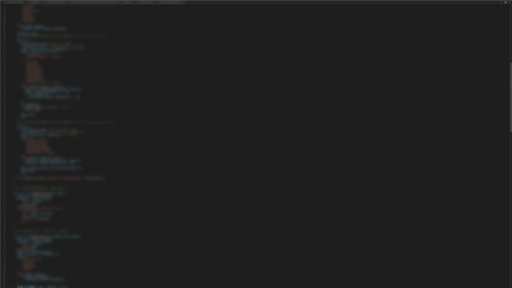
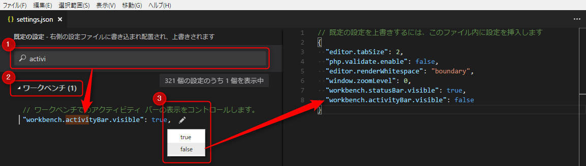
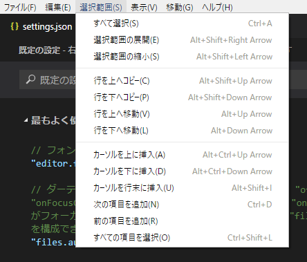

**Visual Studio Code** の 2016年11月度アップデート Version 1.8 が提供されていますので、**今回も私が気になった部分だけを紹介**します。

[Visual Studio Code November 2016](https://code.visualstudio.com/updates/v1_8)

更新項目が多いため、私のあまり使わない機能やよくわからない機能は紹介しませんので、あしからずご了承ください。

先月分はこちら➔ [Visual Studio Code でエディターの水平分割やソースコード整形が可能に (2016/10 version 1.7)](https://mseeeen.msen.jp/vs-code-201610/)

## ワークベンチ

### ホットイグジット (Hot Exit)

**Hot Exit. ホットイグジット**。かっこいい名前なんですが、いい日本語訳が思いつきませんでした(笑)

要するに「**電源入ったままで落とせます**」機能です。イマドキのテキストエディタなら当然な機能なんですが、今までなかったのです。

でもこれからはすべてのウィンドウを閉じたときでも保存していない変更を覚えてくれているのです。そう、VS Code さんがね。

次の起動時にすべてのワークスペースとファイルがバックアップされていて、復元されます。もちろん VS Code がクラッシュしたときも。

この機能はユーザー設定の `files.hotExit` で有効無効を切り替えられます。

### ビューピッカー (View Picker)

かなり地味ですが、 Ctrl+Q を押すと画面上のペイン (エクスプローラーやGit、拡張機能、ターミナルなど) にすばやく？アクセスできます。

慣れると便利かもしれません。

### 統合ターミナル (Integrated Terminal) の改善

ちょっとしたことですが、Ctrl+@ などで画面下部に開くことのできる統合ターミナル (Windows ではコマンドプロンプト) に関する改善がなされています。個人的にはとてもうれしい改善でした。

* **コピペ機能のショートカットキー**が Ctrl+Shift+C/V から **Ctrl+C/V** に変更されました。
* ターミナルで上方向にスクロールしているときになんらかの出力を受け取っても勝手に下までスクロールすることがなくなりました。
* **Ctrl+K でターミナルをクリア**できるようになりました。

## あなたのコードに集中してください。

強制的にプログラマーにコードだけを見せて集中して仕事させようというブラックな機能追加です（嘘です）。

見出しは直訳です。

### Zen モード (Zen Mode)

アメリカ人の大好きな **禅** モードです。

Ctrl+K➔Z と押すことで Zen モードに突入し、エディタ以外の部分をすべて隠して全画面表示に切り替え、ソースコードしか見えない状態にします。

ダークな画面にソースエディターだけがスッとたたずむ様は、まさに

     

禅

     

...個人的には禅というより DOS を彷彿とさせますが、まぁうるさい要素が消えて没入しやすい環境になることは間違いありません。 Spotify の没入系 BGM が合いそうです。

ただ、4K モニターでやると下記のように大変寂しい画面になるのでおすすめしません。

なお、**解除するときは Esc キーを 2 回**押します。最初解除できなくて焦りました(笑)

### アクティビティバーがカスタム可能に

**アクティビティバー**（っていうのを知りませんでしたが、画面左端のアイコンが5個ぐらい並んでるエリアです。）の**アイコンの並べ替えやアイコンの非表示**ができるようになりました。

私はここの Git をつかってないので、とりあえず非表示にしてみました。拡張機能も頻繁には開かないので削除。ちょっとすっきりしました。

「アイコンはユニバーサル」なんでしょうが、最近はバリエーションが多すぎて、逆に直感的にわかりにくくなっている気がします。

ちなみにバーを右クリックすれば、コンテキストメニューが表示されて、すぐにアイコンを復元できます。

### アクティビティバーとタブを閉じるボタンの非表示

アクティビティバー自体を非表示にするオプション 
`workbench.action.toggleActivityBarVisibility` が追加されたそうです。アイコンを非表示にするだけでは我慢できないミニマリストのあなたに。

（下のほうの文を書いてて気づきましたが、設定名は `workbench.activityBar.visible` に変更されているようです。）

ついでにタブに表示される閉じる (✕) ボタンも `workbench.editor.showTabCloseButton` オプションで非表示にできるようになりました。 ✕ ボタンを隠しても、変更されたことを表す ● 表示は残ります。

## 設定 (Setting)

使いにくかった設定周りが大きく改善されました！

VS Code の設定は settings.json に JSON 形式で記述しますが、このとき項目名等がなにもないので、同時に表示される**既定の設定**からコピペしてくる必要があります。

VS Code の機能増加にともなって、設定の数も増え続けているため、この既定の設定から目的の項目を探すのがつらくなっていました。

今回の更新で下記の 3 機能が追加されました。画像と合わせてご覧ください。

1. **既定の設定の検索（フィルタリング）機能**
2. 設定のグループ
3. **クイック編集**

まぁ 1 は今までなかったのが不思議なぐらいですが、 3 は秀逸。

既定の設定の項目右側にエンピツアイコンが表示され、クリックすると選択肢が表示されます。**選択肢をクリックすると右ペインのユーザー設定に自動的に追加**されます！

しかもユーザー設定側でも同様の操作で設定変更ができます。これ CSS でもできるようにならないかな...。変更した設定は基本的には即座に反映されます。

ようやく設定がそれなりに使えるレベルになりました。まる。

## キーボードショートカット

### キーバインドの引数

ファイル➔基本設定➔キーボードショートカット で表示される `keybindings.json` でキーボードショートカットを設定できますが、これに `args` を指定して引数を渡すことができるようになりました。  

定型文を入力したりするのに使えますが、まだ具体的用途がうかびません。

### 推奨キーマップ設定用 拡張機能

ファイル➔基本設定➔キーマップ拡張機能 を選ぶと、よくある他のエディターのキーマップが導入できる拡張機能一覧が表示されます。

2016/12/19 現在では Sublime Text や Vim, IntelliJ IDEA, Emacs, Atom, Visual Studio, Eclipse, Delphi が列挙されています。

Vim が 176K ダウンロードでずば抜けています。使いませんけど。

## エディター

### 選択範囲メニュー

選択範囲メニュー が追加されました。なんかフォトショみたいですね。

このあたりはショートカットキーで慣れておくと便利ですが、そのリファレンスとしても使えるのでこのメニューはありがたいです。

## あとがき

まだまだいろいろあるのですが、疲れたので終了します。

さて、この連載も楽しくなってきたので、来月のアップデートも楽しみです。