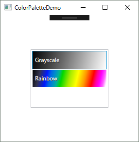

こんにちは、けんけんです。今回は WPF/UWP での画像処理関連です。

最終的にはこのようなカラーパレット選択用のリストボックスを作ります。

### この記事でできること

1. BitmapPalette を LinearGradientBrush に変換（マッピング）する拡張メソッドを実装します
2. この拡張メソッドを使って実際にパレット選択用のリストボックスを実装します

## ビットマップ用のカラーパレットクラス BitmapPalette

画像処理プログラムを作っていると、どこかでお付き合いすることになる [BitmapPalette](https://msdn.microsoft.com/ja-jp/library/system.windows.media.imaging.bitmappalette(v=vs.110).aspx) クラス。[BitmapSource](https://msdn.microsoft.com/ja-jp/library/system.windows.media.imaging.bitmapsource(v=vs.110).aspx) のカラーパレットに使われるクラスで、自分でパレット変換をしようと思うと避けては通れない道です。

さて、そんなカラーパレットを何個か作ると**せっかくなのでユーザーにパレットを選択させたい欲**がでてきます（きっとでてきます）。そして、どうせならそのカラーパレットをそのまま画面に表示して選んでもらいたくなります（きっとなります）。

### BitmapPalette クラスに関する補足

BitmapPalette や BitmapSource は "Bitmap" という名前ですが、別段 Windows ビットマップ (BMP) 専用ではありません。いわゆる普通のラスター画像 (JPEG/PNG/GIF/TIFF/BMP などなど) はすべて Bitmap です。

そして、これらの画像のうちインデックスカラー (Indexed Color: ピクセルデータが画像の色ではなくカラーパレットの色番号を表す方式) の画像に使われるのが BitmapPalette クラスです。

なお、JPEG は仕様上、画像を RGB で管理するため、 BitmapPalette が使われることはありません。その他の形式はだいたい RGB とグレースケール、インデックスの 3 種類に対応しています。

## BitmapPalette を LinearGradientBrush に変換する

ということで画面にカラーマップを表示したいわけですが、ピクセル単位で色を描画していた時代は終わりました。

**WPF や UWP では [LinearGradientBrush](https://msdn.microsoft.com/ja-jp/library/system.windows.media.lineargradientbrush(v=vs.110).aspx) に変換して、このブラシで要素を描画してしまうのがスマート** でしょう。

ちなみに LinearGradientBrush クラスは昔の System.Drawing.Drawing2D にも存在しますが、この記事は UWP/WPF をターゲットにしているので System.Windows.Media のものを指します。

### LinearGradientBrush に変換する拡張メソッドを定義

今回は BitmapPalette クラスの拡張メソッドとして定義してみます。

```csharp
public static class BitmapPaletteExtensions
{
    public static LinearGradientBrush ToLinearGradientBrush(this BitmapPalette palette)
    {
        var d = palette.Colors.Count - 1;
        var stops = palette.Colors.Select((color, index)
            => new GradientStop(color, (double)index / d));
        return new LinearGradientBrush(new GradientStopCollection(stops));
    }
}
```

LINQ で書くとエレガントですね。（ほんとは最初ループで書いてましたが、さっき思いついて書き直しました・笑）

LinearGradientBrush は色の段階を GradientStop で表しますので、カラーパレットの長さ分だけ、この GradientStop を生成して、 それを LinearGradientBrush のコンストラクターに渡してやれば OK です。

GradientStop にはその色の相対位置を 0.0 ～ 1.0 で指定する必要があるため、リストのインデックスを `d` で割ったものを `offset` (`(double)index / d` の部分) にしています。

分母 `d` を カラーリストの長さ-1 としているのは、**カラーパレットの 0 ～ 255 を 0.0 ～ 1.0 にマップするため**です。これで 0.0 ～ 1.0 が 256 段階になります。

## リストボックスにバインドしてみる

では、定義した拡張メソッドをつかって最初に示した選択用リストボックスを作ってみます。

MVVM を前提とし、 MainWindow.DataContext には MainWindowViewModel が設定されているものとします。

### パレット用の ViewModel

簡単な読み取り専用の ViewModel を作ります。特に変更を反映しないので INotifyPropertyChanged は実装していません。

```
public class ColorPaletteViewModel
{
    public string Name { get; }
    public BitmapPalette Palette { get; }
    public LinearGradientBrush Brush { get; }

    public ColorPaletteViewModel(string name, BitmapPalette palette)
    {
        Name = name;
        Palette = palette;
        Brush = palette.ToLinearGradientBrush();
    }
}
```

ここで**今回実装した `ToLinearGradientBrush()` が登場**しています。拡張メソッドなのであたかも BitmapPalette クラスのメソッドのように呼び出せています。

### MainWindow の ViewModel

MainWindowViewModel にパレットのコレクションを定義し、コンストラクタで準備します。

```
public ObservableCollection<ColorPaletteViewModel> ColorPalettes { get; } = new ObservableCollection<ColorPaletteViewModel>();

public MainWindowViewModel()
{
     ColorPalettes.Add(new ColorPaletteViewModel("Grayscale", BitmapPalettes.Gray256));
     ColorPalettes.Add(new ColorPaletteViewModel("Rainbow", ColorPalettes.RainbowPalette));
}
```

※ ColorPalettes.RainbowPalette は標準ではありませんので、自作のパレットを指定します。

### スタイル定義

App.xaml にでも ListBox のスタイルを定義します。

```
<Style x:Key="ColorPaletteListBoxStyle" TargetType="ListBox">
    <Setter Property="HorizontalContentAlignment" Value="Stretch"/>
    <Setter Property="VerticalContentAlignment" Value="Stretch"/>
    <Setter Property="Padding" Value="1"/>
    <Setter Property="ItemContainerStyle">
        <Setter.Value>
            <Style TargetType="ListBoxItem">
                <Setter Property="HorizontalContentAlignment" Value="Stretch"/>
                <Setter Property="VerticalContentAlignment" Value="Stretch"/>
                <Setter Property="Padding" Value="0"/>
                <Setter Property="Margin" Value="0"/>
            </Style>
        </Setter.Value>
    </Setter>
    <Setter Property="ItemTemplate">
        <Setter.Value>
            <DataTemplate>
                <Border Background="{Binding Brush}" Height="36">
                    <Grid Margin="5,3" VerticalAlignment="Center">
                        <TextBlock Text="{Binding Name}" Foreground="#333" Margin="1,1,0,0"/>
                        <TextBlock Text="{Binding Name}" Foreground="White"/>
                    </Grid>
                </Border>
            </DataTemplate>
        </Setter.Value>
    </Setter>
</Style>
```

TextBlock が色違いで 2 つあるのは色によっては文字が見にくくなるのを防ぐためです。

### Window の XAML

View 側にリストボックスを配置します。

```
<ListBox Height="120" Width="160" HorizontalAlignment="Center" VerticalAlignment="Center"
         Style="{StaticResource ColorPaletteListBoxStyle}"
         ItemsSource="{Binding ColorPalettes}">
</ListBox>
```

以上でこういうリストボックスが表示されるはずです。

<a href="images/wpf-bitmap-palette-to-linear-gradient-brush-1.png"></a>

## あとがき

書いてから思いましたが、そもそも今時パレット変換なんてする人がいるのかわからないので、需要があるようでなさそうですね。

でも業務用途ではまだまだビットマップをごにょごにょする機会はけっこうあるのです。

ハッピーな XAML ライフ (?) をお過ごしください。