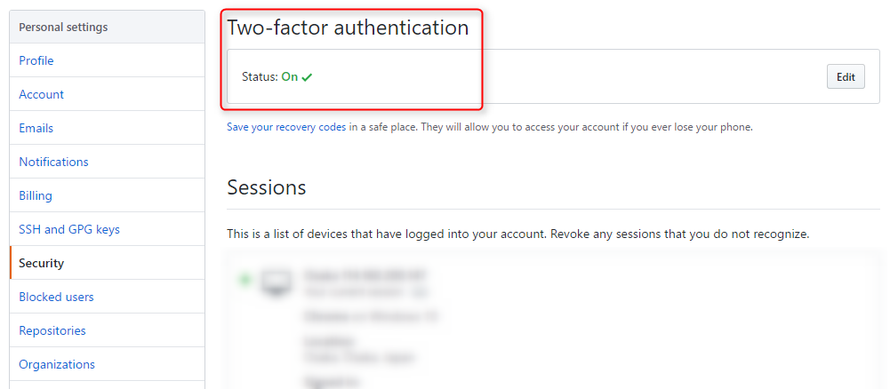
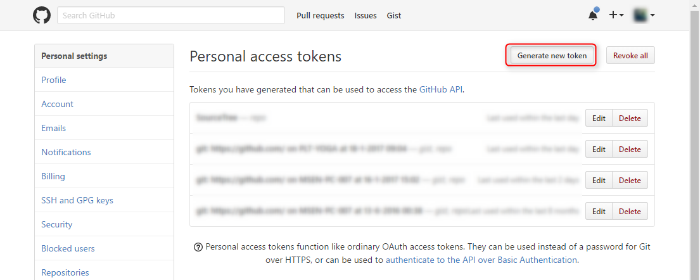
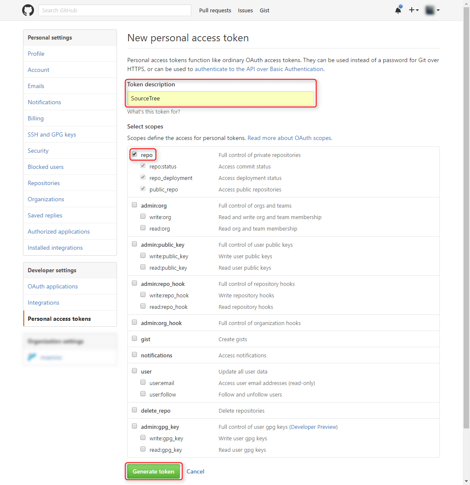
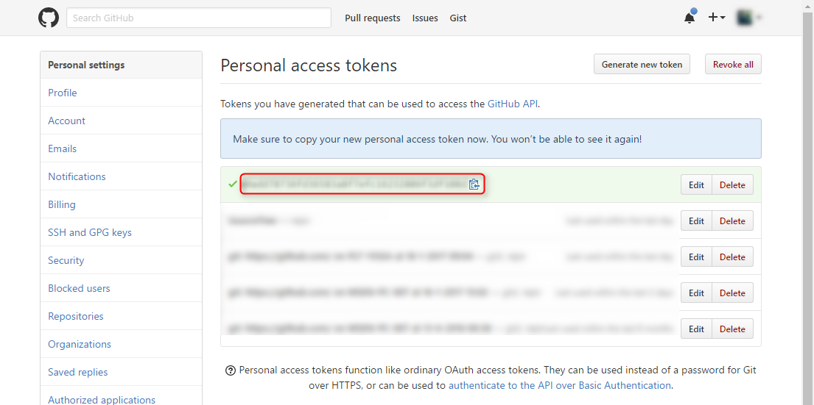
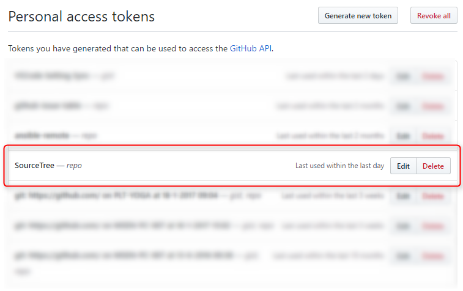
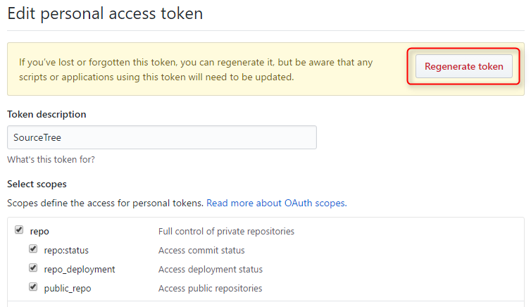

**GitHub では Google Authenticator を使った 2 段階認証** を利用できます。特に業務で使用している場合、有効にしておくほうがよいと思いますが、セキュリティーと引き換えにめんどくさくなることもあります。

Git クライアントからのアクセスもその一つで、もちろん SourceTree などの GUI クライアントからもユーザー名とパスワードだけではアクセスできなくなります。

本記事では Git クライアントからのアクセスに必要となる **パーソナルアクセストークン** の生成方法を紹介します。

## 基本的な考え方

基本的な考え方としては git コマンドや GUI クライアントでは Google Authenticator で生成されるトークンを入力できないので、 **パーソナルアクセストークン (Personal access token)** というものを生成し、これを **パスワード代わりに使用する** ことで Git クライアントからのアクセスを可能にします。

「それなら 2 段階認証の意味がないじゃないか」と思われるかもしれませんが、 2 段階認証なしのユーザー名＋パスワードの場合、この**パスワードが破られてしまうと GitHub のすべての操作ができてしまう**のに比べ、**パーソナルアクセストークンではトークンごとに許可する権限を設定でき、不要になれば無効にするのも容易**なため、セキュアな状態に保つことができます。

基本的には **1 つのサービスやクライアントに対して 1 つのトークンを発行**します。使いまわしているとセキュリティ面で懸念があるだけでなく、再発行をした場合に影響範囲が広くなるので、1 対 1 を基本にしています。

## 2 段階認証の確認

**Personal Settings → Two-factor authentication の Status が On になっていれば 2 段階認証が有効** になっています。

## パーソナルアクセストークンの生成

**Personal Settings → Personal access tokens** を開きます。

* [Personal Access Tokens](https://github.com/settings/tokens)

**Generate new token** をクリックします。

**Token description** は後で判別しやすいような名前をつけます。ここでは SourceTree で使うため "SourceTree" としています。

**Select scopes** (スコープの選択) で **repo** にチェックを入れます。これによりこのトークンを使ってアクセスされたときにリポジトリに対するすべての操作 (push, pull など) が可能になります。チェックをいれなければ、それらの項目は操作することができませんので不要なものはチェックしないようにします。

スコープを選択したら **Generate token** をクリックします。

トークンが生成されると Personal access tokens 画面にハッシュ文字列のようなトークンが表示されます。

文字列の右側のコピーボタンをクリックするとクリップボードにコピーされますので、**このトークンを Git クライアントの認証画面等でパスワードとして使う**ことでリポジトリにアクセスできます。

この**トークンは一度しか表示されない**ので、忘れてしまうと再発行 (regenerate) する必要があります。Git コマンドなどで繰り返し利用しなくてはならない場合は注意してください。

ただ、言うまでもありませんが、**どこかにこのトークンをメモしておくより、都度再発行をかけたほうがセキュア**になります。

### トークンの再発行

**トークン文字列がわからなくなった場合は躊躇なく再発行**しましょう。再発行は何度でもできますが、当然以前のトークンは無効になるので、使い回しをしないように心がけましょう。

Private access tokens の一覧画面で再発行するトークンの **Edit** をクリックします。

あとは **Regenerate token** をクリックすると新規発行時と同じように新しいトークンが発行されますので、それをコピーして使用します。
