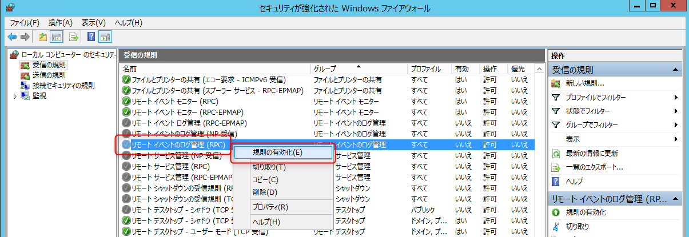
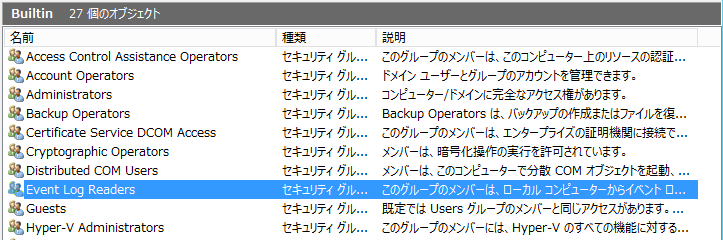
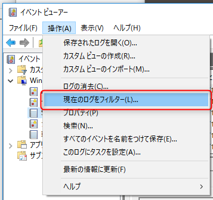
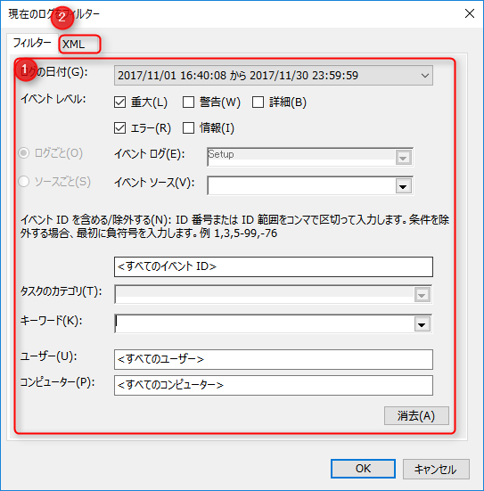
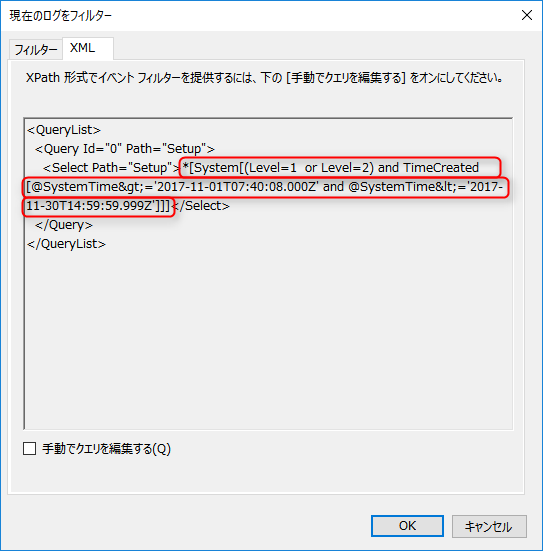

こんにちは、kenzauros です。

別 PC から Windows のイベントログを取得したくなったので、 **Wevtutil** を試してみました。

- [Wevtutil - MSDN](https://technet.microsoft.com/ja-jp/library/cc732848(v=ws.10).aspx)

## 前提条件

本記事は下記の OS を前提とします。

- クライアント（自機）: Windows 10 Pro バージョン 1703 (Creators Update)
- サーバー（リモートマシン）: Windows Server 2012 R2

## Wevtutil とは

[Wevtutil](https://technet.microsoft.com/ja-jp/library/cc732848(v=ws.10).aspx) は Windows サーバー用のツールとして提供されているイベントログを取得したり操作したりするコマンドです。 Windows EVenT UTILity の略でしょうか。地味に名前がややこしくて、この記事を書きながらも Webutil とか Wevutil とか打ってしまっていました。

実体は "C:\Windows\System32\wevtutil.exe" に配置されていて、 MSDN では下記のように説明されています。

>イベント ログおよび発行者に関する情報を取得することができます。またインストールおよびアンインストールのイベント マニフェストを使用してクエリを実行し、エクスポートするには、次のようにアーカイブをするには、このコマンドを使用してログをオフにすることもできます。 このコマンドを使用する方法の例については、例を参照してください。

ひょっとすると Home 系の OS では含まれていないかもしれません。

## ローカルマシンでの使い方

ごくシンプルな使い方で、自機のイベントログを XML 形式で取得して `security-logs.xml` に書き出すには次のようにします。

```ps
wevtutil qe Security /c:10 /f:XML > security-logs.xml
```

これで「セキュリティ」のイベントログが 10 件取得できます。ちなみにこの `Security` の部分はイベントビューアーで見られる **「Windows ログ」の種類**に相当します。

| Windows ログの種類 | ログ名 |
| ----------------- | ------ |
| アプリケーション | `Application` |
| セキュリティ | `Security` |
| セットアップ | `Setup` |
| システム | `System` |
| 転送されたイベント | `ForwardedEvents` |

ちなみにこのログ名の指定は大文字でも小文字でも大丈夫でした。 `/c` オプションは件数指定で取得する場合ですので、「該当するログすべて」の場合は、指定しないで OK です。

## リモートマシンのイベントログを取得する

次にリモートマシンのイベントログを取得します。

### ファイルウォールの設定

まず、取得される側のマシンの**ファイアウォール設定で「リモートイベントのログ管理 (RPC)」を許可**しておく必要があります。



### ユーザーアカウントと権限の設定

次に Wevtutil から接続するユーザーアカウントを設定します。特に理由がなければ専用のユーザーを作成したほうがいいでしょう。

このユーザーを Builtin/**Event Log Readers** グループに所属させます。これにより、このリモートマシンのイベントログを読み取ることができるようになります。



リモート側の準備は以上です。

### イベントログを読み取る

リモートログを取得するには **`/r` オプションに取得するサーバー等のホスト名**を指定します。基本的には**そのホストに接続するためのユーザー名とパスワード**も合わせて指定します。

```
wevtutil qe Security /r:ホスト名 /u:ユーザー /p:パスワード /f:XML /c:10 > remote-security-logs.xml
```

**フィルタリングするには `/q` オプションに XPath クエリで指定**します。結構むずかしいので、後述するようにイベントビューアーでクエリ式を生成させるのがよいでしょう。

下記の例ではイベント ID が 404 もしくは 5447 かつ、 2017/11/1 ～ 2017/11/30 に生成されたログを取得します。

```
wevtutil qe Security /r:ホスト名 /u:ユーザー /p:パスワード /f:XML /q:"*[System[(EventID=404 or EventID=5447) and TimeCreated[@SystemTime>='2017-10-31T15:00:00.000Z' and @SystemTime<='2017-11-30T14:59:59.999Z']]]" > remote-security-logs.xml
```

時間は **GMT (グリニッジ標準時) で記録されているため、フィルターでも GMT で指定**する必要があります。日本標準時 (JST) の場合 9 時間を差し引くため、**前日の 15 時がその日の 0 時**に相当します。

また、日時は `2017-10-31T15:00:00.000Z` の形式なので注意しましょう。

## イベントビューアーを使ったフィルタリング用 XPath クエリの生成方法

前述のとおり `/q` オプションに指定する XPath クエリは特にリファレンス等もないので、手探りで書くにはむずかしいです。

イベントビューアーのフィルター機能を使って、クエリ式を生成しましょう。

まず、**イベントビューアー**を開き、 **[操作] → [現在のログをフィルター]** を選択します。



(1) 任意の検索条件を入れて、 (2) **[XML] タブ**を開きます。



XML でフィルターが表示されているので `<select>` タグの中身をコピーし、これを XPath クエリとして使用します。



ただし、 `<select>` タグの中身は `<` や `>` などの XML の特殊文字がエスケープされているので、 `&lt;` や `&gt;` をそれぞれ `<` や `>` に置換してから使用してください。

## あとがき

Windows のイベントログを取得する方法はいくつかあるのですが、下記の記事で速度検証が行われており、wevtutil がそこそこ優秀であることが示されています。

- [Windows のイベントログをファイルに出力する方法を比較してみた - Qiita](https://qiita.com/sta/items/957d78a8e884f23cb8be)

PowerShell の Get-EventLog がなぜそんなに遅いのかは疑問ですね。
