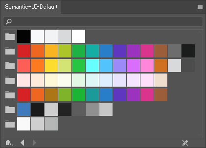

**[Semantic UI](https://semantic-ui.com/)** の色合いが割と好きです。その名の通り、「セマンティック」にスタイルを定義できるところも気に入っています。

Semantic UI 的デザインの際に **Photoshop や Illustrator で使えるスウォッチファイル**を作りましたので、よければご活用ください。

## ダウンロード

いきなりですが、ダウンロードはこちらからどうぞ。

<a style="display:block;font-size:120%;text-align:center;border:1px solid #ccc;padding:0.2em;margin:1em;border-radius:3px;background:#f1f1f1" href="https://mseeeen.msen.jp/wp-content/uploads/2017/11/Semantic-UI-Default.zip">Semantic-UI-Default-Swatches のダウンロード Press to download Semantic-UI-Default-Swatches</a>

展開すると `Semantic-UI-Default.ase` ファイルがありますので、それを Photoshop や Illustrator で読み込ませてください。

ファイルは「交換用スウォッチ」と呼ばれる拡張子 `.ase` (Adobe Swatch Exchange) の形式です。 InDesign でも流用可能です。

使い方はわかりやすくまとめてくださっている方がいらっしゃるので、下記のサイトなどを参照してください。

- [アプリケーション間でのスウォッチの共有（交換用スウォッチ） - DTP Transit](http://www.dtp-transit.jp/adobe/illustrator/post_1963.html)

## 簡単な説明

Semantic UI のテーマの話は公式ページの下記のページに書かれています。

- [Theming | Semantic UI](https://semantic-ui.com/usage/theming.html)

実際の色はソースの `themes/default/globals/site.variables` に LESS の変数として定義されています。

- [Semantic-UI/site.variables at master · Semantic-Org/Semantic-UI](https://github.com/Semantic-Org/Semantic-UI/blob/master/src/themes/default/globals/site.variables)

スウォッチの色はこのファイルをベースにしています。

## 失われた Semantic-UI-Kit

余談ですが、 garystover さんが GitHub で **Semantic-UI-Kit** というイラレ用のファイルを提供してくれていたのですが、これは現在なくなってしまいました。

私も以前のPCでダウンロードしていたのですが、すでに手元にはなく、大変残念な思いをしました。どなたかもっていらっしゃる方がいればお譲りいただけるとうれしいです...
