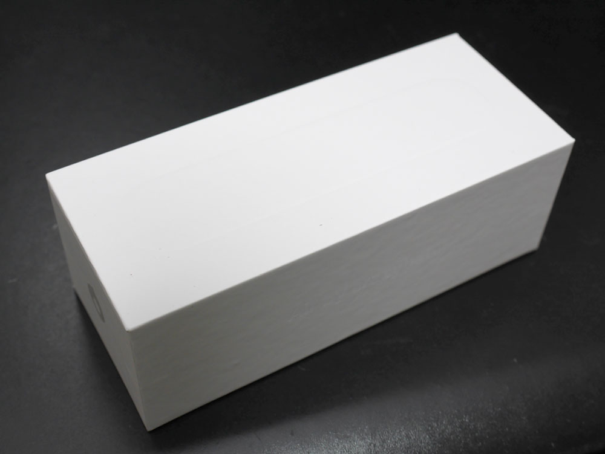
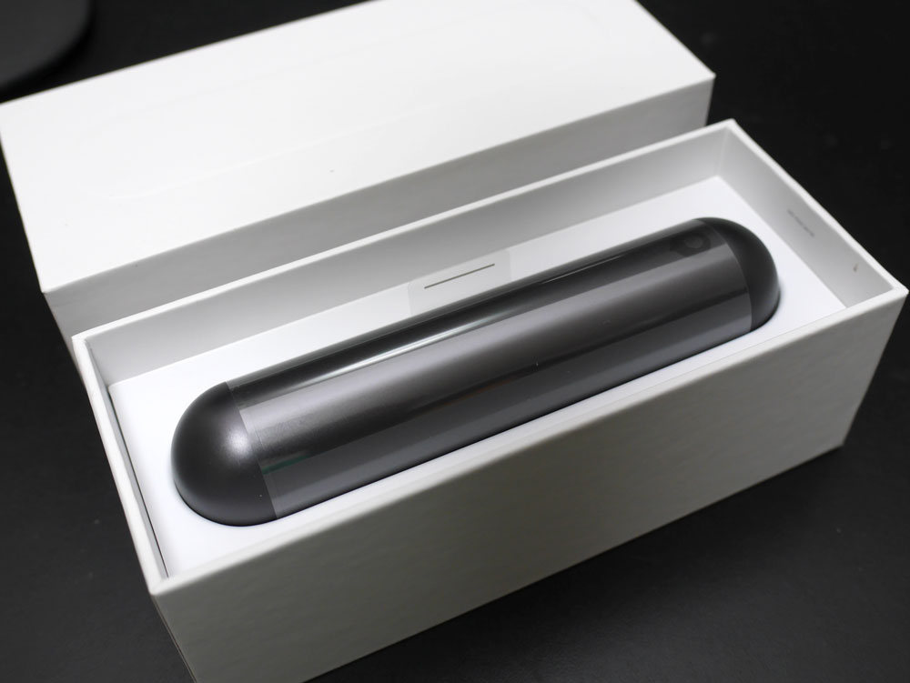
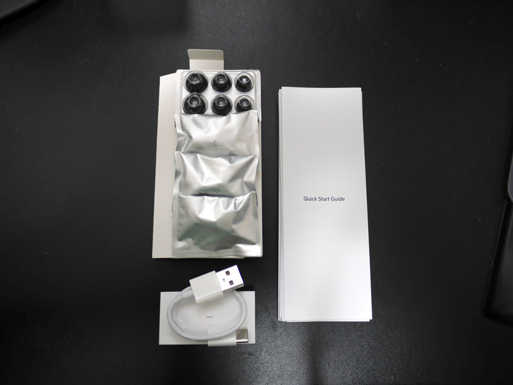
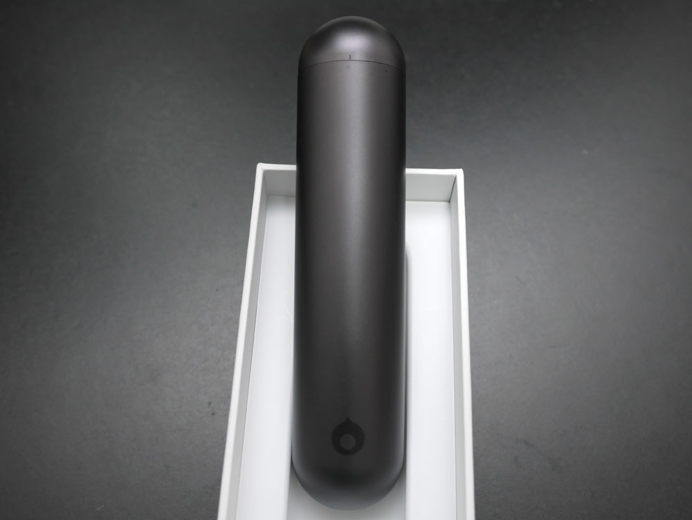
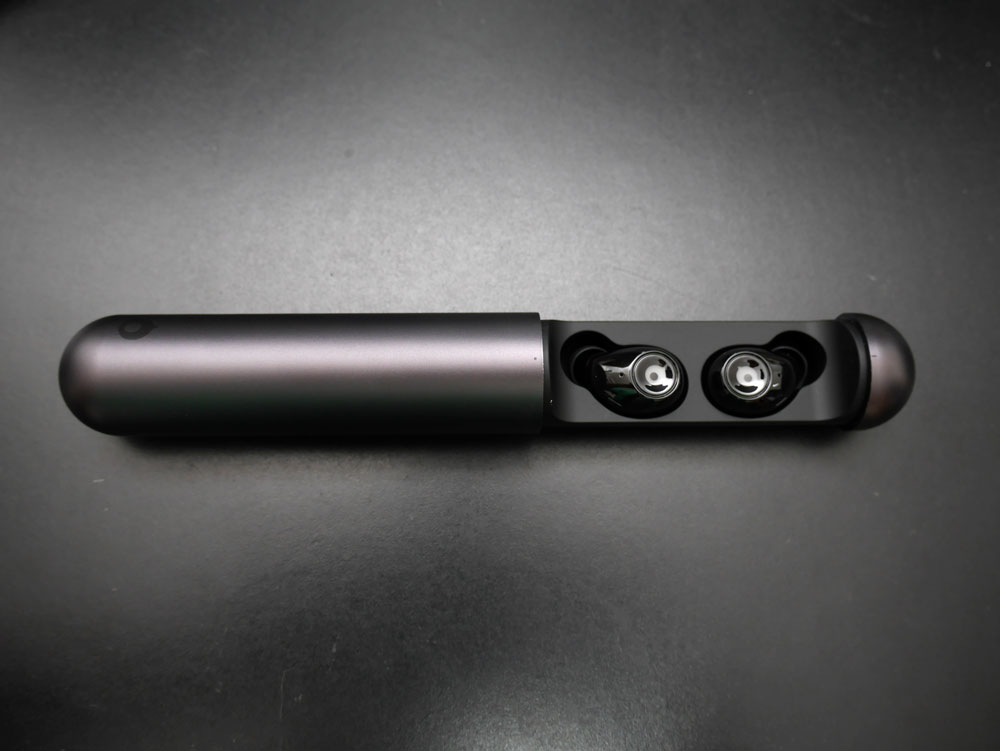
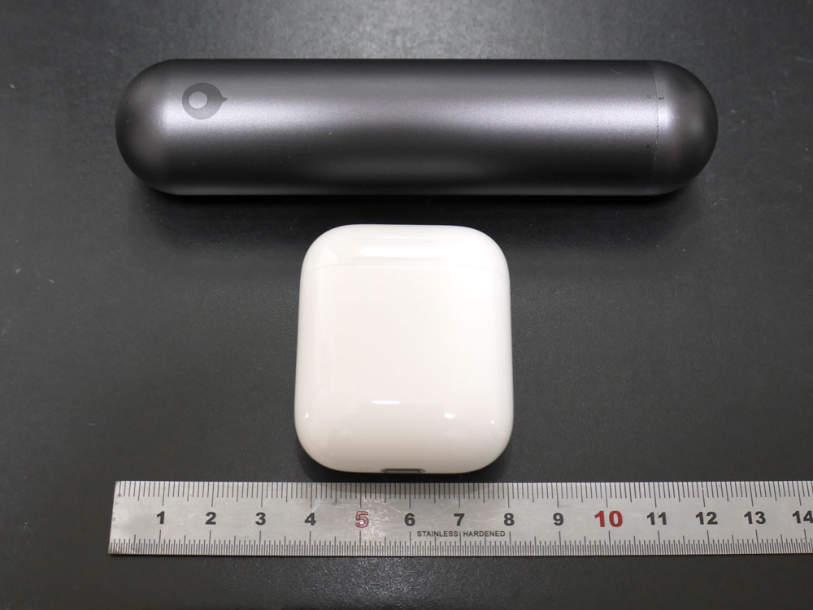
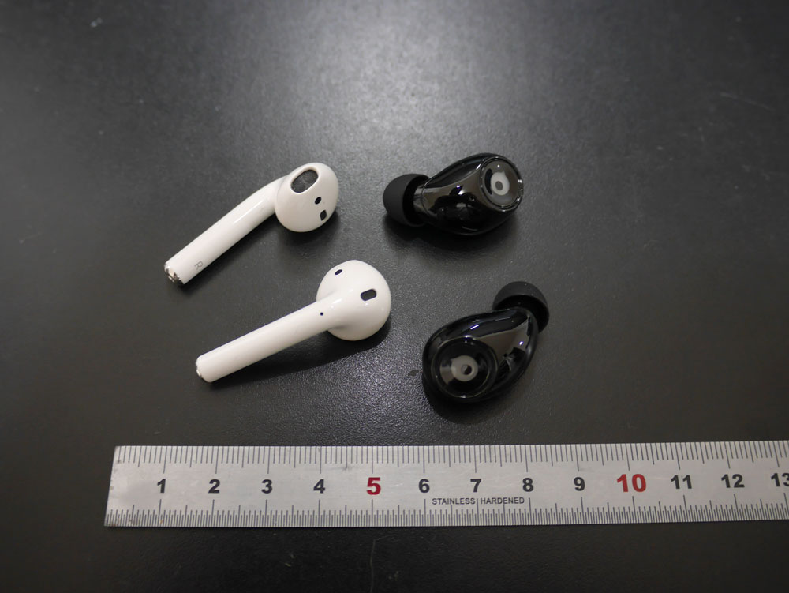
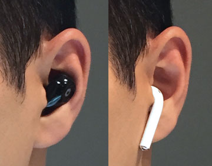
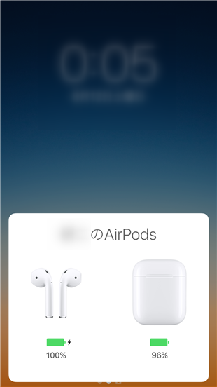

日本のクラウドファンディングサイトの一つである Makuake で 9500 万円を獲得した **[Air by crazybaby](https://www.makuake.com/project/air-by-crazybaby/)** に私も出資していました。**左右独立型の完全ワイヤレスイヤフォン**（「**トゥルー ワイヤレス イヤフォン**」と呼ぶらしい）です。

本当は 4 月ぐらいに到着予定だったはずですが、遅れに遅れて数々のサポーターから文句の嵐で、日本の輸入代理店も泣く泣く (?) キャンセル・返金に応じている状況でした。中国のメーカーもようやくやる気をだしたのか、先月やっとこさ本体が届きました。

しばらく開梱すらできていなかったのですが、最近になってやっと試すことができたので、手持ちの **Apple AirPods** と比較しつつ、簡単なレビューを書いてみます。

ペアリングするスマホは **iPhone 6 Plus** です。

## 外観

### パッケージ

外箱はでかいです。写真では見えにくいですが、箱の上面には **iPhone の箱と同じような製品の形のエンボス加工**が施されています。特徴のあるシルエットではないので大してカッコよくありませんが。あと側面には Air by crazybaby の文字が刻まれていますが、側面の紙質が悪く、全体的に外箱の質感がイマイチです。

ともあれ、箱を開けてみます。箱の構造も**某 Apple 社のスマホとそっくり**です。

開けたところです。ぬーん、とケースが佇んでいます。**想像よりかなり大きい**。これは写真詐欺な気がしてきた。

パッケージの付属品です。

黒いのが 3 サイズのイヤーフィットで、銀色の包みはイヤフォン本体を包み込むシリコーンの汗カバーです。ただしこのカバーを到着した状態では充電できないので、毎回外す必要があるようです。付属の充電ケーブルは **USB type C** です。コネクタに Micro USB でなく type C を採用したところはとてもいいですね。

右側に写る Quick Start Guide に最初の使い方が書いてあります。日本語も記述されているので、とりあえず誰でも安心ですね。

パッケージはプレミア感を決める重要な要素ではありますが、使い出すとあまり関係ないので比較対象外とします。

### ケース

ケースの保護フィルムを剥がしたところです。 CRAZYBABY 社の (?) ロゴと思われるマークが下部にあって、上部にはケースを開けるために回転させるときの目印がついています。

ちなみにこの目印の線が白丸から黒丸に移動するように回すとケースが開く、という構造なのですが、実は白丸の位置でも開いてしまう上、白丸より左側にも回転しまうという謎設計です。まぁ実害はないのでご愛嬌ということにしておきます。

開けるといよいよイヤフォン本体 (これを「Air」と呼ぶらしい) が 2 つ登場します。ケースとは各耳とも 2 つの金メッキ電極で接触して充電されているようです。

ここでケース (Air by crazybaby の場合、正確には「充電カプセル」と呼ぶ) を Apple AirPods と比較してみます。

やっぱりデカイ。っていうか、 AirPods ちっさ！ガムかなんかのケースぐらいに見える。

Air by crazybaby: **132 mm ✕ Φ 30 mm**
AirPods: **54 mm x 44 mm x 21 mm**

ついでに重さも計ってみました。ケース＋イヤフォン本体込みです。

Air by crazybaby: **81 g**
AirPods: **46 g**

とりあえずケースサイズと重さの比較では AirPods の完全勝利でしょう。

まぁ Air by crazybaby のケースはアルミ筐体ですので重さでは分が悪いのでしょうが、サイズはもう少しなんとかなったのではないかと思います。ただ、 AirPods のケースがプラスチックなのに対し **Air by crazybaby のアルミ表面は iPhone 裏面のようなマット仕上げ**になっていますので、質感は高いです。

ケース： **AirPods の勝ち**

### イヤフォン本体のサイズと重さ

ケースから取り出した**イヤフォン本体**です。当たり前ですが、いずれもケーブルは一切ありません。

サイズは形状がまったく違いすぎて比較しにくいので、イヤフォンだけの重さ（両耳）を計ってみました。

Air by crazybaby: **9 g**
AirPods: **8 g**

わずかに AirPods のほうが軽いですが、まぁこれは引き分けというところでしょう。

ただ、ケースからの取り出しやすさ、なおしやすさ、という点ではケース自体が大きいこともあり、 Air by crazybaby が優れていると思います。

イヤフォン本体のサイズと重さ: **引き分け**

### 装用感

大事な「つけ心地」は、個人差の大きいところだと思いますが、個人的には Air by crazybaby が好みです。

AirPods は言わずもがな、 iPhone 標準イヤフォンの EarPods の流れをくむ安定のつけ心地ですし、 Air by crazybaby も最初は少し違和感があるものの、耳に埋め込んで使用でき、重さも気にならないので、なかなかいい感じです。

AirPods は頭をフルフルすると抜け落ちてしまいそうな気がするのですが、 Air by crazybaby はそれがありません。しばらくつけていても耳が痛くなることはありませんでした。また、 Air by crazybaby はカナル型なので遮音性が高いです。

AirPods は「耳からうどん」とか「耳からチンアナゴ」とか言われ続けたせいか、着けている自分ですらそう見えてしまうことがあるので、好みの分かれるところです。

装用感: **Air by crazybaby の勝ち**

## 性能

### ペアリングの簡単さ (iPhone)

これは比べるのがかわいそうな気もしますが、文句なく AirPods です。

なにせ AirPods は開梱後、**「ケースのフタを開けるだけ」で iPhone とペアリングされる**ので、なにも手間がありません。また左右の連携がすばらしいというか片一方だけつながらないということもないので、この部分でストレスを感じたことがありません。

対する Air by crazybaby は**取り出しただけでは ON にならないので、ボタンを長押しして電源をいれたあと、通常の Bluetooth 機器と同じく、iPhone の設定画面からペアリング**してやる必要があります。

ペアリングの簡単さ: **AirPods の勝ち**

### 接続性

AirPods はペアリングも簡単ですが、**使うときも「ケースのフタを開けて取り出すだけ」**です。取り出した時点で ON になって iPhone に接続されるのでほとんどストレスがありません。

Air by crazybaby は前述のとおり、取り出しただけでは ON にならないので、ボタンを長押しして電源をいれれば、自動的に接続されます。...が、**両耳の電源を別個に ON にしないといけない**ので、かなり面倒です。両手でいれるというのも不便ですし、片手で片耳ずついれていると時間がかかってイラッとします。

あと Air by crazybaby は使い始めた当初 iPhone が近くにあっても右耳がプツプツ切れていました。

>「Air by crazybaby」の最新CSRチップセットは、混信やノイズ、音の途切れなどなく、どんな場所でも音が途切れにくい。

という宣伝文句はいったいなんなのでしょうか。しばらくするとなぜか切れなくなってきましたが、それでも右耳に関しては**右手で覆うだけでほぼ確実に切れます**。

接続の安定性は間違いなく AirPods のほうが高いので、これは AirPods 圧勝です。

接続性: **AirPods の勝ち**

### 操作性

操作性に関しては 2 つの製品でまったく主義が違うと思うので、評価しにくいポイントです。

**Air by crazybaby は左右のイヤフォンにそれぞれ 1 つずつボタン**がついています。紹介ページではボタンを「タップ」と表現されていますが、かなり強く押し込まないといけないので「タップ」や「クリック」よりも「押す」という表現のほうが適切です。このあたり耳に装用した状態で操作するのでもう少し軽いクリック感ならよかったのですが...

左: 1回押し→電話をとる／切る、2回押し→Siriなどを起動
右: 1回押し→再生／停止、2回押し→スキップ、3回押し→バック

AirPods はそもそも「ボタン」というものがないので、**「本体をダブルタップする」**しか操作がありません。動作としては「Siri を起動する」か、「再生／停止」を設定で切り替えることができます。

イヤフォンをつけて Siri に話しかけることができるシチュエーションというのは限られている気はしますが、 Apple らしい割り切った仕様です。まぁ iPhone 側で操作すればいいので、慣れれば、さほど不便ではありませんが、音量の上下ぐらいなんとか操作できるようにならなかったのでしょうか。

操作性に関してはドローでしょう。 Air by crazybaby のボタンがもう少しぐらい軽ければ、こちらを勝ちにしていたと思います。

操作性: **引き分け**

### 音質

>この小さなボディに大編成のオーケストラが入り込んでいるようなサウンドなのです。

という謳い文句の **Air by crazybaby は、初期状態ではかなり曇った音質**で、まるでなにかカバーがかかっているかのような音です。しばらくエイジングしてやるとずいぶんマシになりますが、遮音性が高い割には音場の広がりが少なく、「抜け」感が少ない印象です。

もっとも、この音の感じ方は装着ポジションによるところも大きく、付け方が悪いと低音が薄く全体的に軽い音に聞こえがちですが、うまくねじ込みながら装着できるようになると、そこそこの低音が伝わってきます。

対する **AirPods は初期状態からバランスのとれた音域バランスと装着ポジションにあまり依存しない優秀な性能**です。完全ワイヤレスでこの音質を実現できるというのはかなりの研究と試行錯誤が行われていることがうかがえます。

ただしカナル型でないので低音に関しては、あまり厚くありません。低音好きの方はそもそもこのタイプを選ばないでしょうけど。

Air by crazybaby も悪くはないのですが、 AirPods の音が「嫌い」という人は少ないでしょうから、ここも AirPods が優位と思います。

音質: **AirPods の勝ち**

### バッテリーの持ち

いずれも 1～2 時間までの通勤やジョギングなら全く問題ないでしょう。それぞれケースが充電池を兼ねているタイプなので、ケースに戻すだけでケーブルで充電することなく何回か繰り返し使用することができます。

使い切るまで評価はしていませんが、これは引き分けでいいでしょう。

バッテリーの持ち: **引き分け**

## 総評

各比較のまとめです。

<table>
	<tr>
		<th></th>
		<th width="150">Air by crazybaby</th>
		<th width="150">AirPods</th>
	</tr>
	<tr>
		<th>ケース</th>
		<td></td>
		<td style="text-align:center;">○</td>
	</tr>
	<tr>
		<th>イヤフォン本体のサイズと重さ</th>
		<td colspan="2" style="text-align:center;">引き分け</td>
	</tr>
	<tr>
		<th>装用感</th>
		<td style="text-align:center;">○</td>
		<td></td>
	</tr>
	<tr>
		<th>ペアリングの簡単さ</th>
		<td></td>
		<td style="text-align:center;">○</td>
	</tr>
	<tr>
		<th>接続性</th>
		<td></td>
		<td style="text-align:center;">○</td>
	</tr>
	<tr>
		<th>操作性</th>
		<td colspan="2" style="text-align:center;">引き分け</td>
	</tr>
	<tr>
		<th>音質</th>
		<td></td>
		<td style="text-align:center;">○</td>
	</tr>
	<tr>
		<th>バッテリーの持ち</th>
		<td colspan="2" style="text-align:center;">引き分け</td>
	</tr>
</table>

うーん、せっかく支援したので Air by crazybaby に味方したいところですが、どうがんばっても厳しい状況です。

加えて CRAZYBABY 社がのろのろしている間に **Air by crazybaby よりはるかに安価で左右独立型の完全ワイヤレスイヤフォンが Amazon を主なハブとして登場してきている**ため、目新しさがなくなってきています。

ざっと見ただけでも以下のようなレビューの高い（かつ変な日本語のレビューのない）製品がでてきます。ちなみに**現在は Air by crazybaby も一般発売され、 [Amazon](http://www.amazon.co.jp/o/ASIN/B071JRP18H/m1s-22/ref=nosim) で入手可能**になっています。

* [Lesoom Bluetooth イヤホン](http://www.amazon.co.jp/o/ASIN/B071H2VS3Y/m1s-22/ref=nosim)
* [Hellodigi X11 Bluetooth イヤホン](http://www.amazon.co.jp/o/ASIN/B07354CFH8/m1s-22/ref=nosim)
* [TAROME Bluetooth イヤホン](http://www.amazon.co.jp/o/ASIN/B06Y2WBXVK/m1s-22/ref=nosim)

それに引き換え、 **Apple の AirPods は iPhone との接続性やコンパクトさなどから言っても、まだまだ抜きんでています**。いかに「チンアナゴ」と言われようと、 iPhone ユーザーにとって AirPods が最適だという地位は、しばらくの間は不動な気がします。

## 関連ページ

* [Air by crazybaby](https://crazybaby.com/jp/air) (公式サイト)
* [小さなボディにフルオーケストラ。Hi-Fiサウンドの完全ワイヤレスイヤホンAir | クラウドファンディング - Makuake（マクアケ）](https://www.makuake.com/project/air-by-crazybaby/)
* [バリュートレード株式会社](http://v-trade.co.jp/) (日本輸入代理店、Makuake プロジェクト実行者)