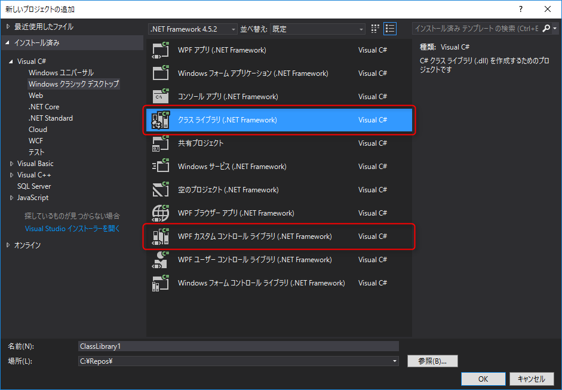
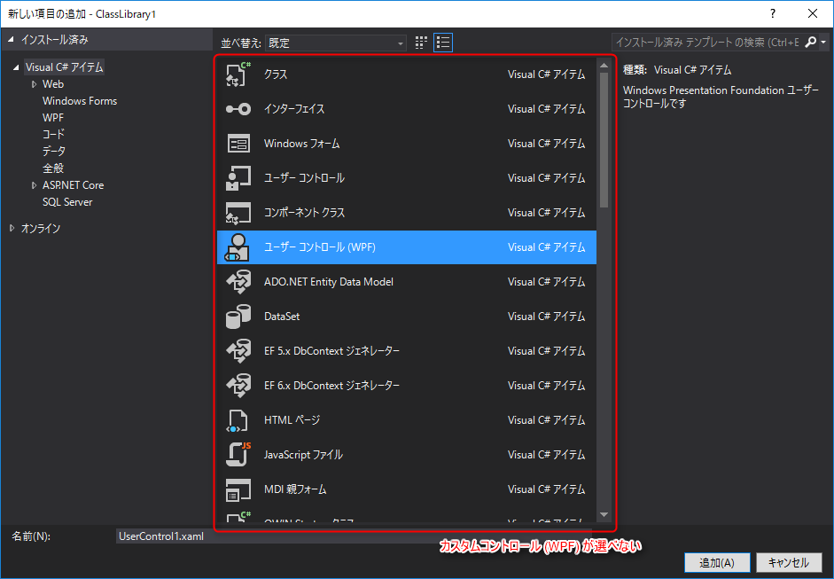
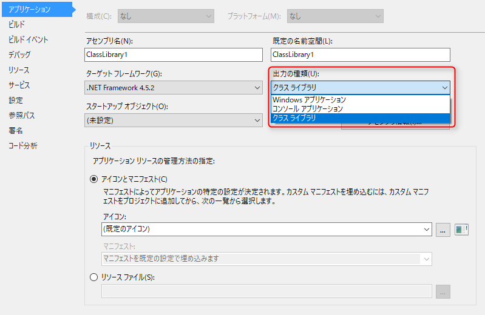
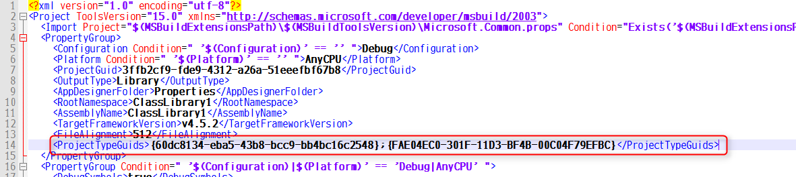
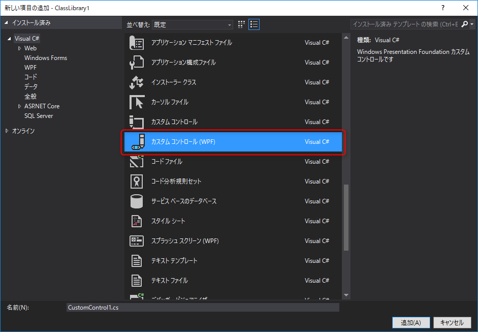

Visual Studio で開発をしていると最初のプロジェクト作成のときの種類選択が割と重要です。

今回は WPF の **クラス ライブラリ** プロジェクトを **カスタム コントロール ライブラリ** プロジェクトに変更する方法をご紹介します。

## プロジェクトタイプは気軽に変更できない



WPF のカスタムコントロールを格納するライブラリを作るときは **Windows クラシックデスクトップ** から **WPF カスタム コントロール ライブラリ** を選択してプロジェクトを作成するのが正しいのですが、すでにあるプロジェクトの場合や誤って **クラス ライブラリ** で作成してしまった場合はちょっと困ったことになります。



プロジェクトの種類によって **新しい項目の追加** で選べる項目が変化するため、たとえば今回の場合は **カスタム コントロール (WPF)** が選べない状態となります。

また、グローバルのスタイルやリソースを定義するファイルである `Themes/Generic.xaml` も生成されていないため、追加したコントロールのテーマ等を格納するファイルがありません。手動で `Themes/Generic.xaml` ファイルを追加することはできますが、プロジェクトから自動で参照されるようになっていないため、あまり意味がありません。

ということでプロジェクトタイプを変更したいわけですが、この変更はプロジェクトのプロパティから気軽に行うことはできません。



## プロジェクトを WPF カスタム コントロール ライブラリ に変更する

実は今回の場合、下記の2つの変更が必要です。

1. プロジェクトタイプの変更
2. テーマ情報の追加

まず**プロジェクトタイプを WPF + C# に変更**します。その後、**テーマ情報を追加**して `Themes/Generic.xaml` が自動的にテーマファイルとして読み込まれるようにします。

### プロジェクトタイプの変更

Visual Studio の GUI からは設定できないので**プロジェクトの定義ファイルである `.csproj` をテキストファイルで開きます**。このファイルは XML ファイルになっていて少々ややこしいですが、よくよく見ると理解できる内容になっています。

`<ProjectGuid>` が含まれている `<PropertyGroup>` タグの中に下記のタグを追加します。

```
    <ProjectTypeGuids>{60dc8134-eba5-43b8-bcc9-bb4bc16c2548};{FAE04EC0-301F-11D3-BF4B-00C04F79EFBC}</ProjectTypeGuids>
```



**`<ProjectTypeGuids>` はその名のとおりプロジェクトタイプを表す**もので、**この GUID を見て Visual Studio はプロジェクトタイプを判別している**らしいです。

Project Type GUID の詳細は下記のページにまとめられています。

* [List of Visual Studio Project Type GUIDs - CodeProject](https://www.codeproject.com/Reference/720512/List-of-Visual-Studio-Project-Type-GUIDs)

ということで `{60dc8134-eba5-43b8-bcc9-bb4bc16c2548}` が WPF 、 `{FAE04EC0-301F-11D3-BF4B-00C04F79EFBC}` が C# を表すことがわかります。

タグの追加ができたら、プロジェクトファイルを保存して、 Visual Studio で読み込み直します。

すると「新しい項目の追加」に **カスタム コントロール (WPF)** が表示されているはずです。



### テーマ情報の追加

`Themes/Generic.xaml` を作成し、 `Themes/Generic.xaml` がデフォルトのテーマファイルとして読み込まれるように設定します。

これは `Themes/Generic.xaml` をプロジェクトに追加し、 `Properties/AssemblyInfo.cs` に下記の行を追加することで実現できます。

```
[assembly: System.Windows.ThemeInfo(System.Windows.ResourceDictionaryLocation.None, System.Windows.ResourceDictionaryLocation.SourceAssembly)]
```

が、もっと簡単な方法があります。

それは**「新しい項目の追加」からなんでもいいので **カスタム コントロール (WPF)** を作成する**ことです。

プロジェクトにカスタムコントロールを追加することで Visual Studio によって自動的に `Themes/Generic.xaml` が作成され、 `Properties/AssemblyInfo.cs` へテーマ情報の記述が追記されます。

追加したカスタムコントロールは不要なら削除しておけばいいでしょう。

## まとめ

以上で、通常のクラスライブラリプロジェクトを WPF カスタムコントロールライブラリに切り替えることができました。

まとめると下記の変更で実現できます。

1. プロジェクトタイプの変更 (ProjectTypeGuids の追記)
1. テーマ情報の追加

ではみなさま快適なカスタムコントロールライブラリの作成をお楽しみください。