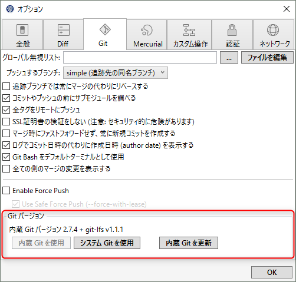
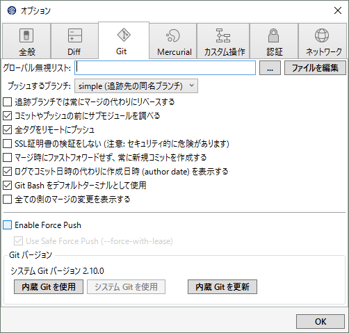
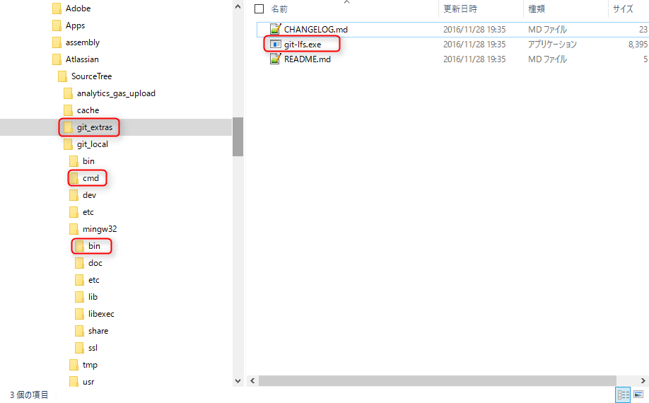

Git の GUI ツールである [SourceTree が Git LFS (Large File Storage) に対応してから 1 年ほどが経過](http://japan.blogs.atlassian.com/2016/02/sourcetree-update-atlassian-account-git-lfs-support-ui-refresh-and-more/)します。

我々が使っている上ではまだまだ [Git LFS](https://git-lfs.github.com/) の不具合が多くて試行錯誤しているところですが、ともあれ大容量ファイルのバージョン管理には役立っています。

さて今回は SourceTree が促してくる Git LFS インストールがうまくいかないという問題があったときに実行ファイルがどこにあるのかを調べたので、そのメモをご紹介します。

なお環境は Windows 10 上の SourceTree 1.9.10.0 です。

## 使用 Git モードによって変わる git-lfs.exe の所在

まず SourceTree が使用している Git が内蔵のものかシステムのものかを調べます。

[ツール]→[オプション]→[Git] を開いて、**Git バージョン**のところを確認します。

[内蔵 Git を使用] が押せなくなっていれば、**内蔵 Git** が使用されています。反対に [システム Git を使用] が押せなくなっていれば、**システムにインストールされた Git** が使用されています。

どちらを選んでも機能に差はありませんが、システム Git のほうが新しい場合はそちらを利用したほうがいいかもしれません。

なお、下記のように git-lfs v*.*.* と表示されていなければ、 Git LFS がインストールされていないか認識されていません。

### SourceTree フォルダ配下の git-lfs.exe

SourceTree が使用するファイルは ↓ のフォルダの下に配置されますので以後はこのフォルダ以下を前提として話を進めます。

`%USERPROFILE%\AppData\Local\Atlassian\SourceTree\`

なおこのフォルダを開くには、↑ をコピーして Windowsキー+R (ファイル名を指定して実行) →貼り付け→実行するとよいでしょう。

SourceTree フォルダ配下の `git-lfs.exe` は環境にもよりますが、次の 3 カ所に存在します。

* `git_extras\`
* `git_local\cmd`
* `git_local\mingw32\bin`

なお `git_local\cmd` の `git-lfs.exe` は配置されているものの SourceTree からは使用されていないようです。

### システム Git の場合

システム Git を使用している場合でも、なぜか Git LFS だけはインストールしたものが使われず、 `git_extras\` フォルダのものが使用されます。

そのためいくら Git LFS をダウンロードしてインストールしても SourceTree は新しいものを使ってくれません(笑)

SourceTree が使う git-lfs.exe を強制的に変更したい場合はこのフォルダのものを上書きする必要があります。

### 内蔵 Git の場合

内蔵 Git の場合、下記の順番で `git-lfs.exe` が参照されます。
(SourceTree 1.9.10.0 での挙動)

1. `git_local\mingw32\bin\git-lfs.exe`
2. `git_extras\git-lfs.exe`

**`git_local\mingw32\bin` に存在する場合はそちらが優先され、存在しない場合はシステム Git のときと同様に `git_extras\` のものが使用される**ようです。

ちなみに内蔵の `git.exe` 自体は `\git_local\bin` にあります。

## 内蔵 Git を更新の注意

オプション画面にある **[内蔵 Git を更新]** というボタンがあり、全自動で SourceTree 内蔵の Git を新しいバージョンに更新することができます（ただし大抵は最新バージョンではありません）。

この場合、内蔵 Git モードで更新を行うと、なぜかどこの `git-lfs.exe` も更新されないことがあるので注意してください。

ということで内蔵 Git モードでも更新するときは下記のように一旦システム Git に切り替えるのがよさそうです（インストールされている場合）。

1. システム Git モードで [内蔵 Git を更新] を実行
2. オプション画面で git-lfs のバージョン表示が更新されたことを確認
3. `git_extras\` の `git-lfs.exe` を `git_local\mingw32\bin` にコピー

あるいはインストーラーでインストールした `git-lfs.exe` を `git_local\mingw32\bin` にコピーしてもいいかもしれません。

インストーラーは下記からダウンロードできます。

* [Git LFS](https://git-lfs.github.com/)