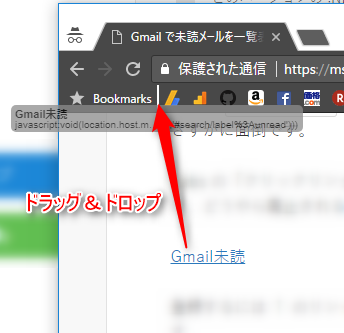
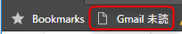
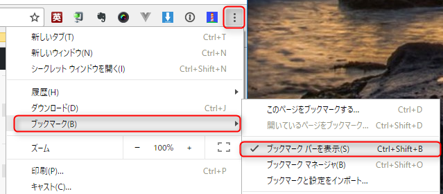

Gmail は便利ですが、簡単に「**未読メールをまとめて読む**」機能がありません。

標準では受信トレイにすべて未読メールが格納されるのでよいのですが、フィルター等で受信トレイをスキップ (アーカイブ) するようにしている場合は、未読メールを確認するのに複数のラベルを渡り歩く必要があります。

検索で `label:unread` と叩けば、「未読メールをまとめて読む」ことができるのですが毎回打つのはさすがに面倒です。

Labs の「クイックリンク」を使えばこれが実現できるので使ってらっしゃった方も多いようですが、どうやら廃止されるみたいなので、一つの代替案として**ブックマークレット**にしてみました。

## ブックマークレットの登録

Chrome の場合、下記の手順でブックマークレットを登録します。

<span style="font-size:150%;font-weight:bold;border:solid 1px dodgerblue;padding:0 .5em;border-radius:5px;background-color:aliceblue"><a href="javascript:void(location.host.match(/mail\.google\.com/)&&(location.href=location.href.replace(location.hash,'#search/label%3Aunread')))">Gmail 未読</a></span>

登録するには ↑ のリンクをドラッグしてブックマークバーにドロップするのが一番簡単だと思います。



あとは Gmail を開いた状態で**ブックマークバーに追加されたリンクをクリックするだけ**です。



※ちなみに Gmail 以外のサイトでは反応しないようにしてあります。

ブックマークバーが表示されていない方は下記のメニューから表示させてください。



## ソースコード

ちなみにソースコードはこれだけです。

```
void(location.host.match(/mail\.google\.com/)&&(location.href=location.href.replace(location.hash,'#search/label%3Aunread')))
```

Gmail の場合、 URL には必ず内容を表すハッシュ (`#`) がついているので、これを `label:unread` で検索したときと同じものに置き換えているだけです。
