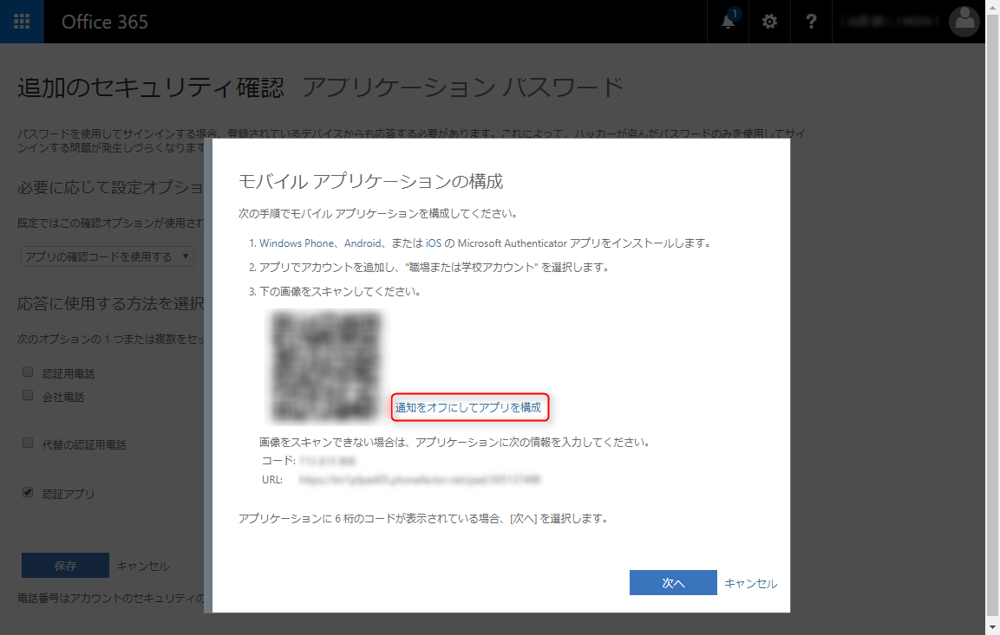
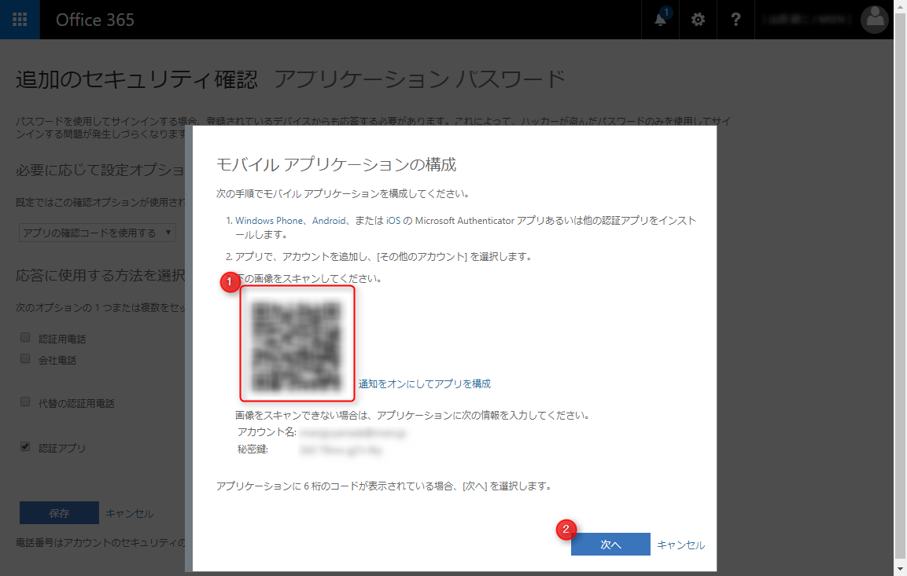

昨今、弊社もセキュリティインシデントに悩まされておりますが、 Office 365 のような統合アカウントのセキュリティは非常に重要なものです。

そこで今さらではありますが、少しでも**安全性を高めるために多段階認証を有効に**してみました。

多段階認証には携帯電話番号、会社電話、 Microsoft Authenticator などいろいろあるようですが、 GitHub でも利用している **Google Authenticator** を利用したいと思います。

なお、ビジネス向けの Office 365 で多段階認証を有効にするには管理者画面で、個別のアカウントに対して多段階認証を有効にしておく必要があります。

また、本記事の内容は 2017/8/11 時点のものです。設定画面のレイアウトや位置等が変更になる可能性がありますので、ご注意ください。

## Google Authenticator で多段階認証を設定する

Office 365 のホーム画面 (https://www.office.com/) 右上の歯車アイコンをクリックし、 **[アプリの設定] → [Office 365]** を選びます。

左メニューで
1. [セキュリティとプライバシー] を選択
2. [追加のセキュリティ検証]をクリック
3. [アカウントのセキュリティに使用する電話番号を更新します。] リンクをクリック

追加のセキュリティ確認 画面が表示されたら、
1. [アプリの確認コードを使用する] を選択
2. [認証用電話] にチェック
3. [電話番号] を入力
4. [認証アプリ] にチェック
5. [構成] ボタンをクリック

モバイルアプリケーションの構成 画面で **QR コードが表示されますが、このままだと Google Authenticator から読めない**ので、 [通知をオフにしてアプリを構成] をクリックします。
（QR コードが Google Authenticator でも対応できるものに変化します。）

QR コードが変わったらスマホで **Google Authenticator** を開いて QR コードを読み取り、 [次へ] をクリックします。

スマホの Google Authenticator で **Microsoft** が追加され、 6 桁の認証コードが表示されていますので、 Office 365 側にこのコードを入力します。

「確認コード用にモバイルアプリが構成されました」となっていれば OK です。 [保存] ボタンをクリックし、完了します。携帯電話での認証がまだの場合、このあと電話か SMS での認証がはじまるかもしれません。

ここまでで多段階認証の設定が完了しました。次回からログイン時はパスワードを入力したあと、 Google Authenticator の 6 桁コードを求められるようになります。

## アプリケーション パスワードの取得

さて、多段階認証の設定が完了したのですが、実は**クライアントアプリの Outlook は多段階認証に対応していない**ので、認証コードを利用したログインができません。

そこで多段階認証に対応していないアプリのために **アプリケーション パスワード** を発行する機能があります。これは GitHub でいう "Private Access Token" のようなものです。

さきほどの 追加のセキュリティ確認 画面の右上に [アプリケーション パスワード] というリンクがあります（わかりにくい）。

[作成] ボタンをクリックします。

1. [名前] に "Outlook" など任意の名前を入力する
2. [次へ] をクリック

これでアプリケーション パスワードが生成されるので、 [パスワードをクリップボードにコピー] でパスワードをコピーしておき、 [閉じる] をクリック

アプリケーション パスワードが発行されたことが確認できます。

**このアプリケーション パスワードは使いまわすものではないので、アプリごとに発行するようにし、パスワードも極力メモらず使い切りにします。アプリで再認証する場合は、同じ手順で新しいパスワードを発行すれば OK です。**

パスワードを忘れた場合やアプリを使用しなくなった場合は [削除] をクリックして、**躊躇なく削除しましょう**。

と言いたいところですが、2017/8/14 現在、削除しようとするとエラーが出てしまって削除できません。早期の改善を期待したいですね。