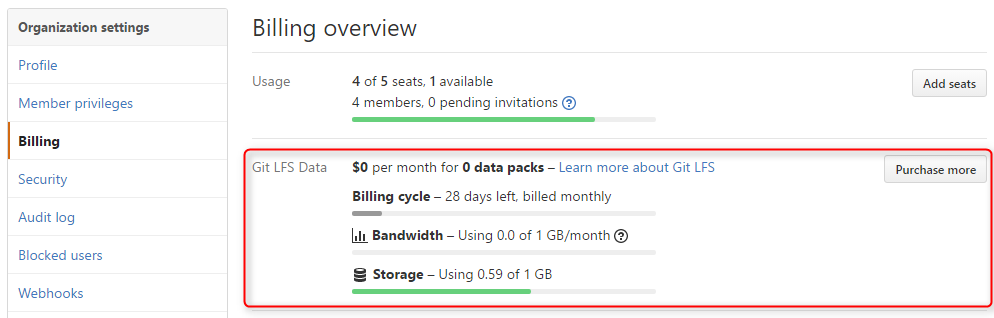
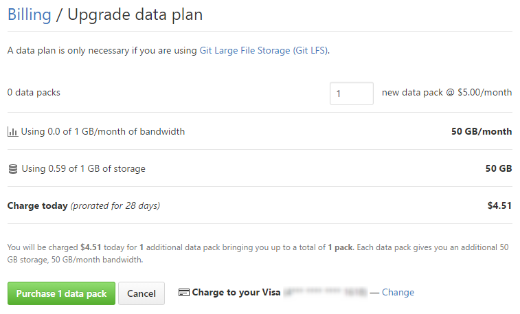
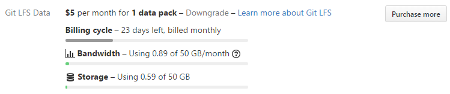

こんにちは、kenzauros です。

GitHub の有料プランで [Git LFS (Large File Storage)](https://git-lfs.github.com/) の使用容量と転送量の確認の仕方をご紹介します。

## 使用料の確認

GitHub で [LFS (Large File Storage)](https://git-lfs.github.com/) を使用する場合、通常のプランだと**ストレージ容量 (Strorage) が 1GB** 、 **転送量 (Bandwidth) が 1GB/月** に制限されています。

LFS はもともとファイルサイズの大きいファイルを扱うものなので複数リポジトリがある場合、これぐらいの容量・あるいは転送量にはすぐに到達してしまうでしょう。

今自分あるいは自分の組織がどの程度使っているのかを調べるにはまず、 [Setting → Billing](https://github.com/settings/billing) を開きます。 

組織の場合は対象の組織に切り替えてから Setting → Billing を開きます。

**Billoing Overview / Git LFS Data** というところを見ると、使用量が確認できます。

この場合だと Bandwidth (転送量) は 1GB 中 0.0GB ですが、 Storage (ストレージ) は 1GB 中 0.59GB を利用していますので、残り半分もありません。

なお、この部分に Bandwidth や Storage が表示されていなければ、まだ Git LFS の領域を使用していない状態だと思います。

## 容量を追加する

さて、使っていて転送量やストレージが足りなくなったら、追加の **data pack** というものを購入する必要があります。

意外と [Pricing](https://github.com/pricing) のページなんかにも載っていなくて情報が少ないです。

**1 data pack は 5 US ドル/月**で、**転送量 50GB/月＋ストレージ 50GB** が追加で利用できるようになります。

これは組織のメンバー数によらず一律ですのでが、毎月かかるコストになるので注意が必要です。まぁ一月 5 ドルで 50GB のクラウドストレージなら悪くはないと思います。

この画面の右側にある **Purchase more** をクリックすると購入画面に進めます。割と良心的で日割り計算してくれます。

決済情報（クレジットカード）はすでに登録されているので **Purchase 1 data pack** ボタンをクリックするとすぐに追加容量の購読がはじまります。

購入後は転送量・ストレージともに 50GB 追加されていることがわかります。

ちなみに容量を追加しないまま使用していると下記のようなアラートメールがきます。

>[GitHub] At 80% of Git LFS data quota for *****
>
>We wanted to let you know that you’ve used 80% of your data plan for Git LFS on the organization mseninc. No immediate action is necessary, but you might want to consider purchasing additional data packs to cover your bandwidth and storage usage:
>
>  https://github.com/organizations/mseninc/billing/data/upgrade
>
>Current usage as of 22 Jan 2017 05:40PM UTC:
>
>  Bandwidth: 0.83 GB / 1 GB (83%)
>  Storage: 0.59 GB / 1 GB (59%)

使いつづける場合は早めに購入しましょう。
