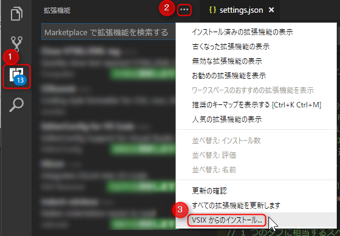
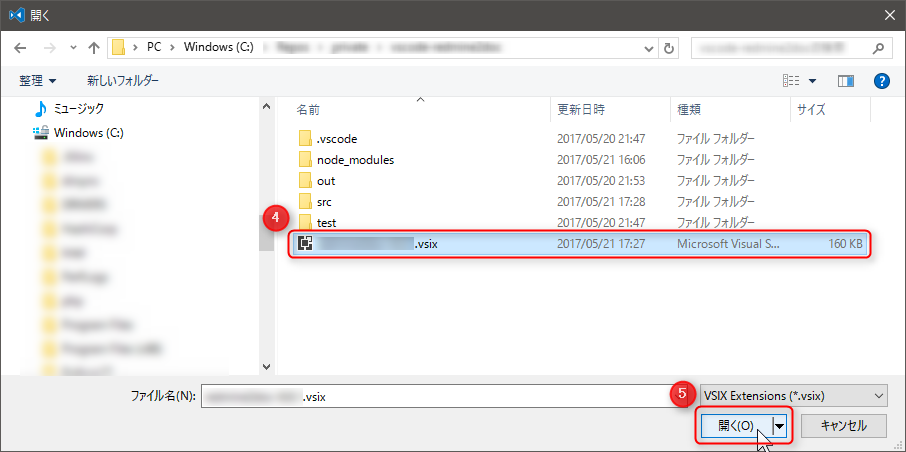

**Visual Studio Code (VSCode)** ではすでに Marketplace で多くの拡張機能が公開されているため、大抵のことは Marketplace からインストールすることができます。

しかし Marketplace に公開できないときや、公開前に仲間内で試用したいときは、 **VSIX と呼ばれる拡張子が `*.vsix` のパッケージファイル**を使えば Marketplace 以外からでも拡張機能をインストールすることができます。

## インストール方法

ここでは VSIX ファイルはすでに入手済みとします。 VSIX ファイルはコンピューター上であれば、どこに置いておいても問題ありません。

1. アクティビティーバーの拡張機能をクリックするか、 `Ctrl+Shift+X` を押して**拡張機能**ウィンドウを表示します。
1. **...** をクリックしてメニューを開き、
1. **VSIX からのインストール...** を選択します。

1. `*.vsix` ファイルを選択して、
1. 開く(O) をクリックします。

1. インストールに成功すると、メッセージが表示されるので、 **今すぐ再度読み込む** をクリックして VSCode を再起動します。

ちなみに拡張機能開発環境で VSIX ファイルを生成するにはプロジェクトルートで `vsce package` を叩くだけです。同じフォルダに `*.vsix` ファイルが生成されます。
