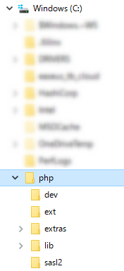
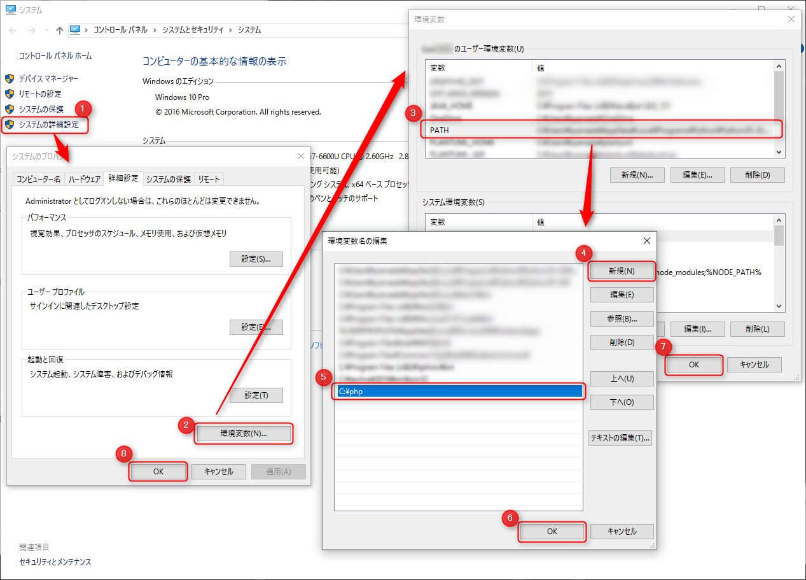

今回は **Windows 10 Pro** に **PHP 7.1.2** と **composer** をインストールします。ちなみに開発環境を想定していますので、運用には向きません。

所要時間は**約 5 分**です。

あまり Windows に PHP を入れて開発する必要はないのですが、 Laravel でプロジェクトに Homestead をインストールするときにローカルの PHP+Composer が必要だったのでインストールすることにしました。

vagrant (Homestead) を導入するのに PHP をインストールとはなんだか本末転倒な気もしますが、気にしないでおきます。

## PHP のインストール

基本的に Windows 向けはコンパイル済のパッケージになっていますので、配置するだけで動作します。

### パッケージのダウンロード

公式ページから PHP のバイナリーをダウンロードします。

* [PHP For Windows: Binaries and sources Releases](http://windows.php.net/download)

4 種類ありますが、基本的には **Thread Safe** のものでいいので、あとは Windows が 32 bit なら **"VC14 x86 Thread Safe"**, 64 bit なら **"VC14 x64 Thread Safe"** の zip ファイルをダウンロードします。

ちなみにタイトルに VC14 とあるように Visual C++ のパッケージが入っていないと動きませんので、 Visual Studio がインストールされていない場合は再頒布可能パッケージを入れてください。

* [Download Visual Studio 2015 の Visual C++ 再頒布可能パッケージ from Official Microsoft Download Center](https://www.microsoft.com/ja-jp/download/details.aspx?id=48145)

### 解凍と配置

ダウンロードしたら解凍して **C ドライブ直下に配置**します。別に他の場所でもいいのですが、一番わかりやすくてメンテしやすいので `C:\php` がおすすめです。



### PATH の追加



スタートボタン右クリックからシステムを開くか、 Windows + Pause キー でシステムを開き、下記の手順でパスを追加します。

1. システムの詳細設定をクリック
2. 環境変数をクリック
3. ユーザー環境変数のところの PATH をダブルクリック
4. 新規ボタンをクリック
5. `C:\php` (PHP を配置したパス) を入力
6. OK
7. OK
8. OK

この状態でコマンドプロンプトを起動して、どこのフォルダーからでも `php -v` と叩けば、バージョンが表示されるはずです。

```
c:\php> php -v
PHP 7.1.2 (cli) (built: Feb 14 2017 21:24:49) ( ZTS MSVC14 (Visual C++ 2015) x64 )
Copyright (c) 1997-2017 The PHP Group
Zend Engine v3.1.0, Copyright (c) 1998-2017 Zend Technologies
```

### php.ini の設定

デフォルトでは `php.ini` がなく、おそらくいろんなものが動作しないため、 `php.ini` を配置します。

**PHP をインストールしたフォルダーに `php.ini-development` があるはずなのでこれを `php.ini` に名前変更**します。

テキストエディターでこの `php.ini` を開き、何行か編集します。

#### 拡張機能 (Extensions) の設定

`extension=` で検索すると拡張機能の設定周辺に飛ぶはずなので、下記 2 行のコメントアウトを外します。 (行頭のセミコロンを消す)

```diff
- ;extension=php_mbstring.dll
+ extension=php_mbstring.dll
- ;extension=php_openssl.dll
+ extension=php_openssl.dll
```

`mbstring` と `openssl` は composer でも必要なので、この時点で外しておきます。あとは必要に応じてコメントアウトを外してください。

#### タイムゾーン

任意ですが、まぁタイムゾーンも併せて設定しておくといいでしょう。

```diff
- ;date.timezone = 
+ date.timezone = "Asia/Tokyo"
```

これで PHP のインストールは完了です。

## Composer のインストール

コマンドプロンプトを開き、 `C:\php` に移動します。

公式ページにある **Command-line installation** の 4 行をコピペで実行します。

* [Composer](https://getcomposer.org/download/)

```
php -r "copy('https://getcomposer.org/installer', 'composer-setup.php');"
php -r "if (hash_file('SHA384', 'composer-setup.php') === '55d6ead61b29c7bdee5cccfb50076874187bd9f21f65d8991d46ec5cc90518f447387fb9f76ebae1fbbacf329e583e30') { echo 'Installer verified'; } else { echo 'Installer corrupt'; unlink('composer-setup.php'); } echo PHP_EOL;"
php composer-setup.php
php -r "unlink('composer-setup.php');"
```

ちなみに 1 行目で `composer-setup.php` ファイルがダウンロードされます。

2 行目はこのファイルが正しいものかどうかを判断しているだけですが、バージョンアップなどでファイルのハッシュが変わっていると通らないので、公式ページの記述を利用するようにしてください。

どう見ても正常にダウンロードできているのに 2 行目が "Installer corrupt" でファイルが消えてしまうときは、1 行目を再度実行したあと、飛ばして 3 行目を実行しても問題ありません。

### インストールの確認

正常に完了すると `composer.phar` ファイルができているはずです。

この状態で `php composer.phar -V` とすると Composer のバージョン情報が表示されます。

```bash
c:\php> php composer.phar -V
Composer version 1.3.2 2017-01-27 18:23:41
```

### ショートカット (bat ファイル) の作成

このままだと composer を実行するのにいちいち `C:\php` にこないといけないので、バッチファイルを作成して、 **`composer` だけで呼び出せるようにします**。

```
c:\php> echo @php "%~dp0composer.phar" %*>composer.bat
```

これで `C:\php` に composer.bat が生成されていれば OK です。

## 再起動して完了

**再起動します。**

コマンドプロンプトは立ち上げ直すとパスが通りますが、なぜか Git bash や ConEmu は読み込んでくれないので、再起動するのが無難です。

再起動したら、好きなフォルダーで `composer` を実行してさきほどと同じバージョン情報が表示されれば完了です。（Git bash の場合 `composer.bat` のように拡張子をつけないと呼んでくれませんでした。）

```
c:\php> composer
Composer version 1.3.2 2017-01-27 18:23:41
```

おつかれさまでした！

## 参考

* [PHP7をwindows7にインストールする - Qiita](http://qiita.com/daijinload/items/3eb3d7d776143b3c5392)
* [Composerをインストールしてみた - Qiita](http://qiita.com/kakijin/items/02364adacf36410f449e#windows)