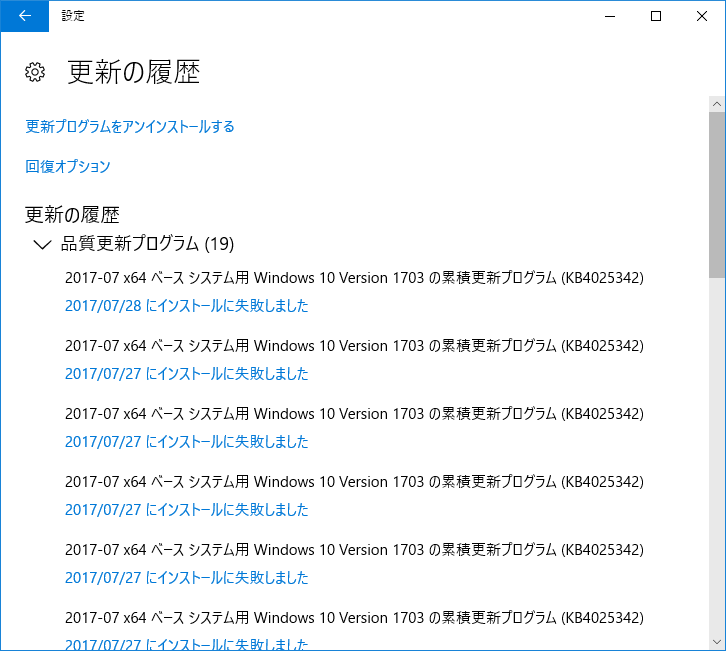
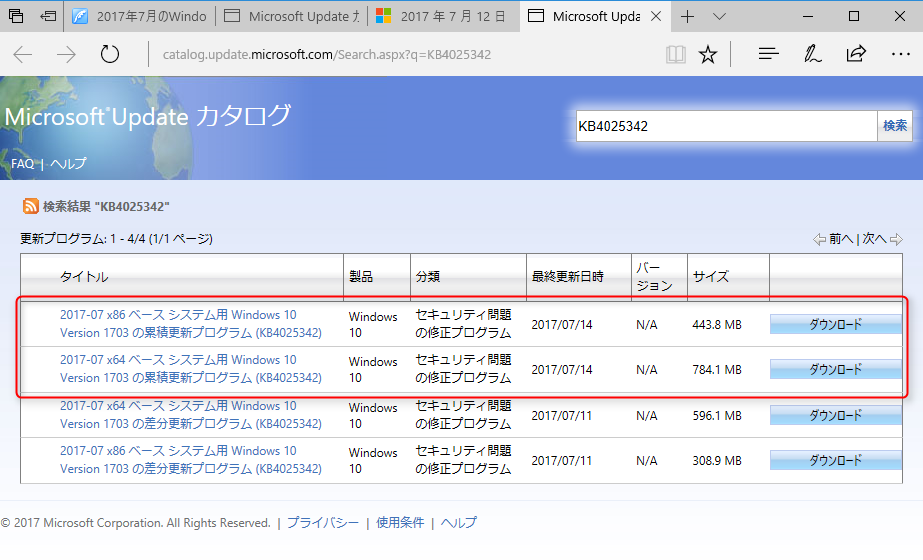
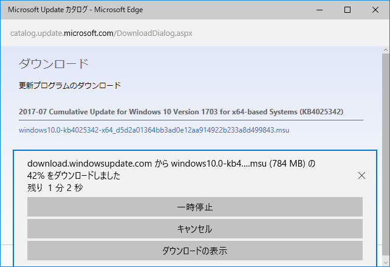
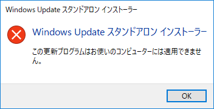
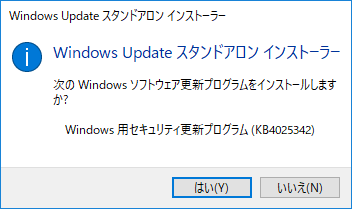
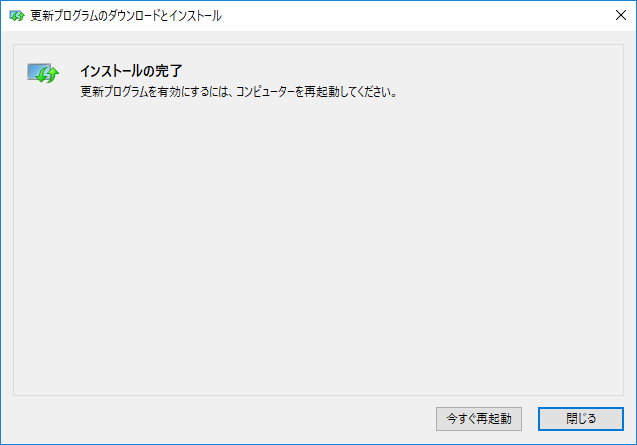
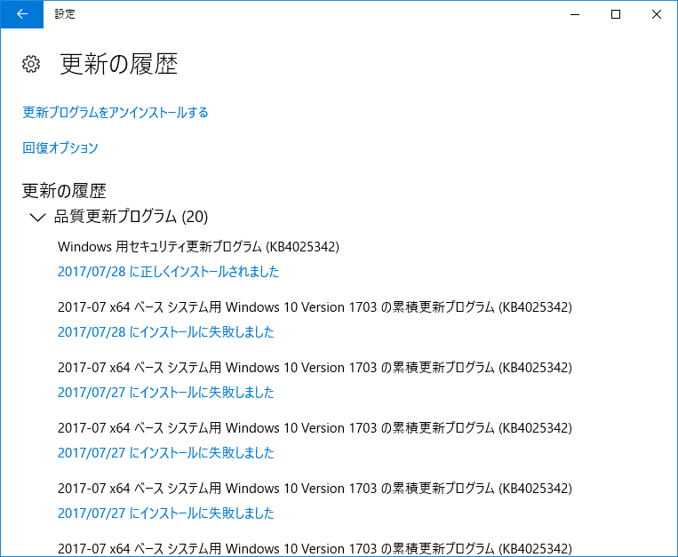
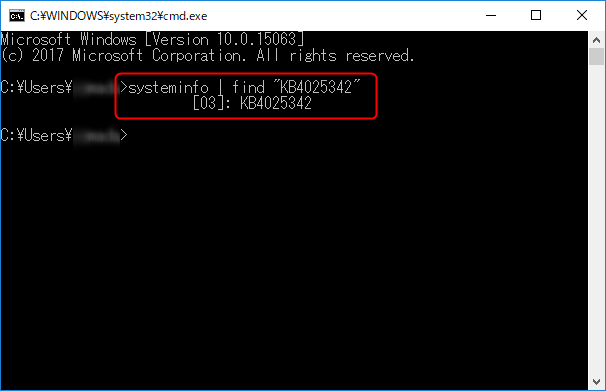

こんにちは、kenzauros です。

**Windows 10** が Creators Update (Version 1703) にあがってからなんか調子悪いなーと感じたので、しばらく「インストールができない」と言われたまま放置していた累積更新プログラム **KB4025342** をちゃんとインストールしてみました。

## 自動ではインストールが完了しない

7月21日ごろから Windows Update に表示されてはいたものの、インストールを開始してもすぐに終わってしまい、適用されないままでした。



Windows Update の適用履歴を見てみると「**インストールに失敗しました**」が並んでいます。

再度 Windows Update から試してみましたが、状況は変わりませんでした。

## スタンドアロン インストーラーでのインストール

### インストーラーの入手

うまくいかないので Windows Update を使わずにスタンドアロンで動作するインストーラーを Microsoft のカタログからダウンロードします。

* [KB4025342 - Microsoft Update カタログ](http://www.catalog.update.microsoft.com/Search.aspx?q=KB4025342)

**Microsoft Update** で **KB4025342** を検索すると 4 件表示されます。



似たファイル名が並びますが、上の2つが「**累積**更新プログラム」、下の2つが「**差分**更新プログラム」と記載されています。どちらがいいのかわからなかったので、2種類とも落として試してみました。

なお、それぞれ 64ビット版 (x64) と 32ビット版 (x86) がありますので、自PC の環境を確認してダウンロードします。

右端の「ダウンロード」ボタンを押すと別ウィンドウでダウンロードダイアログが開くので、 `.msu` のリンクをクリックするとインストーラーがダウンロードできます。



結果、「**差分**更新プログラム」は下記のように表示されてインストールできませんでした。



ということで「**累積**更新プログラム」をダウンロードします。

### インストール

ダウンロードした `.msu` ファイルをダブルクリックして実行し、 [はい] をクリックします。



インストールが完了すると再起動を促されるので、それに従って再起動します。



再起動後、Windows Update の適用履歴を見てみるとインストールが完了していることがわかります。



念のため、コマンドプロンプトで `systeminfo` を叩いてみると、 **KB4025342** が表示されました。

```
systeminfo | find "KB4025342"
```



これで不具合が解消されることを祈るのみです。
