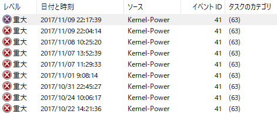
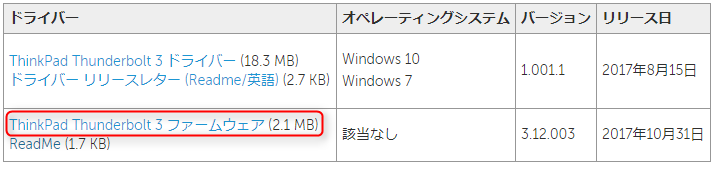
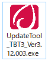

最近、私の大事な **ThinkPad X1 Carbon (5th Gen.)** さんが魔の **Kernel-Power 41 病**に侵されています。



Windows からも度々**重大**な病だと宣告されております。

そんな Windows の無粋さと、無慈悲な青い画面が、私の精神をブルーにしていきます。

## 経緯

これまでの経験 ([スリープで強制シャットダウンされる Kernel Power 41 闘病記 (Windows 10)](https://mseeeen.msen.jp/how-to-fix-kernel-power-41-in-windows-10/)) から、ドライバーのアップデートは Lenovo Companion で万全に当てていましたが、症状は改善されませんでした。

頻発しだしてからしばらく経ったのでなんとなく傾向がわかりはじめました。

私は **Carbon → ThinkPad Thunderbolt 3 ドック → Philips BDM4350UC/11 モニター** という構成で使っています。

スリープから起きるときによく起きていると思っていたのですが、どうも**ドックに挿しているときだけ起こっている**ようです。

## ドックのファームウェアを更新してみた

### ファームウェアの確認

というわけで早速ドック関連の情報を確認します。ドライバーは最新 (`1.001.1`) が当たっているようです。

ファームウェアはドックの公式ページで公開されています。

- [ThinkPad Thunderbolt 3 ドック - 製品の概要とサービス部品](https://support.lenovo.com/jp/ja/solutions/acc100356)

先に [Readme](https://download.lenovo.com/pccbbs/options_iso/thunderbolt3dock_fw.txt) で変更点を見てみます。

```plain
Change List
=======================
(2017/10/17)
1rst release 
Fixed:
 1. Add workaround for Dell2715Q monitor DP no display issue while connecting to dock.
 2. fixed lenovo 2424zA(VGA)will blinking if attach dock after enter S3(1/100)
3, fix Philips BDM3275/241p6VPJKEB half garbage if connect to dock and set refresh rate to 23Hz or 24Hz.
4, fixed Lenovo P27U-10 DP no display issue when hot plug dock.
```

ふと見ると、 **Philips BDM** からはじまる見覚えのある型番が... 私のモニターは Phiplips BDM4350UC/11 です。一致はしていないものの、これはひょっとして期待できるのでは...？！

そんな一縷の望みをかけて、ファームウェアのアップデートにとりかかります。

### ファームウェアのダウンロード

「ThinkPad Thunderbold 3 ファームウェア」をクリックしてファームウェアのインストーラーをダウンロードします。



2017/11/09 時点でのバージョンは 3.12.003 でした。

### ファームウェアのインストール

ダウンロードした `thunderbolt3dock_fw.zip` を展開すると `UpdateTool_TBT3_Ver3.12.003.exe` が現れます。



当たり前ですが **PC をドックにつないだ状態で、この exe ファイルを実行**します。

インストーラーに従って進めればすぐに完了します。

完了すると同じフォルダに `update.log` ができます。中身を確認して、 `Version: 3.12.003` のようにバージョン番号がダウンロードしたものと一致していれば OK です。

### Dock の再起動

**PC からドックを抜き、ドックの電源を抜いて挿し直します**。これでファームウェアのインストールが完了します。

ちなみに再度 exe を実行しても特になにも起こりませんが、 `update.log` は更新されて「すでにこのバージョンになっています」と出力されます。

## 結果

ドック再起動後、期待をこめて、ドック接続！！

...

**即死 (ブルースクリーン) orz**

意味不明です。泣きたいです。

その昔、 X1 Yoga さんも闘病の末、KP41 に打ち勝ったので、 Carbon も勝てると信じていますが、それまでに失うデータと時間がハンパないです。

続報あればまた書きます。

ちなみに ThinkPad X1 Carbon (第5世代) 自体のドライバーやソフトウェアは下記からダウンロードできます。

- [ThinkPad X1 Carbon (マシンタイプ 20HR, 20HQ) ダウンロード](https://pcsupport.lenovo.com/jp/ja/products/laptops-and-netbooks/thinkpad-x-series-laptops/thinkpad-x1-carbon-type-20hr-20hq/downloads)