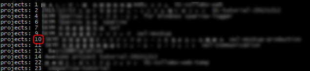

**GitLab の Issue を GitHub に移行する Node.js スクリプト**を発見したので、使ってみました。

結果、満足のいく移行になりましたので、簡単に使い方をご紹介します。

## 背景

弊社では Git 導入後しばらくはオープンソースの Git 管理環境である **[GitLab](https://about.gitlab.com/) Community Edition** を社内サーバーにオンプレで構築して使っていました。

今はほぼクラウドの **GitHub** ベースに移ったのですが、当初使っていたリポジトリであまり更新のないものは GitLab に残ったままになっていました。

それらのリポジトリで**移行のネックとなっていたのは Issue** です。

**ソースコードとコミット履歴自体は GitHub の Import 機能で簡単に移せるのですが、 Issue までは吸い取ってくれません**。そこそこ Ticket-driven というか Issue-driven でやっていたプロジェクトだと、 Issue 自体がそれなりの重責を担っているので、その履歴を引き継げないのはなんとも悲しいことです。

というわけで「API 経由の移行ツールでも作るかなー」などと考えていたところ、うん、やはり先人が作っておられました。さすが。すばらしい。

- **[piceaTech/node-gitlab-2-github: Migrate Issues, Wiki from gitlab to github](https://github.com/piceaTech/node-gitlab-2-github)**

GitLab → GitHub の一方通行ではありますが、 Issue とそのコメント、 Wiki まで移行してくれるのですから優れものです。しかも Milestone や Label まで自動で生成してくれます。

ただし当然ながら、投稿者はすべて自分 (設定ファイルに書いた GitHub アカウント) になるので、そこは妥協しましょう (後述の usermap を設定しておくとコメント中に `In gitlab by @hogehoge on May 31, 2017, 14:52` のように元の投稿者を表示してくれます。

## 実行環境

- Windows 10 Pro
- Node.js 6.10.3
- npm 3.10.10
- GitLab 9.5.4

## 移行手順

### node-gitlab-2-github のダウンロード

`git clone` でスクリプトをダウンロードし、 `npm install` しておきます。

```bash
git clone https://github.com/piceaTech/node-gitlab-2-github.git
cd node-gitlab-2-github
npm i
```

### GitLab の Access Token の取得

GitLab から情報を取得するために、移行するリポジトリからデータを読み取る権限をもったユーザーでログインし、 **Access Token を発行する必要があります**。


1. ユーザーアイコンから
2. Settings →
3. Access Tokens を開き、
4. Name に適当な識別名を入力し、
5. Scopes でとりあえず全部チェックをつけて、
6. [Create personal access token] をクリックします

移行が終わればトークンは無効化するので、スコープや有効期限はゆるゆるでもかまいません（適宜設定してください）。


生成されたトークンをコピーしておき、なくさないようにします。

### 設定ファイル settings.json の編集

リポジトリフォルダーにある **`sample_settings.json` を `settings.json` にリネーム**し、テキストエディターで開きます。


下記の部分を編集します。

- `gitlab`
    - `url` : http/https などを含む、 GitLab のルート URL を記述します。
    - `token` : さきほど生成した「GitLab の Access Token」を指定します。
    - `projectID` : `null` のままにしておきます。
- `github`
    - `url`, `pathPrefix` : 普通の GitHub を使っているのであれば特に変更する必要はありません。
    - `owner` : リポジトリのオーナー (GitHub の URL `https://github.com/XYZ/REPO` の XYZ の部分) を指定します。個人オーナーであれば自分のアカウント名、組織オーナーであれば組織名になります。
    - `username` : **GitHub API を叩く自分のアカウント名**を指定します。
    - `password` : 上記 username に対する password を指定します。ただし二段階認証を有効にしている場合は、 **GitHub 側で取得した Personal Access Token をここに設定**する必要があります。
    - `repo` : Issue や Wiki を移行する先のリポジトリ名を指定します。
- `usermap` : それぞれのユーザー名の対応を記述します。**キーが GitLab 側、値が GitHub 側のユーザー名**になります。いずれも各サイト上で @ メンションの後ろにつける英数字の名称です (@ は不要)。
- `projectmap` : 設定しなくてもかまいませんが、 `usermap` と同様に GitLab:GitHub の対応表を書いておけば、コメント中などでプロジェクト参照などがある場合に、うまく変換してくれるようです。

編集が完了したらファイルを保存しておきます。

### プロジェクト一覧の取得

`settings.json` の `gitlab.projectID` が `null` のままで実行すると、 GitLab 側のプロジェクトを列挙してくれます。

設定がきちんとできていることを再確認したら、 `node index.js` を実行してみます。

下図のようにプロジェクト一覧が表示されれば、 GitLab 側の設定がうまくできている証拠です。



ここで **移行元** のプロジェクトの ID を確認し、`settings.json` で `null` のままにしていた `gitlab.projectID` に設定します。

### 移行スタート

これで移行準備が完了です。

再度 `node index.js` を実行すれば、 `gitlab.projectID` に指定した GitLab のプロジェクトから Issue と Wiki が読み取られ、 `github.repo` に指定した GitHub のリポジトリの Issue, Wiki に書き込まれます。

基本的に取り消しはできないので、移行先はまっさらなリポジトリで進めるほうがいいでしょう。

一つずつ API を叩いていくので、しばらく時間がかかります。ログは都度流れていくので、 GitHub に生成されてはクローズされていく Issue とともに眺めていると懐かしいやりとりに涙するかもしれません。

### 完了

ともあれ完了すると `Finished creating all issues and Comments` のようなメッセージが表示されます。

GitHub の Issues が増えていれば成功です。 (GitLab でクローズされていたものはちゃんと Closed になっています)


あらためて、すばらしきスクリプトを作ってくださった [piceaTech](https://github.com/piceaTech) さんに感謝いたします。