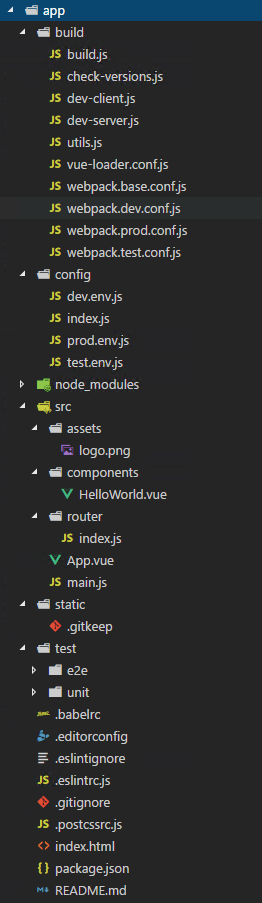
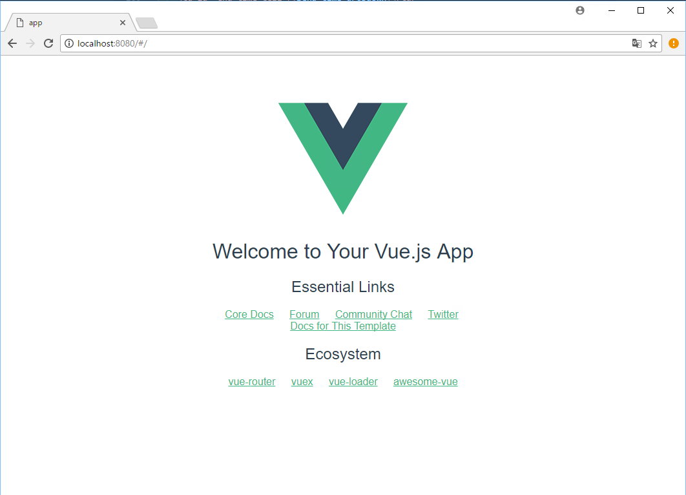

最近 Laravel に組み込まれた **Vue.js** を使っていたのですが、 Vue を単体で使用したいこともあるため、ひさしぶりに個別にインストールしてみました。

vue-cli を使えば 5 分程度で開発環境が構築できます。

## Vue CLI をインストール

Vue CLI は Vue.js 環境構築用のコマンドラインインターフェースです。
**vue-cli をインストールすると vue コマンドが使えるように**なります。

npm でグローバルインストールします。

```bash
npm i -g vue-cli
```

インストールされた vue-cli のバージョンは 2.9.1 でした。

## Vue.js プロジェクトを生成

プロジェクトを作成する親ディレクトリで下記のコマンドを実行します。

Webpack を使用する場合は `webpack` を指定しておきます。

`app` はディレクトリ名になるので、なんでもかまいませんが、特になければプロジェクト名を指定しましょう。

```bash
vue init webpack app
```

コマンドを実行するといくつかの質問がきますが、特に指定がなければ Enter 連打でも大丈夫です。

- vue-router
- ESLint
- Karma + Mocha
- Nightwatch

このあたりはテストフレームワークの必要性に応じて、不要なら No にしましょう。

```bash
? Project name app
? Project description An awesome project
? Author HOGEHOGE
? Vue build standalone
? Install vue-router? Yes
? Use ESLint to lint your code? Yes
? Pick an ESLint preset Airbnb
? Setup unit tests with Karma + Mocha? Yes
? Setup e2e tests with Nightwatch? Yes
   vue-cli · Generated "app".
   To get started:
     cd app
     npm install
     npm run dev
   Documentation can be found at https://vuejs-templates.github.io/webpack
```

インストールが完了した状態ではディレクトリ構成は次のようになっていました。



## npm パッケージのインストール

次に生成されたディレクトリにおりて、パッケージをインストールします。

```bash
cd app 
npm i
```

インストールされた Vue.js のバージョンは 2.5.2 、 vue-router は 3.0.1 でした。

## 開発環境の起動

インストール後、 `npm run dev` を実行すると `http://localhost:8080` で開発環境が起動し、 ブラウザーでデフォルトのトップページが立ち上がります。



これで Vue.js の開発環境構築は完了です。