**[Gmail がアドオン (Add-on) に対応](https://www.blog.google/products/g-suite/do-more-your-inbox-gmail-add-ons/)**しました。

Asana や Trello など有名サービスのアドオンがリリースされていますが、実は誰でもアドオンを開発することができます。

ということで [Quickstart](https://developers.google.com/gmail/add-ons/guides/quickstart) を参考に、クイックスタートしてみたいと思います。

- [Quickstart: Gmail Add-on | Google Developers](https://developers.google.com/gmail/add-ons/guides/quickstart)
- [G Suite Developers Blog: Gmail add-ons framework now available to all developers](https://gsuite-developers.googleblog.com/2017/10/gmail-add-ons-framework-now-available.html)

## アドオンの作成

### スクリプトの作成

Gmail の Add-on は Google サービス共通の Web App や自動化のスクリプト環境である **Google Apps Script** で作成します。

まず、 [Google Apps Script](https://script.google.com/) を開き、 **Start Scripting** をクリックします。
(2回目以降は自動で新規プロジェクトに飛ぶかもしれません)

<a href="images/quickstart-with-gmail-add-on-1.png">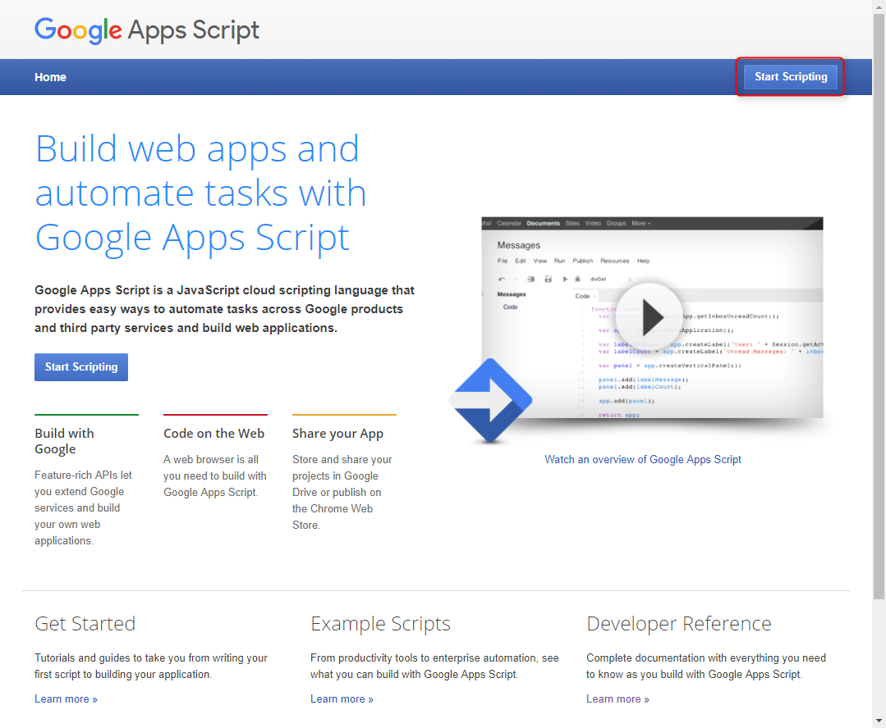</a>

こんな感じのスクリプトエディターが開きます。 Google Apps Script は言語的には JavaScript とほぼ同じです。日本語環境だと標準で `コード.gs` が開いていると思います。

<a href="images/quickstart-with-gmail-add-on-2.png">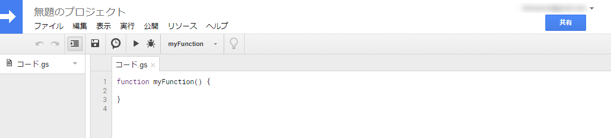</a>

スクリプト部分に [Quickstart Step 1](https://developers.google.com/gmail/add-ons/guides/quickstart#step_1_create_the_script_project) の**ソースコードを貼り付け**ます。

[ファイル] から [保存] して変更を保存します。「無題のプロジェクト」となっているプロジェクト名をクリックして "Gmail Add-on Quickstart" とでも名前を変えておきましょう。

<a href="images/quickstart-with-gmail-add-on-3.png">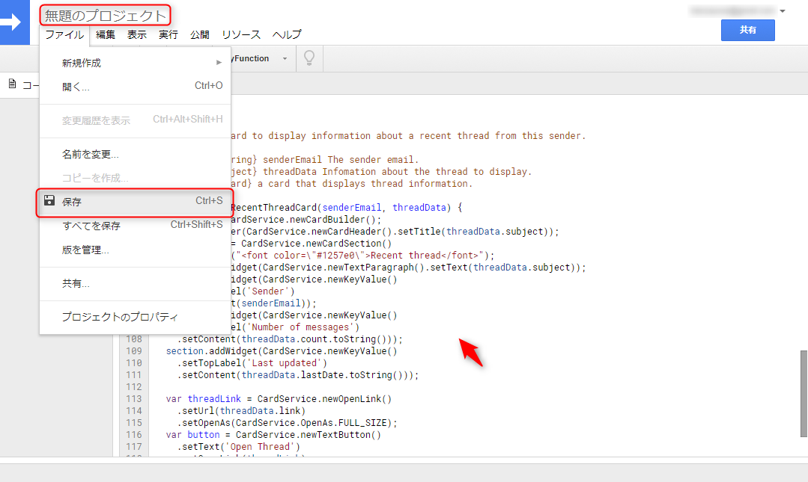</a>

### マニフェストファイルの編集

[表示] から [マニフェストファイルを表示] を選択します。

<a href="images/quickstart-with-gmail-add-on-4.png">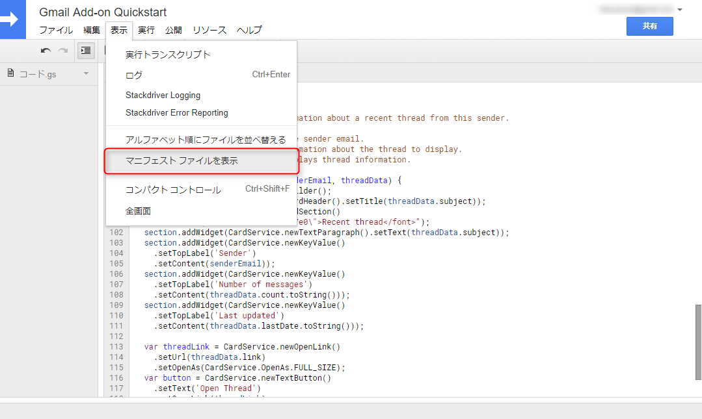</a>

`appsscript.json` が開いたら [Quickstart Step 2](https://developers.google.com/gmail/add-ons/guides/quickstart#step_2_update_the_script_manifest) のマニフェストファイル用 JSON をコピペし、保存します。

<a href="images/quickstart-with-gmail-add-on-5.png">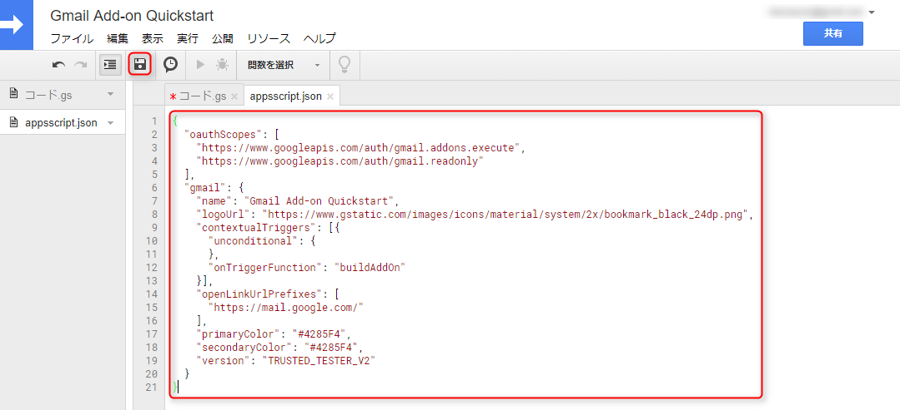</a>

### 公開

今回はあくまでお試しのため、ウェブストア等で公開しません。 Gmail にインストールするために [公開] から [Deploy from manifest...] を選択します。

<a href="images/quickstart-with-gmail-add-on-6.png">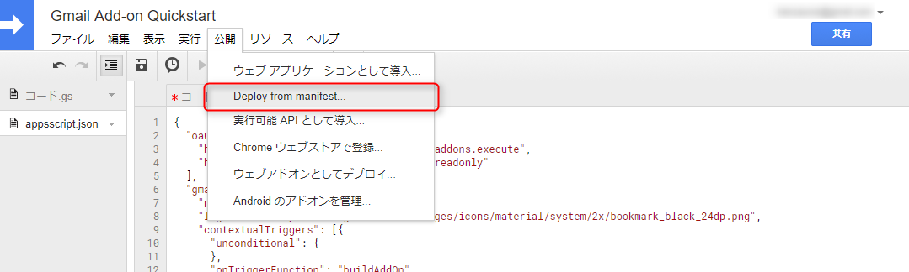</a>

Deployments というダイアログが開くので、 [Get ID] というリンクをクリックします。

<a href="images/quickstart-with-gmail-add-on-7.png">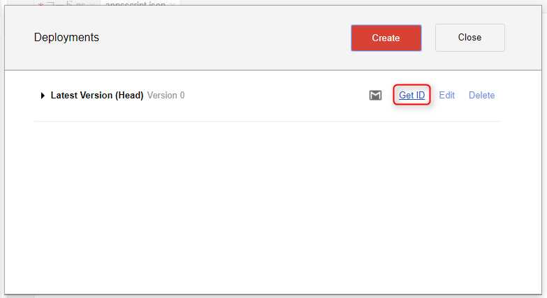</a>

**Deployment ID** が表示されるのでこれをコピーし、ダイアログを 2 つとも閉じます。

<a href="images/quickstart-with-gmail-add-on-8.png">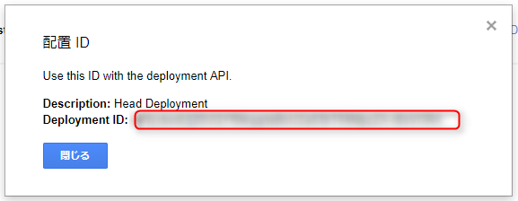</a>

これで Gmail Add-on の準備は完了です。

## Gmail にインストール

Add-on をインストールしたいアカウントで **Gmail** を開きます。**歯車アイコンから [設定] を開き、 [アドオン] タブ**を開きます。

今回のクイックスタート アドオンはウェブストア等に公開されたものではなく Google が安全を確認したものではないため（安全とわかっているのは作った本人だけ）、特別にインストールを許可してやる必要があります。

「**ご利用のアカウントで、デベロッパーアドオンを有効にします**」というチェックボックスを ON にします。

<a href="images/quickstart-with-gmail-add-on-9.png">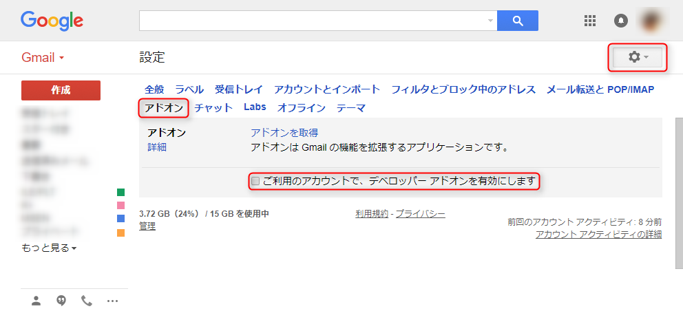</a>

下記の通り、警告が表示されますが、今は自分で作ったアドオンをインストールするので、「有効にする」をクリックします。

<a href="images/quickstart-with-gmail-add-on-10.png">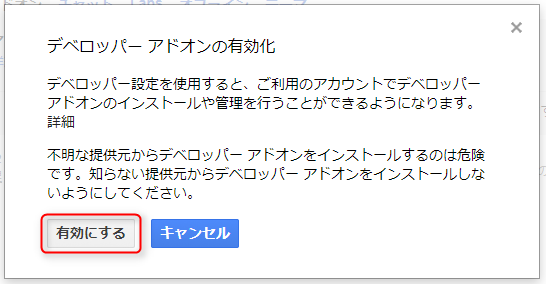</a>

「デベロッパーアドオンをインストール」という欄が表示されるので、このテキストボックスに先ほど作成時にコピーしておいた **デプロイ ID (Deployment ID)** を貼り付け、 [インストール] をクリックします。 

<a href="images/quickstart-with-gmail-add-on-11.png">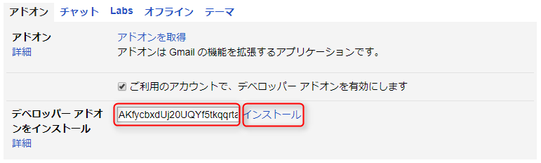</a>

さらに確認が表示されるので、 ID を確認してインストールします。

<a href="images/quickstart-with-gmail-add-on-12.png">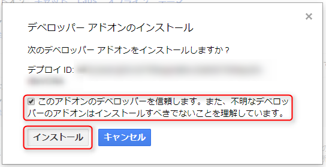</a>

これで **Gmail に戻り、リロード**します。すると右側に Quickstart のマニフェストで指定された Bookmark アイコンが表示されていますので、これをクリックします。

<a href="images/quickstart-with-gmail-add-on-13.png">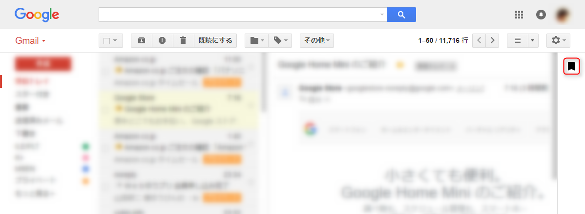</a>

**アドオンが Gmail のデータにアクセスするのに必要な権限を与える必要がある**ので、 [**アクセスを承認**] をクリックします。

<a href="images/quickstart-with-gmail-add-on-14.png">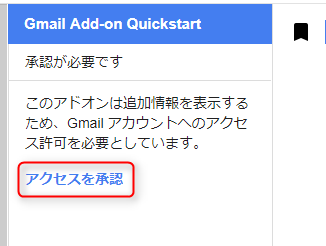</a>

アカウント選択画面がでたら、自分のアカウントをクリックし、下記のようなダイアログに警告が表示されますが、ここは自分で認識して進めているので [Advanced] リンクをクリックします。

<a href="images/quickstart-with-gmail-add-on-15.png">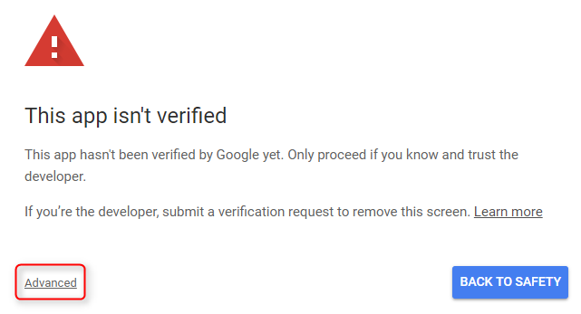</a>

下に表示された [Go to Gmail Add-on Quickstart (unsafe)] をクリックします。繰り返しますが、デベロッパーアドオンなので unsafe になっています。今回は気にせず進みましょう。

<a href="images/quickstart-with-gmail-add-on-16.png">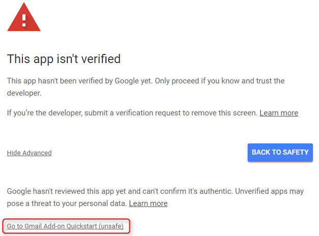</a>

さらに厳重に確認ダイアログが表示されるので、 **Continue** と入力して NEXT をクリックします。

<a href="images/quickstart-with-gmail-add-on-17.png">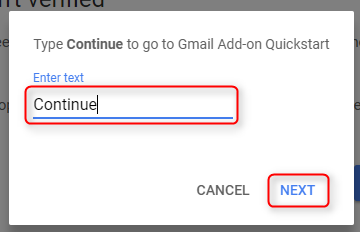</a>

またまた今度は与える権限について OAuth 画面の認可画面が開くので、一応確認して [ALLOW] をクリックします。

<a href="images/quickstart-with-gmail-add-on-18.png">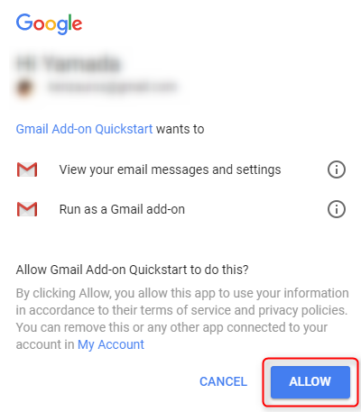</a>

これでやっとアドオンが使えるようになりました。アドオン作成よりインストールのほうが面倒ですね(笑)

まぁこのアドオンはクイックスタートなので、あまり便利ではないですが、アドオンでどんなことができるかの雰囲気は感じることができます。いろいろ触ってみてください。

<a href="images/quickstart-with-gmail-add-on-19.png">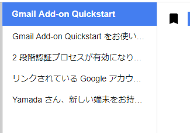</a>

## アンインストール

不要になったら、設定のアドオンタブから [アンインストール] を押して削除しましょう。特に他のデベロッパーアドオンを使用しないのであれば、デベロッパーアドオンを無効にしておいたほうが無難でしょう。

<a href="images/quickstart-with-gmail-add-on-20.png">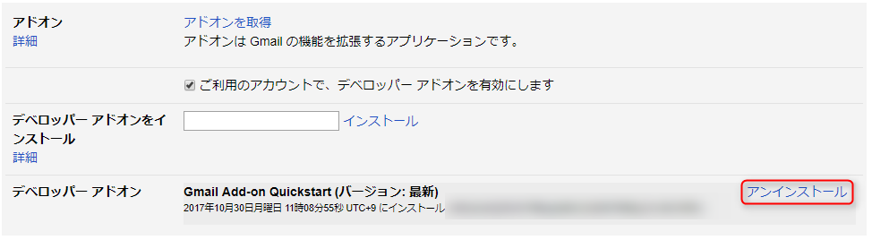</a>

くれぐれもよくわからないところで配布されているアドオンをインストールしないようご注意ください。