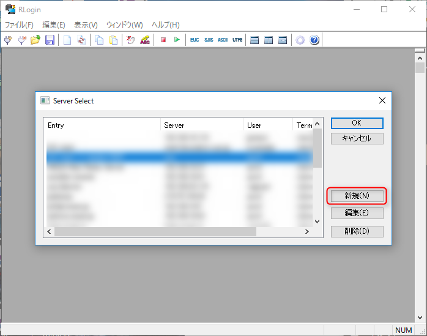
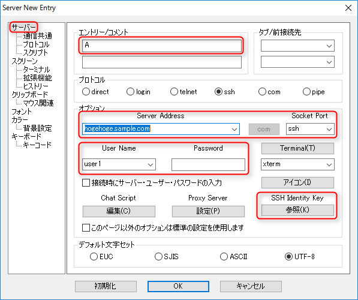
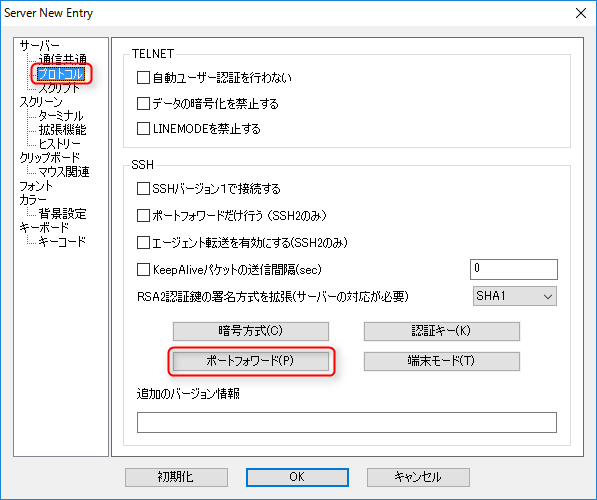
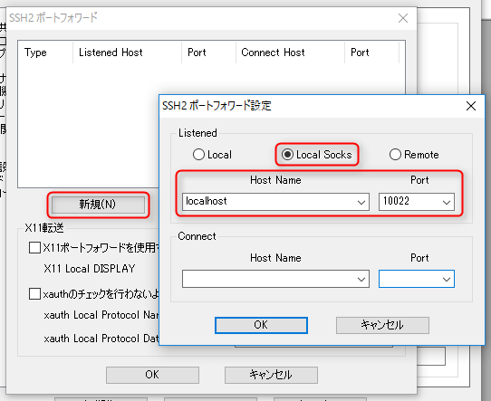
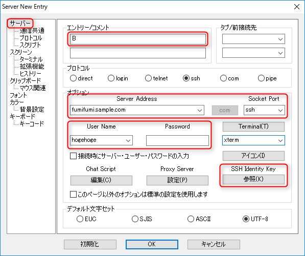
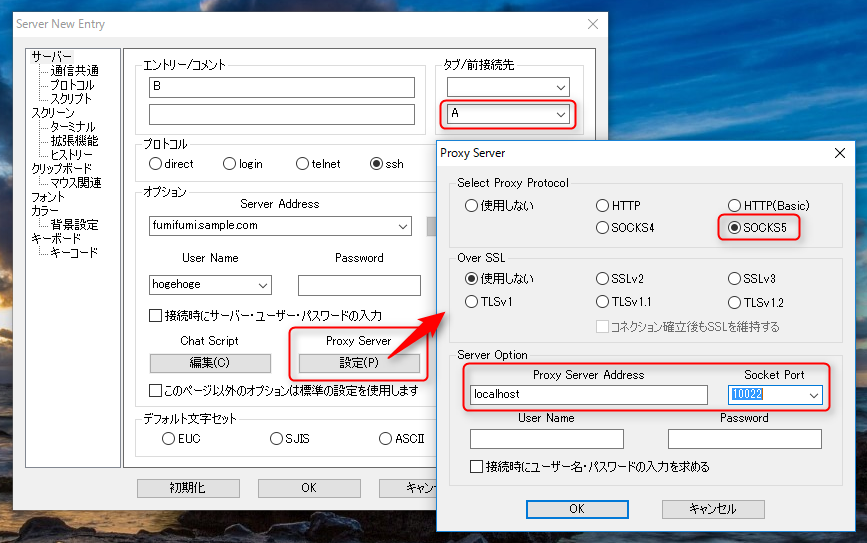
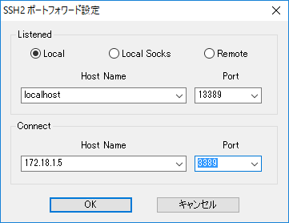

物理的に離れた環境で**リモートデスクトップ (RDP)** をしようと思うと VPN を利用するのがわかりやすいですが、クラウドなど VPN できない環境もありますし VPN クライアントが増えすぎて面倒という悩みもあります。

そんなときリモートデスクトップ接続先のマシンが所属しているネットワークに SSH のログインサーバーがある場合、そのサーバーを踏み台すれば SSH 経由でリモートデスクトップを利用することができます。

今回は **SSH クライアントに [RLogin](http://nanno.dip.jp/softlib/man/rlogin/) を使用して 2 段の踏み台サーバーを経由したリモートデスクトップ接続の設定方法**をご紹介します。

## 概要

### 環境

今回は下記のような構成を前提とします。

* A: 踏み台 1 hogehoge.sample.com (CentOS 6, B にアクセス可能なネットワーク)
* B: 踏み台 2 fumifumi.sample.com (CentOS 6, C にアクセス可能なネットワーク)
* C: リモートデスクトップ接続先のマシン (Windows Server 2012 R2)

OS は Windows 10 Pro, [RLogin](http://nanno.dip.jp/softlib/man/rlogin/) のバージョンは 2.22.3 です。

つまり hogehoge と fumifumi を通してリモートデスクトップを使います。

### 接続の考え方

まず接続の仕組みを確認しておきましょう。

1. A の SSH 接続を `localhost:10022` ポートでプロキシできるようにする 
2. B で A の SSH 接続をプロキシとして使って `localhost:13389` を C の `3389` ポートに接続する

このため、 RLogin のサーバー設定は 2 個必要になります。

## サーバー設定の作成

### A の SSH 接続を localhost:10022 ポートでプロキシできるようにする

RLogin を起動し Server Select から **新規** をクリックします。

Server New Entry 画面の **サーバー** 設定で踏み台 1 (A) の情報を入力します。

* エントリー名: 適当な名前
* Server Address: 踏み台 1 (A) のホスト名か IP アドレス (ここでは hogehoge.sample.com)
* Socket Port: 踏み台 1 (A) の SSH ポート (デフォルトは 22)
* User Name: 踏み台 1 (A) の 接続に使うユーザー名
* Password: 踏み台 1 (A) の 接続に使うパスワード (鍵認証の場合は不要）
* SSH Identity Key: 踏み台 1 (A) の 接続に使う鍵ファイル (鍵認証の場合）

**プロトコル** 設定を開き、 **ポートフォワード** をクリックします。

**SSH2 ポートフォワード** 画面で **新規** をクリックし、新しく開いた SSH2 ポートフォワード設定画面で、 **Local Socks** を選択し、 Host Name に **localhost**, Port に **`10022`** を入力します。

ポート番号はこのあとのプロキシを指定するときに同じ番号にすればいいだけなので `10022` 以外でも問題ありません。

入力できたら OK で Server Select 画面まで戻ります。

### B で A の SSH 接続をプロキシとして使って localhost:13389 を C:3389 に接続する

もう一度 **新規** をクリックして Server New Entry 画面を開き、とりあえず **サーバー** 設定で A と同様に踏み台 2 (B) の接続情報を入力します。

* エントリー名: 適当な名前
* Server Address: 踏み台 2 (B) のホスト名か IP アドレス (ここでは fumifumi.sample.com)
* Socket Port: 踏み台 2 (B) の SSH ポート (デフォルトは 22)
* User Name: 踏み台 2 (B) の 接続に使うユーザー名
* Password: 踏み台 2 (B) の 接続に使うパスワード (鍵認証の場合は不要）
* SSH Identity Key: 踏み台 2 (B) の 接続に使う鍵ファイル (鍵認証の場合）

これに加えて、 B はさらに設定を追加します。

まず、この接続の前に A の接続を確立するように **タブ/前接続先** の下側のドロップダウンリストでさきほど作成した A の接続を指定します。

次に **Proxy Server の設定** をクリックし、 Proxy Server 画面を開きます。 Protocol に **SOCKS5** Server Address に `localhost`、 Socket Port に A のポートフォワードで設定したポート (ここでは `10022`) を指定します。

次に A のときと同様に B のプロトコル→ポートフォワード設定を開き、リモートデスクトップの接続先へのポートフォワードを設定します。

* Listened:  Local, Host Name = `localhost`, Port = `13389` (任意)
* Connect: Host Name = C のホスト名もしくは IP アドレス, Port = `3389`

この `13389` ポートも任意ですので、他の用途で塞がっている場合は開いているポートを指定してください。

これで設定は完了です。

## 接続

Server Select 画面で B への接続をダブルクリックして接続します。まず A に自動的に接続され、その後 B に接続されます。

あとは**リモートデスクトップで `localhost:13389` に対して接続すれば OK** です。

接続中は RLogin の接続は両方開いたままにしておきましょう。