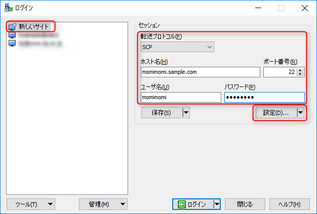
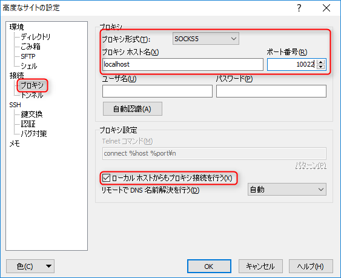
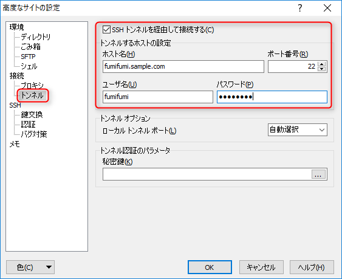

こんにちは、kenzauros です。

先日、[ターミナルソフト RLogin を使って多段 SSH 経由でリモートデスクトップで Windows サーバーに接続する](/remote-desktop-through-cascaded-ssh-with-rlogin) という記事を書いたので、次に **[RLogin](http://nanno.dip.jp/softlib/man/rlogin/) と [WinSCP](https://winscp.net/eng/docs/lang:jp) を使って 2 段の SSH 経由でリモートサーバーのファイルを操作する**方法を紹介します。

## 概要

### 環境

今回は下記のような構成を前提とします。前回と違うのは C が Windows から Linux に変わったところだけです。

* A: 踏み台 1 hogehoge.sample.com (CentOS 6, B にアクセス可能なネットワーク)
* B: 踏み台 2 fumifumi.sample.com (CentOS 6, C にアクセス可能なネットワーク)
* C: SCP 先のマシン momimomi.sample.com (CentOS 6)

OS は Windows 10 Pro, [RLogin](http://nanno.dip.jp/softlib/man/rlogin/) のバージョンは 2.22.3 です。

hogehoge と fumifumi を通して momimomi に SCP で接続します。

### 接続の考え方

接続の仕組みを確認しておきましょう。

1. A の SSH 接続を `localhost:10022` ポートでプロキシできるようにする 
2. A の SSH 接続をプロキシとして使って B に接続し、 B をトンネルして C に SCP で接続する

この流れで 1 を RLogin 、 2 を WinSCP で行います。

## RLogin 側の設定

### A の SSH 接続を localhost:10022 ポートでプロキシできるようにする

前回の記事で作った A の接続がある場合はこの手順は不要です。

まだ A の接続がない場合は、[前回の記事]((/remote-desktop-through-cascaded-ssh-with-rlogin#A_SSH_localhost10022))を参照して作成してください。

## WinSCP 側の設定

### B をトンネルして C に SCP で接続する

WinSCP を起動してログイン画面で新しいサイトをクリックし、右側に最終的に SCP で接続したいホスト (C/momimomi) の情報を入力します。

* 転送プロトコル: SCP
* ホスト名: **C のホスト名または IP アドレス** (ここでは `monimoni.sample.com`)
* ポート番号: C の SSH ポート番号 (デフォルトは 22)
* ユーザ名: C の接続に使うユーザー名
* パスワード: C の接続に使うパスワード

入力が終わったら **設定...** ボタンを押します。高度なサイトの設定画面で、**接続 → プロキシ** を開きます。

* プロキシ形式: SOCKS5
* プロキシホスト名: `localhost`
* ポート番号: **A のポートフォワードで設定したポート** (ここでは `10022`)
* ローカルホストからもプロキシ接続を行う にチェック

次に **接続 → トンネル** を開きます。

* SSHトンネルを経由して接続する にチェック
* ホスト名: **踏み台 2 (B) の  ホスト名または IP アドレス** (ここでは `fumifumi.sample.com`)
* ポート番号: 踏み台 2 (B) の SSH ポート番号 (デフォルトは 22)
* ユーザ名: 踏み台 2 (B) の接続に使うユーザー名
* パスワード: 踏み台 2 (B) の接続に使うパスワード

## 接続

以上で設定は完了です。

**まず RLogin で A に対して接続**してください。その後、 **WinSCP から C に対して接続**すれば、 A → B を通って C に接続され、ファイル一覧が取得できるはずです。
