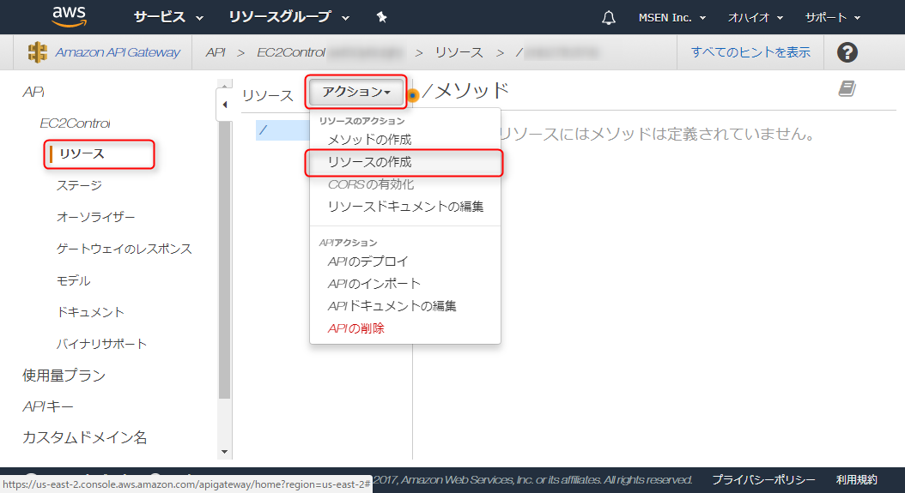

[前回](/start-ec2-instance-by-aws-lambda-with-python-36)は Lambda 関数で EC2 インスタンスの起動と終了ができるところまで確認しましたので、今回は **API Gateway を使って Web 経由で呼び出せるようにします**。

ざっくりなロードマップです。

1. Lambda から EC2 の起動と終了ができるようになる
2. **1 を API Gateway から呼び出す** ←いまここ
3. CI (Jenkins) から呼び出す

**API Gateway は AWS に用意された Web API を簡単に提供するためのサービス**です。同じく AWS のサービスである Lambda の関数を直接呼び出すこともできます。

今回の記事の内容は5分程度で実践できます。

## 前提条件

前回記事 ([AWS Lambda 関数で EC2 インスタンスを起動・終了する (Python 3.6)](/start-ec2-instance-by-aws-lambda-with-python-36)) が完了したあとの状態になっていることを前提としています。

今回は前回作った Lambda メソッドに対し、それぞれ `GET` でアクセスできる `start`, `stop` リソースをもつ API を定義します。なお、ステージは `prod` とします (後述)。

| Lambda 関数 | API リソース | API メソッド | API URL 例 |
| ----- | ----- | ----- | ----- |
| StartEC2Instance | start | GET | https://?????/prod/start |
| StopEC2Instance | stop | GET | https://?????/prod/stop |

Web API の観点からいくとリソース名が動作を表しているので、あまりよくない設計ですが、今回はやりたいことができればいいので、気にしないでおきます。

## API の作成

### API Gateway コンソール

AWS コンソールから **API Gateway** を選択します。


まだ、作ったことがなければ案内が表示されるので「今すぐ始める」をクリックします。


### API の作成

まず、 **API** を作成します。ここで "API" とは一連の Web API のリソースとメソッドの集合を言います。 API に対してユニークな URL が振られ、その後にリソース名を追加した URL にアクセスすることで API を実行することができます。

たとえば `users` というリソースを定義するとアクセスするための URL は次のようになります。 (`hogehoge` は API のデプロイ時に自動で振り出されます)

```plain
https://hogehoge.execute-api.us-east-2.amazonaws.com/prod/users
```

「**新しい API**」 を選択して API 名は "EC2Control" とでも命名し、 **[API の作成]** をクリックします。


### リソースの作成

今回は `start`, `stop` の 2 つのリソースを作成するので、まず [リソース] メニューの [アクション] → **[リソースの作成]** をクリックします。



リソース名に `start` と入力します。このときリソースパスが `/start` となっていることを確認します。 [リソースの作成] を押すと、 `/start` リソースが追加されます。


同様に `/stop` リソースも追加します。このとき、 `/start/stop` とならないよう、ルート (`/`) を選択した状態で追加し、ソースパスが `/stop` となっていることを確認してください。

### メソッドの作成

**それぞれのリソースに対して、 `GET` メソッドを追加**します。今回の場合、リソース自体が動作を表しているので、適切なメソッドはないのですが、 `GET` ならブラウザ等から簡単に動作確認ができるので、とりあえずこれで定義します。 (`ANY` でもかまいません)

`/start` リソースを選択した状態で [アクション] → **[メソッドの作成]** をクリックします。


メソッドに `GET` を選択してチェックマークをクリックします。


セットアップ画面で 統合タイプに「Lambda 関数」を選び、 リージョンを選択して Lambda 関数の名前を入力し、 [保存] をクリックします。


権限追加のダイアログは一応確認して、 [OK] をクリックします。


これで `GET /start` のメソッドができました。構成図（フロー図）が表示されます。メソッドから Lambda 関数 `StartEC2Instance` が起動して結果が HTTP レスポンスとして返されることがわかります。

とりあえずの動作確認のため、稲妻マークの **[テスト]** をクリックします。


さらに **[テスト]**　をクリックすると API メソッドがテスト実行され、右側に結果が表示されます。ステータスが 200 になっていれば、メソッドの実装は完了です。


同様に `/stop` リソースに対しても `GET` メソッドを定義しておきます。

### API のデプロイ

次に**デプロイ**して、 URL から API を実行できるようにします。

[アクション] → **[API のデプロイ]** をクリックします。


"新しいステージ" を選択し、ステージ名に "prod" とします。この**ステージ名は URL の一部**になります。任意の名称で結構です。

[デプロイ] ボタンをクリックすると API の URL が決定し、公開されます。


デプロイが完了するとステージエディター画面に移ります。画面上部で **API の URL** を確認できます。


### 動作確認

試しにブラウザーのアドレスバーに API の URL + `/start` と入力して Enter を押してみると...


無事 EC2 インスタンスが起動しました！

戻り値を定義していないのでブラウザーで開くと "null" とだけ表示されるのがダサいですが、そこはご愛嬌ということで。


今度は `/stop` で叩いてみると...


無事 EC2 インスタンスが立ち下がりました！


これで Web API から EC2 インスタンスの起動・終了が制御できるようになりました。

## 注意

API Gateway に認証を設定していないため、 **URL がわかってしまうと誰でも制御できてしまいます**。制御対象が評価環境等で重要度が高くなければ、さほど気にする必要はありませんが。

今回程度の用途であれば **API Key** を設定するのがもっとも手軽でセキュアにできると思いますので、それはまた後日。