**AWS (Amazon Web Services) EC2 のインスタンスは起動している時間で課金される**ので、ステージング環境等で常時起動している必要がないインスタンスはたち下げておくのがお財布にやさしいわけです。セキュリティー上も精神衛生上も多少マシでしょう(笑)

しかし、いちいちコンソールにログインして起動や終了をするのは面倒なので、デプロイの際に自動的に起動するとか、定刻で起動・終了するとか、ちょっとでも自動化しておきたいわけです。

というわけで、その第一歩として **AWS Lambda (ラムダ) を使用して EC2 インスタンスの起動と終了ができる関数を作ってみます**。

## 前提条件

EC2 のインスタンスはすでにできているものとします。このインスタンスの**リージョンコード**と**インスタンス ID** が必要となるので、コンソールで確認しておきましょう。

## EC2 インスタンス起動用関数を作成する

### 関数の作成

AWS コンソールから好きなリージョンに切り替えたあと (今回はなんとなくオハイオリージョン)、 Lambda をクリックして **Lambda のダッシュボード**を開きます。略してラムダッシュです。

<a href="images/start-ec2-instance-by-aws-lambda-with-python-36-1.png">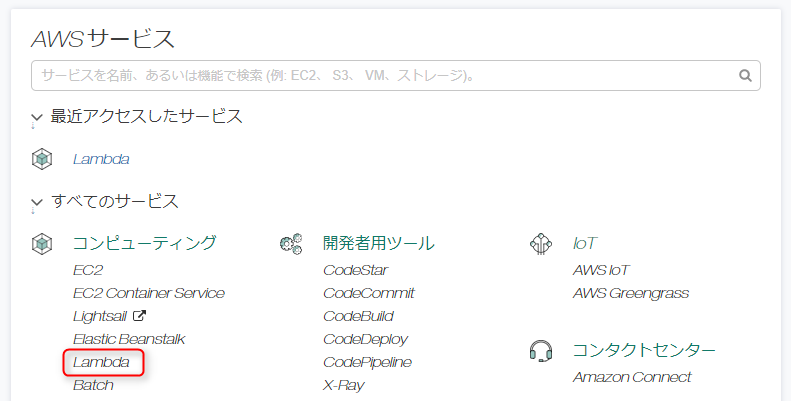</a>

ちなみに EC2 インスタンスのリージョンと Lambda のリージョンは異なっていてもかまいません。

なにも関数がない状態だと下記のように「ようこそ」的な画面が表示されます。なにはともあれ「**関数の作成**」をクリックして関数の作成を開始します。

<a href="images/start-ec2-instance-by-aws-lambda-with-python-36-2.png">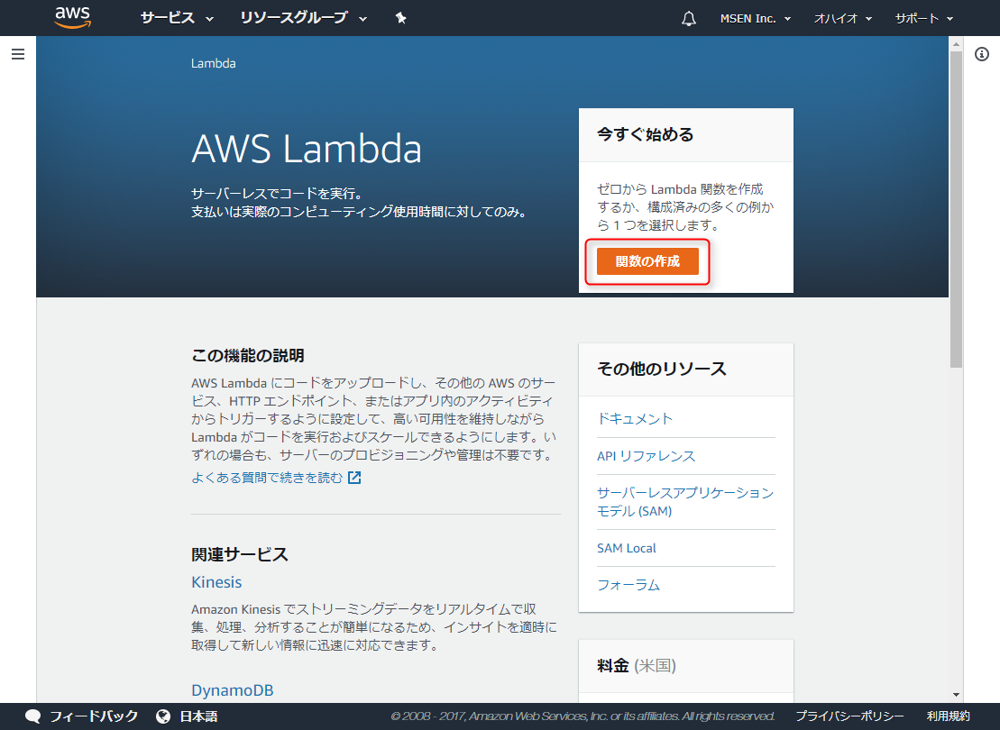</a>

「設計図」の選択では、使えそうなものがないので「**一から作成**」をクリックします。

<a href="images/start-ec2-instance-by-aws-lambda-with-python-36-3.png">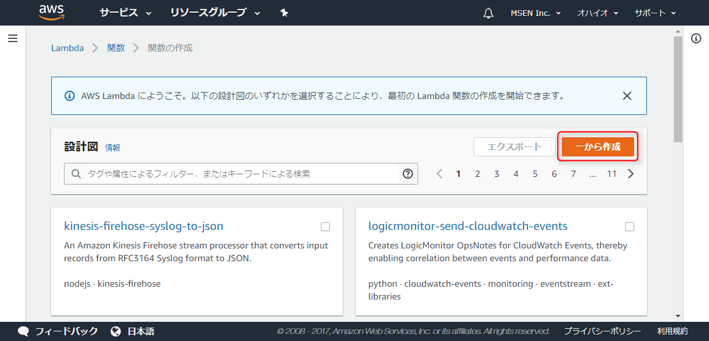</a>

「**名前**」には適当に関数の名前を入力します。ちなみに**この関数名は二度と変更できません**ので、命名規約を決めるなどして、慎重に命名してください。今回は `StartTestEC2Instance` とします。

次にロールから「**カスタムロールの作成**」をクリックすると新しいウィンドウで **IAM Management Console** が開きます。

<a href="images/start-ec2-instance-by-aws-lambda-with-python-36-4.png">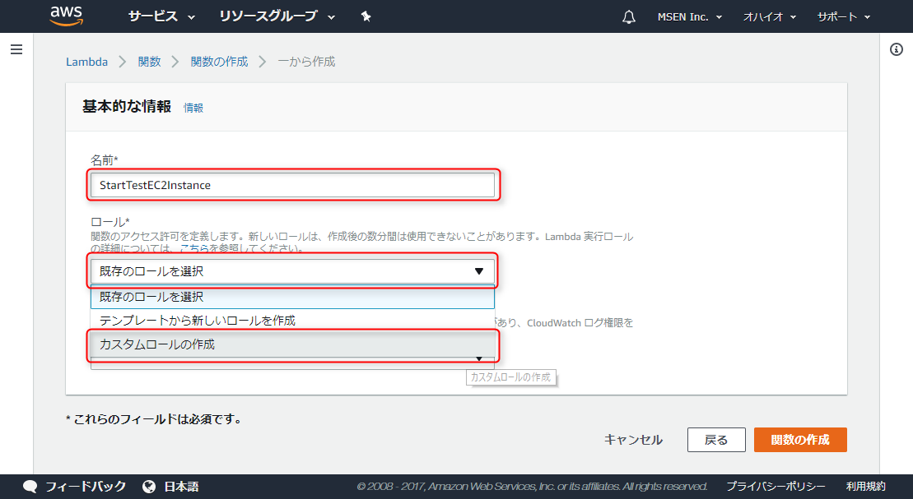</a>

### IAM ロールの作成

**IAM (Identity and Access Management)** は AWS の権限管理の名称です。

すでに IAM ロールがある場合はそれを使ってもかまいませんが、わかりやすくするために EC2 インスタンスの起動・終了をするためのロールを作成します。

IAM Management Console の新しいロールを作る画面が開いたら、 (1) ロール名を入力し (ここでは `LambdaEC2Control`) ポリシードキュメントを表示して (2) 編集を押したあと、(3) テキストエリアに下記の JSON をペーストして「許可」を押します。

<a href="images/start-ec2-instance-by-aws-lambda-with-python-36-5.png">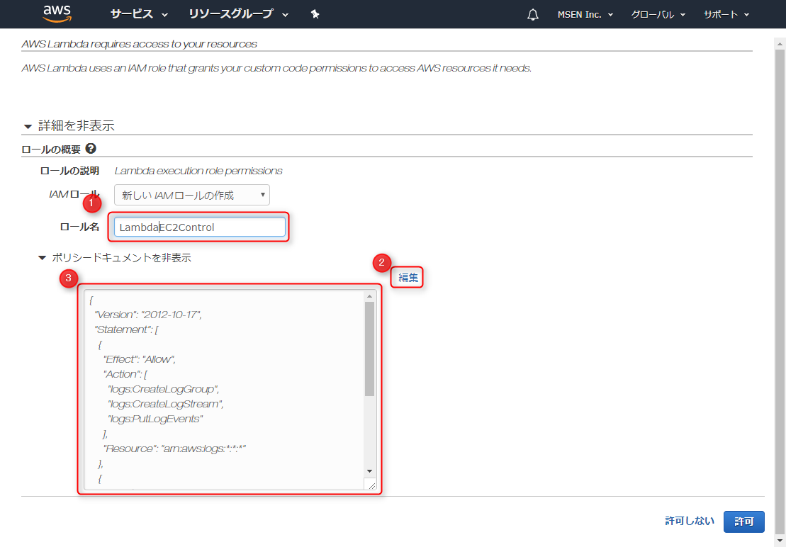</a>

ちなみに**ポリシードキュメント**は IAM ロールの権限ポリシーを記述した JSON を言います。ここでは `"ec2:Start*"`, `"ec2:Stop*"` を指定して、 EC2 の起動・終了の権限を追加しています。

```
{
  "Version": "2012-10-17",
  "Statement": [
    {
      "Effect": "Allow",
      "Action": [
        "logs:CreateLogGroup",
        "logs:CreateLogStream",
        "logs:PutLogEvents"
      ],
      "Resource": "arn:aws:logs:*:*:*"
    },
    {
      "Effect": "Allow",
      "Action": [
        "ec2:Start*",
        "ec2:Stop*"
      ],
      "Resource": "*"
    }
  ]
}
```

### 関数の作成 (続き)

IAM ロールの「許可」を押すと自動的に関数の作成画面に戻り、いま作成したロールが「既存のロール」として選択されているはずです。

もう一度名前とロールを確認して「**関数の作成**」ボタンを押しましょう。

<a href="images/start-ec2-instance-by-aws-lambda-with-python-36-6.png">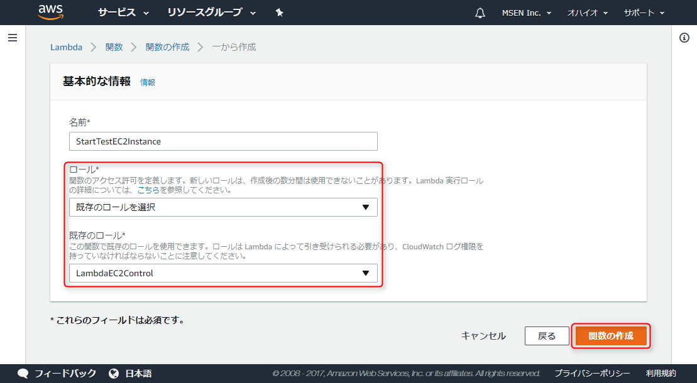</a>

関数が作成されると詳細画面になるので、「関数コード」の「ランタイム」に **Python 3.6** を指定します。もちろん書きやすい言語でけっこうですが、いまから書くのであればあえて Python 2.7 にする必要はないでしょう。

<a href="images/start-ec2-instance-by-aws-lambda-with-python-36-7.png">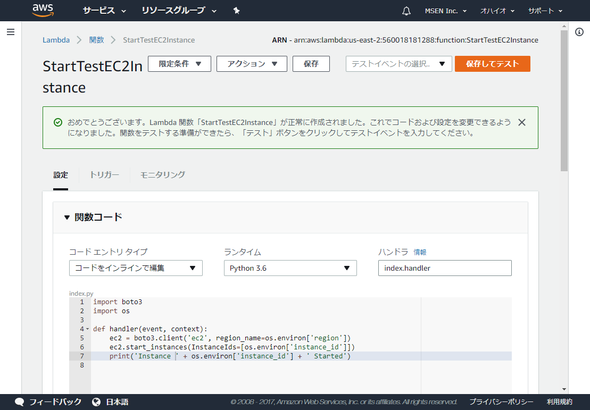</a>

関数コードのテキストエリア (index.py と書かれているところ) に下記のソースコードをペーストします。

```
import boto3
import os
 
def handler(event, context):
    ec2 = boto3.client('ec2', region_name=os.environ['region'])
    ec2.start_instances(InstanceIds=[os.environ['instance_id']])
    print('Instance ' + os.environ['instance_id'] + ' Started')
```

今回はLambdaの便利機能である**環境変数**を使うことでソースコード中にリージョンコードやインスタンス ID を含まなくていいようにしています。

もう少し画面をスクロールして「環境変数」セクションを開き、関数中で使用している `region` と `instance_id` という変数を追加します。

`region` には **AWS のリージョンコード** (ここでは `us-east-2`)、 `instance_id` には EC2 インスタンス一覧で確認できる **インスタンス ID** を指定します。

さらに基本設定の「**タイムアウト**」がデフォルトは3秒になっているので、6秒にしておきます。通常は3秒あれば十分だと思いますが、最初はこれが原因でエラーになっても面倒なので少し余裕をみておきます。あとで必要に応じて縮めましょう。

<a href="images/start-ec2-instance-by-aws-lambda-with-python-36-8.png">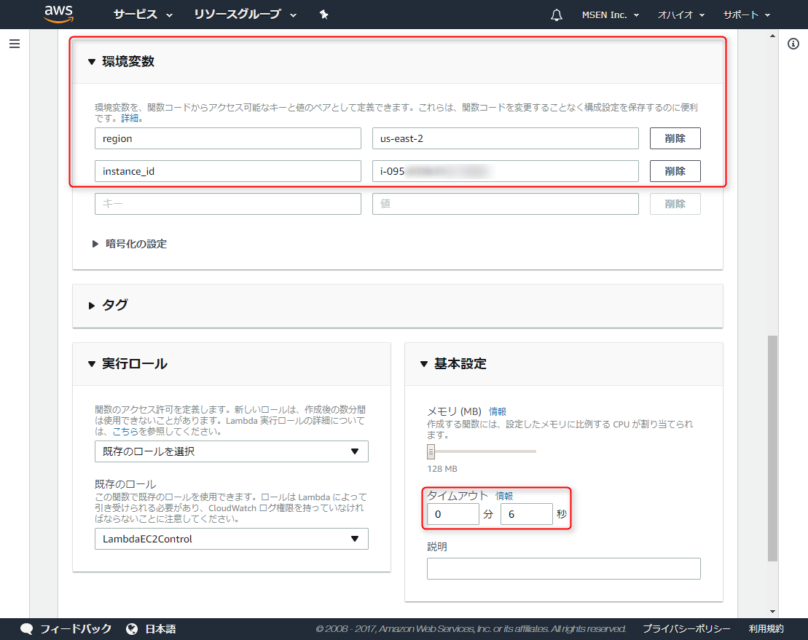</a>

ここまで完了したら一番上に戻って、「**保存してテスト**」をクリックします。当たり前ですが、動作確認のために操作対象の EC2 インスタンスは停止させて stopped にしておきましょう。

まだテストイベントがない場合、**テストイベントの設定**画面が開くので、イベントテンプレートを **Hello World** にし、イベント名に適当な名前をつけて、「**作成**」をクリックします。ここは動作確認だけなので、あまり考えなくても OK です。

<a href="images/start-ec2-instance-by-aws-lambda-with-python-36-9.png">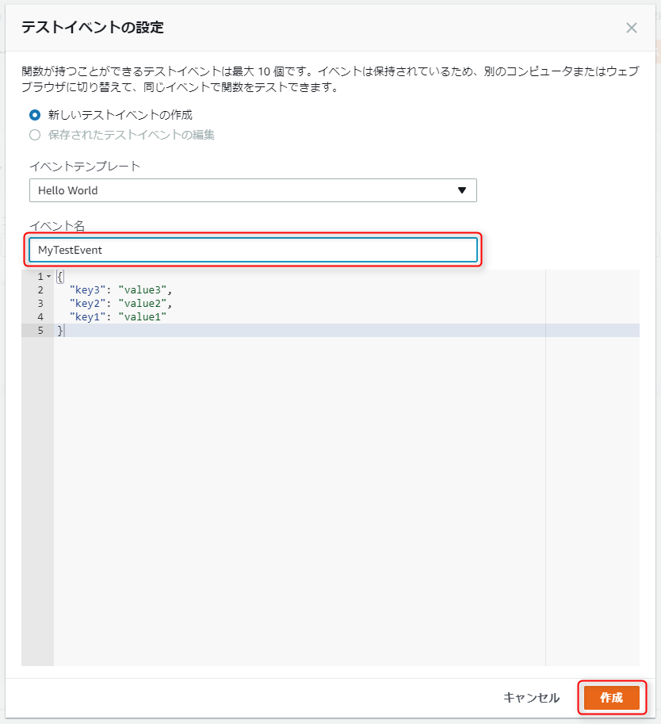</a>

あとは「**テスト**」ボタンをクリックすれば、やっとこさ関数が実行されます。

<a href="images/start-ec2-instance-by-aws-lambda-with-python-36-10.png">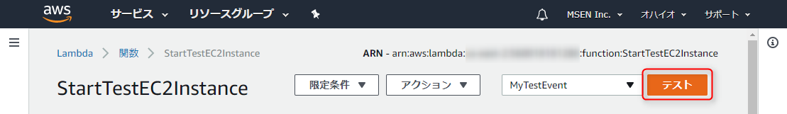</a>

実行が成功すると下記のように成功と表示されるはずです。

<a href="images/start-ec2-instance-by-aws-lambda-with-python-36-11.png">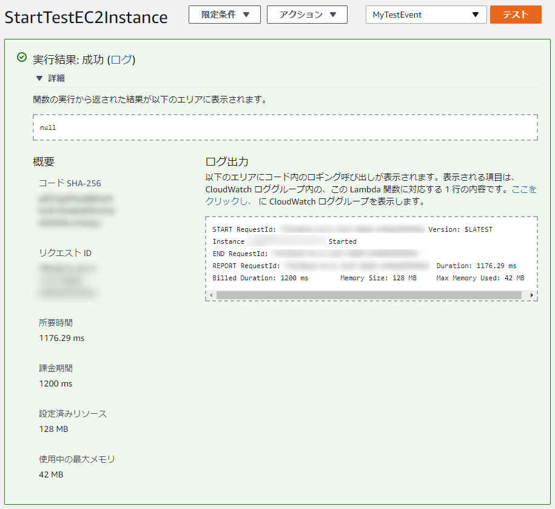</a>

当たり前ですが、エラーのときはここが赤くなって、エラー内容が表示されます。普通にデバッグログが表示されるので、がんばって直しましょう(笑)

EC2 を確認するとちゃんと running になっていることが確認できました。すばらしい！

<a href="images/start-ec2-instance-by-aws-lambda-with-python-36-12.png">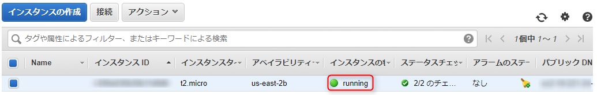</a>

### トラブルシューティング

ちなみに私は今回3回ほどエラーと戦いましたので、トラブルシューティングのメモです。

1. **ハンドラの不一致**  
関数コードの「ハンドラ」には、メインルーチンのファイル名 (今回は `index.py`) とコードのエントリポイントとなる関数名 (今回は `handler`) をつないだものを指定します。これが異なっていると当然ながらエラーになります。
<a href="images/start-ec2-instance-by-aws-lambda-with-python-36-13.png">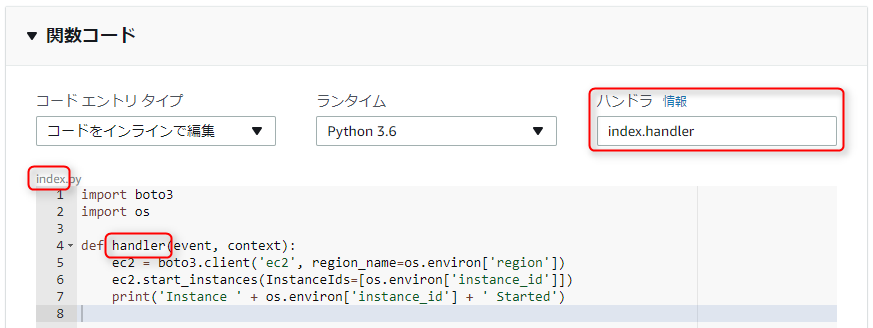</a>
2. **タイムアウト**  
あとあと経過時間を見てみると2秒ほどだったのですが、初期設定の3秒だとタイムアウトがでてエラーになっていました。とりあえず動くまでは長めでいきましょう。
3. **IAM ロールの権限不足 (UnauthorizedOperation)**  
先述の通り、 `"ec2:Start*"`, `"ec2:Stop*"` のアクションが "Allow" となるように設定しましょう。うまくいかないときはポリシーの JSON を簡素化したり Lambda の関数画面をリロードしたりして試行しましょう。

## EC2 インスタンス終了用関数

起動用関数ができたら**終了用関数**も作っておきましょう。

`start_instances` を `stop_instances` に変えるだけなのでなにも難しくありません。念のためソースコードを置いておきます。

起動用関数と同じ手順で作成しますが、 **IAM ロールは別途作らなくても起動用と同じものを使えば OK** です。

```
import boto3
import os
 
def handler(event, context):
    ec2 = boto3.client('ec2', region_name=os.environ['region'])
    ec2.stop_instances(InstanceIds=[os.environ['instance_id']])
    print('Instance ' + os.environ['instance_id'] + ' Stopped')
```

## 関数名の変更

**Lambda の関数は基本的に一度つけた名前を変更することはできません**。「**エイリアス（別名）**」というものがありますが、これはどちらかというと「関数のバージョンに対するエイリアス」なので関数名自体を別名で使うことはできません。

変更したい場合は、新たに関数を作成して古い方を削除するしかないようです。

次回は、この2つの関数をリモートから呼び出せるようにしていきます。